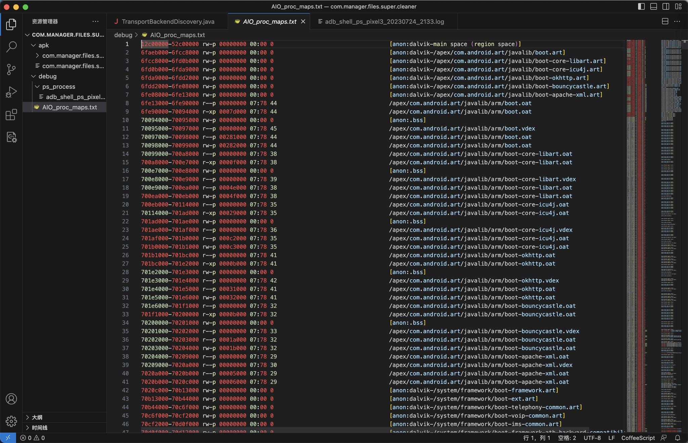
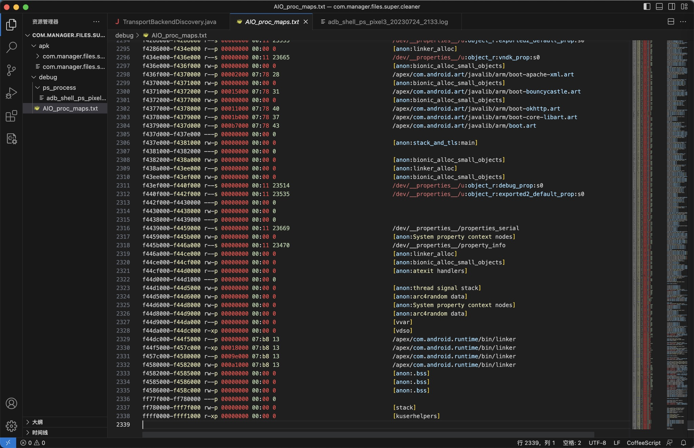
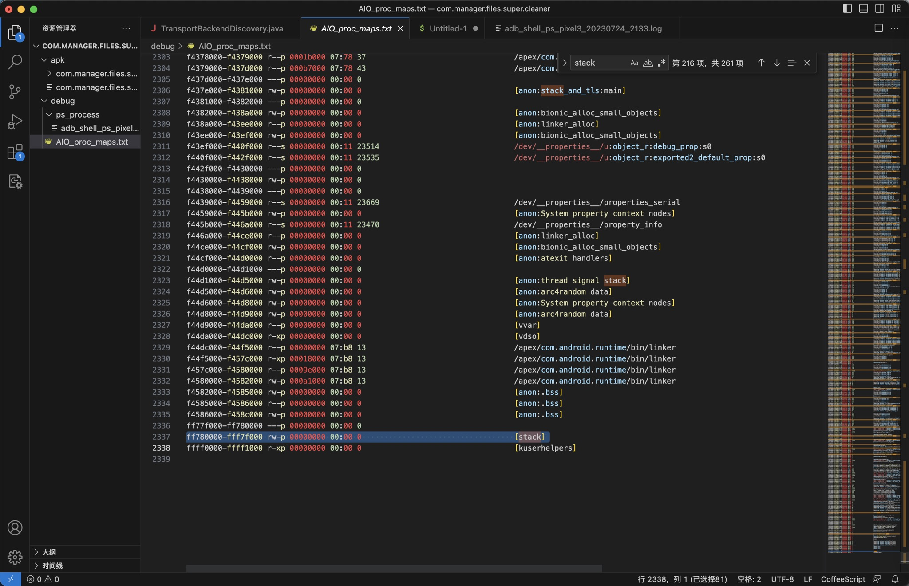

# adb查看进程内存映射

* 查看进程的内存映射real layout of process segment
  ```bash
  /proc/<pid>/maps
  ```

举例：

查看安卓app：`AIO File Manager`=包名：`com.manager.files.super.cleaner`的进程的内存映射

```bash
adb shell
```

后：

查看确认进程PID：

```bash
blueline:/storage/emulated/0/dev # ps -A | grep clean
u0_a256       14868   1025 2051980  61568 SyS_epoll_wait      0 S com.manager.files.super.cleaner
```

查看到AIO File Manager的PID是：14868

再去切换到root权限：

```bash
su
```

然后才能看到maps映射：

```bash
cat /proc/14868/maps
```

输出结果：

```bash
blueline:/sdcard/dev $ cat /proc/14868/map
map_files/  maps
```

详细结果：

```bash
blueline:/storage/emulated/0/dev # cat /proc/14868/maps
12c00000-52c00000 rw-p 00000000 00:00 0                                  [anon:dalvik-main space (region space)]
6faeb000-6fcc8000 rw-p 00000000 00:00 0                                  [anon:dalvik-/apex/com.android.art/javalib/boot.art]
6fcc8000-6fd0b000 rw-p 00000000 00:00 0                                  [anon:dalvik-/apex/com.android.art/javalib/boot-core-libart.art]
6fd0b000-6fda9000 rw-p 00000000 00:00 0                                  [anon:dalvik-/apex/com.android.art/javalib/boot-core-icu4j.art]
6fda9000-6fdd2000 rw-p 00000000 00:00 0                                  [anon:dalvik-/apex/com.android.art/javalib/boot-okhttp.art]
6fdd2000-6fe08000 rw-p 00000000 00:00 0                                  [anon:dalvik-/apex/com.android.art/javalib/boot-bouncycastle.art]
6fe08000-6fe13000 rw-p 00000000 00:00 0                                  [anon:dalvik-/apex/com.android.art/javalib/boot-apache-xml.art]
6fe13000-6fe90000 r--p 00000000 07:78 44                                 /apex/com.android.art/javalib/arm/boot.oat
6fe90000-70094000 r-xp 0007d000 07:78 44                                 /apex/com.android.art/javalib/arm/boot.oat
70094000-70095000 rw-p 00000000 00:00 0                                  [anon:.bss]
70095000-70097000 r--p 00000000 07:78 45                                 /apex/com.android.art/javalib/arm/boot.vdex
70097000-70098000 r--p 00281000 07:78 44                                 /apex/com.android.art/javalib/arm/boot.oat
70098000-70099000 rw-p 00282000 07:78 44                                 /apex/com.android.art/javalib/arm/boot.oat
70099000-700a8000 r--p 00000000 07:78 38                                 /apex/com.android.art/javalib/arm/boot-core-libart.oat
700a8000-700e7000 r-xp 0000f000 07:78 38                                 /apex/com.android.art/javalib/arm/boot-core-libart.oat
700e7000-700e8000 rw-p 00000000 00:00 0                                  [anon:.bss]
700e8000-700e9000 r--p 00000000 07:78 39                                 /apex/com.android.art/javalib/arm/boot-core-libart.vdex
700e9000-700ea000 r--p 0004e000 07:78 38                                 /apex/com.android.art/javalib/arm/boot-core-libart.oat
700ea000-700eb000 rw-p 0004f000 07:78 38                                 /apex/com.android.art/javalib/arm/boot-core-libart.oat
700eb000-70114000 r--p 00000000 07:78 35                                 /apex/com.android.art/javalib/arm/boot-core-icu4j.oat
70114000-701ad000 r-xp 00029000 07:78 35                                 /apex/com.android.art/javalib/arm/boot-core-icu4j.oat
701ad000-701ae000 rw-p 00000000 00:00 0                                  [anon:.bss]
701ae000-701af000 r--p 00000000 07:78 36                                 /apex/com.android.art/javalib/arm/boot-core-icu4j.vdex
701af000-701b0000 r--p 000c2000 07:78 35                                 /apex/com.android.art/javalib/arm/boot-core-icu4j.oat
701b0000-701b1000 rw-p 000c3000 07:78 35                                 /apex/com.android.art/javalib/arm/boot-core-icu4j.oat
701b1000-701bc000 r--p 00000000 07:78 41                                 /apex/com.android.art/javalib/arm/boot-okhttp.oat
701bc000-701e2000 r-xp 0000b000 07:78 41                                 /apex/com.android.art/javalib/arm/boot-okhttp.oat
701e2000-701e3000 rw-p 00000000 00:00 0                                  [anon:.bss]
701e3000-701e4000 r--p 00000000 07:78 42                                 /apex/com.android.art/javalib/arm/boot-okhttp.vdex
701e4000-701e5000 r--p 00031000 07:78 41                                 /apex/com.android.art/javalib/arm/boot-okhttp.oat
701e5000-701e6000 rw-p 00032000 07:78 41                                 /apex/com.android.art/javalib/arm/boot-okhttp.oat
701e6000-701f1000 r--p 00000000 07:78 32                                 /apex/com.android.art/javalib/arm/boot-bouncycastle.oat
701f1000-70200000 r-xp 0000b000 07:78 32                                 /apex/com.android.art/javalib/arm/boot-bouncycastle.oat
70200000-70201000 rw-p 00000000 00:00 0                                  [anon:.bss]
70201000-70202000 r--p 00000000 07:78 33                                 /apex/com.android.art/javalib/arm/boot-bouncycastle.vdex
70202000-70203000 r--p 0001a000 07:78 32                                 /apex/com.android.art/javalib/arm/boot-bouncycastle.oat
70203000-70204000 rw-p 0001b000 07:78 32                                 /apex/com.android.art/javalib/arm/boot-bouncycastle.oat
70204000-70209000 r--p 00000000 07:78 29                                 /apex/com.android.art/javalib/arm/boot-apache-xml.oat
70209000-7020a000 r--p 00000000 07:78 30                                 /apex/com.android.art/javalib/arm/boot-apache-xml.vdex
7020a000-7020b000 r--p 00005000 07:78 29                                 /apex/com.android.art/javalib/arm/boot-apache-xml.oat
7020b000-7020c000 rw-p 00006000 07:78 29                                 /apex/com.android.art/javalib/arm/boot-apache-xml.oat
7020c000-70b13000 rw-p 00000000 00:00 0                                  [anon:dalvik-/system/framework/boot-framework.art]
70b13000-70b44000 rw-p 00000000 00:00 0                                  [anon:dalvik-/system/framework/boot-ext.art]
70b44000-70c6f000 rw-p 00000000 00:00 0                                  [anon:dalvik-/system/framework/boot-telephony-common.art]
70c6f000-70cf2000 rw-p 00000000 00:00 0                                  [anon:dalvik-/system/framework/boot-voip-common.art]
70cf2000-70d0f000 rw-p 00000000 00:00 0                                  [anon:dalvik-/system/framework/boot-ims-common.art]
70d0f000-70d12000 rw-p 00000000 00:00 0                                  [anon:dalvik-/system/framework/boot-framework-atb-backward-compatibility.art]
70d12000-70f01000 r--p 00000000 fd:04 1225                               /system/framework/arm/boot-framework.oat
70f01000-71613000 r-xp 001ef000 fd:04 1225                               /system/framework/arm/boot-framework.oat
71613000-71615000 r--p 00901000 fd:04 1225                               /system/framework/arm/boot-framework.oat
71615000-71616000 rw-p 00000000 00:00 0                                  [anon:.bss]
71616000-71620000 r--p 00000000 fd:04 1258                               /system/framework/boot-framework.vdex
71620000-71621000 r--p 00903000 fd:04 1225                               /system/framework/arm/boot-framework.oat
71621000-71622000 rw-p 00904000 fd:04 1225                               /system/framework/arm/boot-framework.oat
71622000-71627000 r--p 00000000 fd:04 1219                               /system/framework/arm/boot-ext.oat
71627000-71638000 r-xp 00005000 fd:04 1219                               /system/framework/arm/boot-ext.oat
71638000-71639000 r--p 00016000 fd:04 1219                               /system/framework/arm/boot-ext.oat
71639000-7163a000 r--p 00000000 fd:04 1256                               /system/framework/boot-ext.vdex
7163a000-7163b000 r--p 00017000 fd:04 1219                               /system/framework/arm/boot-ext.oat
7163b000-7163c000 rw-p 00018000 fd:04 1219                               /system/framework/arm/boot-ext.oat
7163c000-71644000 r--p 00000000 fd:04 1231                               /system/framework/arm/boot-telephony-common.oat
71644000-71645000 r--p 00000000 fd:04 1260                               /system/framework/boot-telephony-common.vdex
71645000-71646000 r--p 00008000 fd:04 1231                               /system/framework/arm/boot-telephony-common.oat
71646000-71647000 rw-p 00009000 fd:04 1231                               /system/framework/arm/boot-telephony-common.oat
71647000-7164c000 r--p 00000000 fd:04 1234                               /system/framework/arm/boot-voip-common.oat
7164c000-7164d000 r-xp 00005000 fd:04 1234                               /system/framework/arm/boot-voip-common.oat
7164d000-7164e000 r--p 00000000 fd:04 1261                               /system/framework/boot-voip-common.vdex
7164e000-7164f000 r--p 00006000 fd:04 1234                               /system/framework/arm/boot-voip-common.oat
7164f000-71650000 rw-p 00007000 fd:04 1234                               /system/framework/arm/boot-voip-common.oat
71650000-71652000 r--p 00000000 fd:04 1228                               /system/framework/arm/boot-ims-common.oat
71652000-71653000 r--p 00000000 fd:04 1259                               /system/framework/boot-ims-common.vdex
71653000-71654000 r--p 00002000 fd:04 1228                               /system/framework/arm/boot-ims-common.oat
71654000-71655000 rw-p 00003000 fd:04 1228                               /system/framework/arm/boot-ims-common.oat
71655000-71657000 r--p 00000000 fd:04 1222                               /system/framework/arm/boot-framework-atb-backward-compatibility.oat
71657000-71658000 r--p 00000000 fd:04 1257                               /system/framework/boot-framework-atb-backward-compatibility.vdex
71658000-71659000 r--p 00002000 fd:04 1222                               /system/framework/arm/boot-framework-atb-backward-compatibility.oat
71659000-7165a000 rw-p 00003000 fd:04 1222                               /system/framework/arm/boot-framework-atb-backward-compatibility.oat
7165a000-719bd000 rw-p 00000000 00:00 0                                  [anon:dalvik-zygote space]
719bd000-719bf000 rw-p 00000000 00:00 0                                  [anon:dalvik-non moving space]
719bf000-719cc000 rw-p 00000000 00:00 0                                  [anon:dalvik-non moving space]
719cc000-74e5b000 ---p 00000000 00:00 0                                  [anon:dalvik-non moving space]
74e5b000-7565a000 rw-p 00000000 00:00 0                                  [anon:dalvik-non moving space]
b1562000-b1564000 r--p 00000000 fd:04 176                                /system/bin/app_process32
b1564000-b1568000 r-xp 00001000 fd:04 176                                /system/bin/app_process32
...
...
...


f4226000-f4246000 r--s 00000000 00:11 23653                              /dev/__properties__/u:object_r:vendor_socket_hook_prop:s0
f4246000-f4266000 r--s 00000000 00:11 23566                              /dev/__properties__/u:object_r:heapprofd_prop:s0
f4266000-f4286000 r--s 00000000 00:11 23535                              /dev/__properties__/u:object_r:exported2_default_prop:s0
f4286000-f434e000 r--p 00000000 00:00 0                                  [anon:linker_alloc]
f434e000-f436e000 r--s 00000000 00:11 23665                              /dev/__properties__/u:object_r:vndk_prop:s0
f436e000-f436f000 rw-p 00000000 00:00 0                                  [anon:bionic_alloc_small_objects]
f436f000-f4370000 r--p 00002000 07:78 28                                 /apex/com.android.art/javalib/arm/boot-apache-xml.art
f4370000-f4371000 rw-p 00000000 00:00 0                                  [anon:bionic_alloc_small_objects]
f4371000-f4372000 r--p 00015000 07:78 31                                 /apex/com.android.art/javalib/arm/boot-bouncycastle.art
f4372000-f4377000 rw-p 00000000 00:00 0                                  [anon:bionic_alloc_small_objects]
f4377000-f4378000 r--p 00011000 07:78 40                                 /apex/com.android.art/javalib/arm/boot-okhttp.art
f4378000-f4379000 r--p 0001b000 07:78 37                                 /apex/com.android.art/javalib/arm/boot-core-libart.art
f4379000-f437d000 r--p 000b7000 07:78 43                                 /apex/com.android.art/javalib/arm/boot.art
f437d000-f437e000 ---p 00000000 00:00 0 
f437e000-f4381000 rw-p 00000000 00:00 0                                  [anon:stack_and_tls:main]
f4381000-f4382000 ---p 00000000 00:00 0 
f4382000-f438a000 rw-p 00000000 00:00 0                                  [anon:bionic_alloc_small_objects]
f438a000-f43ee000 r--p 00000000 00:00 0                                  [anon:linker_alloc]
f43ee000-f43ef000 rw-p 00000000 00:00 0                                  [anon:bionic_alloc_small_objects]
f43ef000-f440f000 r--s 00000000 00:11 23514                              /dev/__properties__/u:object_r:debug_prop:s0
f440f000-f442f000 r--s 00000000 00:11 23535                              /dev/__properties__/u:object_r:exported2_default_prop:s0
f442f000-f4430000 ---p 00000000 00:00 0 
f4430000-f4438000 rw-p 00000000 00:00 0 
f4438000-f4439000 ---p 00000000 00:00 0 
f4439000-f4459000 r--s 00000000 00:11 23669                              /dev/__properties__/properties_serial
f4459000-f445b000 rw-p 00000000 00:00 0                                  [anon:System property context nodes]
f445b000-f446a000 r--s 00000000 00:11 23470                              /dev/__properties__/property_info
f446a000-f44ce000 r--p 00000000 00:00 0                                  [anon:linker_alloc]
f44ce000-f44cf000 rw-p 00000000 00:00 0                                  [anon:bionic_alloc_small_objects]
f44cf000-f44d0000 r--p 00000000 00:00 0                                  [anon:atexit handlers]
f44d0000-f44d1000 ---p 00000000 00:00 0 
f44d1000-f44d5000 rw-p 00000000 00:00 0                                  [anon:thread signal stack]
f44d5000-f44d6000 rw-p 00000000 00:00 0                                  [anon:arc4random data]
f44d6000-f44d8000 rw-p 00000000 00:00 0                                  [anon:System property context nodes]
f44d8000-f44d9000 rw-p 00000000 00:00 0                                  [anon:arc4random data]
f44d9000-f44da000 r--p 00000000 00:00 0                                  [vvar]
f44da000-f44dc000 r-xp 00000000 00:00 0                                  [vdso]
f44dc000-f44f5000 r--p 00000000 07:b8 13                                 /apex/com.android.runtime/bin/linker
f44f5000-f457c000 r-xp 00018000 07:b8 13                                 /apex/com.android.runtime/bin/linker
f457c000-f4580000 r--p 0009e000 07:b8 13                                 /apex/com.android.runtime/bin/linker
f4580000-f4582000 rw-p 000a1000 07:b8 13                                 /apex/com.android.runtime/bin/linker
f4582000-f4585000 rw-p 00000000 00:00 0                                  [anon:.bss]
f4585000-f4586000 r--p 00000000 00:00 0                                  [anon:.bss]
f4586000-f458c000 rw-p 00000000 00:00 0                                  [anon:.bss]
ff77f000-ff780000 ---p 00000000 00:00 0 
ff780000-fff7f000 rw-p 00000000 00:00 0                                  [stack]
ffff0000-ffff1000 r-xp 00000000 00:00 0                                  [kuserhelpers]
```

* 
* 

## 内存映射信息的解读

想要搞懂：

* 内存对齐
* 哪个是stack

等具体含义。

[Understanding ELF using readelf and objdump (studylib.net)](https://studylib.net/doc/8584577/understanding-elf-using-readelf-and-objdump)

```bash
[1] 0039d000-003b2000 r-xp 00000000 16:41 1080084 /lib/ld-2.3.3.so
[2] 003b2000-003b3000 r--p 00014000 16:41 1080084 /lib/ld-2.3.3.so
[3] 003b3000-003b4000 rw-p 00015000 16:41 1080084 /lib/ld-2.3.3.so
[4] 003b6000-004cb000 r-xp 00000000 16:41 1080085 /lib/tls/libc-2.3.3.so
[5] 004cb000-004cd000 r--p 00115000 16:41 1080085 /lib/tls/libc-2.3.3.so
[6] 004cd000-004cf000 rw-p 00117000 16:41 1080085 /lib/tls/libc-2.3.3.so
[7] 004cf000-004d1000 rw-p 004cf000 00:00 0
[8] 08048000-08049000 r-xp 00000000 16:06 66970 /tmp/test
[9] 08049000-0804a000 rw-p 00000000 16:06 66970 /tmp/test
[10] b7fec000-b7fed000 rw-p b7fec000 00:00 0
[11] bffeb000-c0000000 rw-p bffeb000 00:00 0
[12] ffffe000-fffff000 ---p 00000000 00:00 0
```

其中：

* VMA# 11
  * `[11] bffeb000-c0000000 rw-p bffeb000 00:00 0`

是：

* stack
  * usually, the kernel allocate several pages dynamically and map to the highest virtual address possible in user space to form stack area.

-> 此处去搜stack，还真有多个stack这样的：

```bash
e6ded000-e6df1000 rw-p 00000000 00:00 0                                  [anon:thread signal stack]

e84d3000-e86d3000 rw-p 00000000 00:00 0                                  [anon:dalvik-rb copying gc mark stack]
e86d3000-e96d3000 rw-p 00000000 00:00 0                                  [anon:dalvik-concurrent copying gc mark stack]
e96d3000-e9ed4000 rw-p 00000000 00:00 0                                  [anon:dalvik-live stack]
e9ed4000-ea6d5000 rw-p 00000000 00:00 0                                  [anon:dalvik-allocation stack]

ebbc0000-ebdc0000 rw-p 00000000 00:00 0                                  [anon:dalvik-rb copying gc mark stack]

f2282000-f228e000 rw-p 00000000 00:00 0                                  [anon:dalvik-thread local mark stack]
...
```

倒数最后一个：

```bash
ff780000-fff7f000 rw-p 00000000 00:00 0                                  [stack]
```

整个名字就是Stack：



是我们希望的，要找的

* Simply speaking, each process address space isdivid ed into two part (this assume Intel compatible 32 bit processor): user space and kernel space. User space is in 0x00000000-0xc0000000 range, while kernel space starts on 0xc0000000 onward

-> 
* 每个进程的（Intel 的32位处理器的）地址空间都被分为2部分
  * 用户空间
    * 范围：`0x00000000-0xc0000000`
      * 所以上述test的地址空间的，最高位置(地址范围`bffeb000-c0000000`),分配给了stack
          * `[11] bffeb000-c0000000 rw-p bffeb000 00:00 0`
  * 内核空间
    * 范围：0xc0000000-...

其他相关解释：

[Executable and Linkable Format (ELF) (netmeister.org)](https://stevens.netmeister.org/631/elf.html)

```bash
0000000000400000      8K r-x--  a.out
0000000000601000      4K rw---  a.out
0000003433e00000    112K r-x--  /lib64/ld-2.5.so
000000343401b000      4K r----  /lib64/ld-2.5.so
000000343401c000      4K rw---  /lib64/ld-2.5.so
0000003434200000   1336K r-x--  /lib64/libc-2.5.so     <-- The first "LOAD" segment, which contains .text and .rodata sections
000000343434e000   2044K -----  /lib64/libc-2.5.so     <-- "Hole"
000000343454d000     16K r----  /lib64/libc-2.5.so     <-- Relocation (GNU_RELRO) info  -+---- The second "LOAD" segment
0000003434551000      4K rw---  /lib64/libc-2.5.so     <-- .got.plt .data sections      -+
0000003434552000     20K rw---    [ anon ]             <-- The remaining zero-filled sections (e.g. .bss)
0000003434e00000     88K r-x--  /lib64/libpthread-2.5.so     <-- The first "LOAD" segment, which contains .text and .rodata sections
0000003434e16000   2044K -----  /lib64/libpthread-2.5.so     <-- "Hole"
0000003435015000      4K r----  /lib64/libpthread-2.5.so     <-- Relocation (GNU_RELRO) info  -+---- The second "LOAD" segment
0000003435016000      4K rw---  /lib64/libpthread-2.5.so     <-- .got.plt .data sections      -+
0000003435017000     16K rw---    [ anon ]                   <-- The remaining zero-filled sections (e.g. .bss)
00002aaaaaaab000      4K rw---    [ anon ]
00002aaaaaac6000     12K rw---    [ anon ]
00007ffffffea000     84K rw---    [ stack ]
ffffffffff600000   8192K -----    [ anon ]
 total            14000K
```

供参考。
