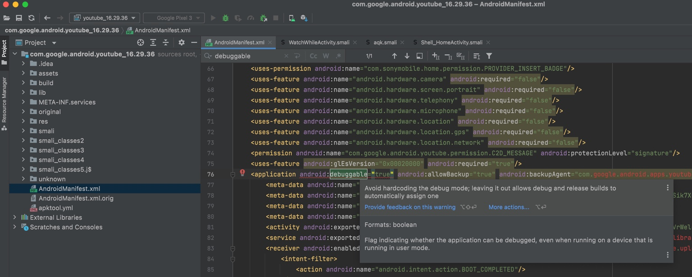

# app可调试

TODO：

* 【已解决】安卓逆向：如何让YouTube的apk可以被调试
* 【已解决】安卓让apk可调试：修改全局系统属性ro.debuggable
* 【已解决】安卓逆向：用MagiskHide Props Config实现全局apk可调试
* 【未解决】安卓逆向：让apk可调试之通过XPosed插件
* 【未解决】尝试用BDOpener修改ro.debuggable使得apk可调试
* 【已解决】用Magisk插件MagiskHide Props Config去设置ro.debuggable实现全局app可调试
* 【已解决】Google Pixel3安卓手机中MagiskHide Props Config中没有ro.debuggable属性可设置
* 【未解决】安卓逆向：用mprop修改属性ro.debuggable让apk可调试
* 【未解决】安卓逆向：用rootadb的setpropex修改属性ro.debuggable让apk可调试
* 【未解决】mprop提示报错：inject position not found, may be already patched

---

确保app`可调试`=`debuggable`：

让app可调试，有多种方式：

* 针对`特定app`可调试
  * app代码中`AndroidManifest.xml`加上`android:debuggable="true"`
    * 思路：往往是（`apktool`等）反编译得到源码，修改后，再重新打包回去
    * 缺点：对于稍微复杂点的apk，往往重新打包的过程中会出错，会很麻烦
* `全局可调`：安卓系统中所有app进程都可调试
  * 实现思路：修改系统全局属性`ro.debuggable`
  * 具体方法
    * 修改`boot.img`，重新刷入
      * 说明：比较折腾的一种。不推荐，虽然也可以一劳永逸，但是比较折腾，刷机操作失误还容易变砖
    * `mprop`
      * 已基本失效，放弃
    * `XPosed`插件
      * `xinstaller`
      * `Xdebuggable`
      * `BuildProp Enhancer`
      * `XDebug`
    * `Magisk`
      * `Magisk`
        * 命令行：`magisk resetprop ro.debuggable 1`
        * 缺点：重启后失效
      * `Magisk`插件
        * `MagiskHide Props Config`
          * 用`props`去修改`ro.debuggable=1`

此处选择，相对方便操作和效果更好的：

## MagiskHide Props Config

* Magisk的插件
  * MagiskHide Props Config
    * 下载
      * https://github.com/Magisk-Modules-Repo/MagiskHidePropsConf/releases
        * https://github.com/Magisk-Modules-Repo/MagiskHidePropsConf/releases/download/v6.1.2/MagiskHidePropsConf-v6.1.2.zip
    * 安装并开启后
      * 

安装后，去安卓设备端的命令行（`adb shell`进去）运行：

```bash
props
```

根据提示，去（先新增再）修改为：`ro.debuggable=1`

核心的选择是：

* `5` - Add/edit custom props
  * `n` - New custom prop
    * `ro.debuggable`
      * `y` - Yes
        * `1`
          * `y`

最后查看属性，确保修改成功：

```bash
> adb shell getprop ro.debuggable
1
```

## AndroidManifest.xml加debuggable属性

顺带介绍另外一种，虽然不推荐，但是大家常提到的方式：

* app代码中`AndroidManifest.xml`加上`android:debuggable="true"`

思路：

把apktool反编译后的代码中的

`AndroidManifest.xml`

去修改，加上：

```bash
android:debuggable="true"
```



然后再用apktool重新打包出apk（有失败的风险）

安装到安卓手机中，成为可调试的app
