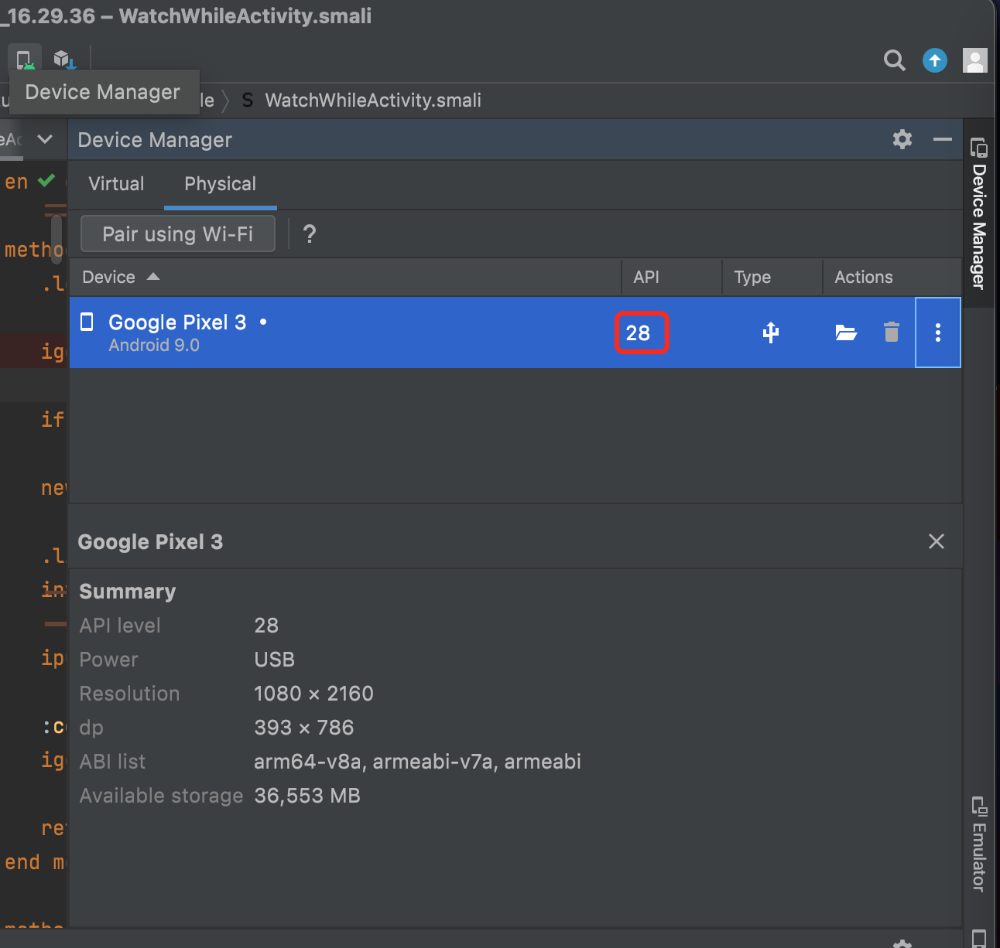
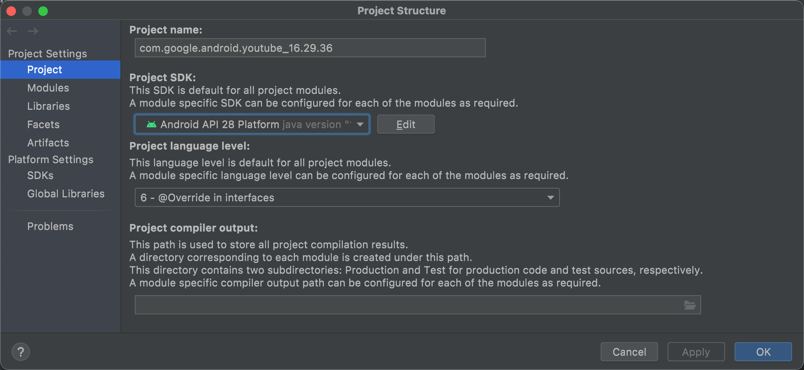
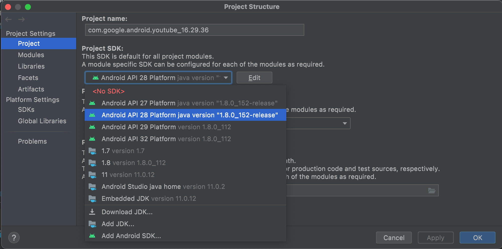

# 配置AS项目

Android Studio项目初始化配置

主要是：

`File`->`Project Structure`->`Project Settings`->`Project SDK`：

设置为和安卓设备的`Android API Level`=`sdkVersion`一致的值：

此处：Android设备是`Google Pixe 3`，API是`Android 9`=`Android API 28`

所以设置为：

* `Android API 28 Platform`
  * 
    * 

TODO：

* 【基本解决】安卓AS调试apk的smali：新建和设置远程调试配置
* 【已解决】安卓AS调试apk的smali：初始化配置AS调试环境
