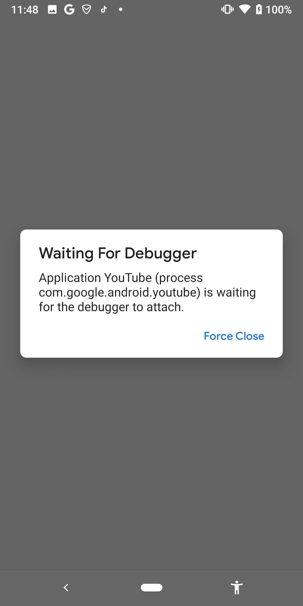

# 调试方式启动app

以调试方式启动app：

* 目的：这样启动的app，才可以被调试，方便被调试

此处以调试方式启动`YouTube`的app：

```bash
adb shell am start -D -n com.google.android.youtube/com.google.android.apps.youtube.app.application.Shell_HomeActivity
```

说明：

* `-D`：表示`debug`模式
* `com.google.android.youtube/com.google.android.apps.youtube.app.application.Shell_HomeActivity`
  * `com.google.android.youtube`
    * app包名=package
  * `com.google.android.apps.youtube.app.application.Shell_HomeActivity`
    * app的主页面=MainActivity

以调试模式启动后的效果：



启动后，app没有立刻正常运行，而是显示 `Waiting For Debugger`

并且：此界面不会消失，直到对应的debugger调试器连接上，开始调试，此界面才消失，才继续开始运行app

说明：

## 如何获取app的包名

`Youtube`包名：`com.google.android.youtube`

* 方式1：`pm`

举例：

```bash
~  adb shell pm list packages -f | grep youtube
package:/data/app/com.google.android.youtube-9Nw_99XIz2jZh7Lyor2SKQ==/base.apk=com.google.android.youtube
```

* 方式2：`aapt`

```bash
 aapt dump badging com.google.android.youtube_16.29.36.apk | grep package
package: name='com.google.android.youtube' versionCode='1522263488' versionName='16.29.36' compileSdkVersion='31' compileSdkVersionCodename='12'
```

## 如何获取app的MainActivity

app的首页的`activity`，一般被叫做`MainActivity`

一般情况是：`apktool`逆向导出的`xml`格式的`AndroidManifest.xml`中，找到`android.intent.action.MAIN`所属于的`activity`，就是`MainActivity`

-》此处YouTube的情况稍微特殊点：

`AndroidManifest.xml`

```xml
        <activity android:exported="true" android:name="com.google.android.apps.youtube.app.application.Shell_HomeActivity" android:theme="@style/Theme.YouTube.Launcher"/>
        <activity-alias android:exported="true" android:name="com.google.android.youtube.HomeActivity" android:targetActivity="com.google.android.apps.youtube.app.application.Shell_HomeActivity"/>
        <activity-alias android:exported="true" android:name="com.google.android.youtube.app.application.Shell$HomeActivity" android:targetActivity="com.google.android.apps.youtube.app.application.Shell_HomeActivity"/>
        <activity-alias android:exported="true" android:name="com.google.android.youtube.app.honeycomb.Shell$HomeActivity" android:targetActivity="com.google.android.apps.youtube.app.application.Shell_HomeActivity">
            <intent-filter>
                <action android:name="android.intent.action.MAIN"/>
                <category android:name="android.intent.category.DEFAULT"/>
                <category android:name="android.intent.category.LAUNCHER"/>
            </intent-filter>
```

找到：

* `android.intent.action.MAIN`

所属的activity是：

* `com.google.android.youtube.app.honeycomb.Shell$HomeActivity`

其是个别名`alias`，对应着`真正的activity`=`MainActivity`是：

* `com.google.android.apps.youtube.app.application.Shell_HomeActivity`


TODO：

* 【已解决】获取安卓apk应用的app的主界面activity即MainActivity
