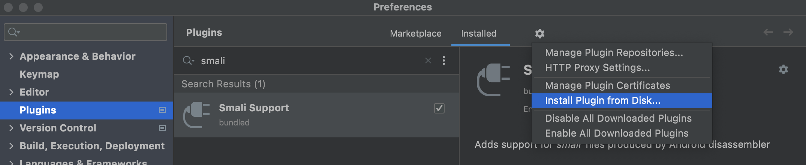
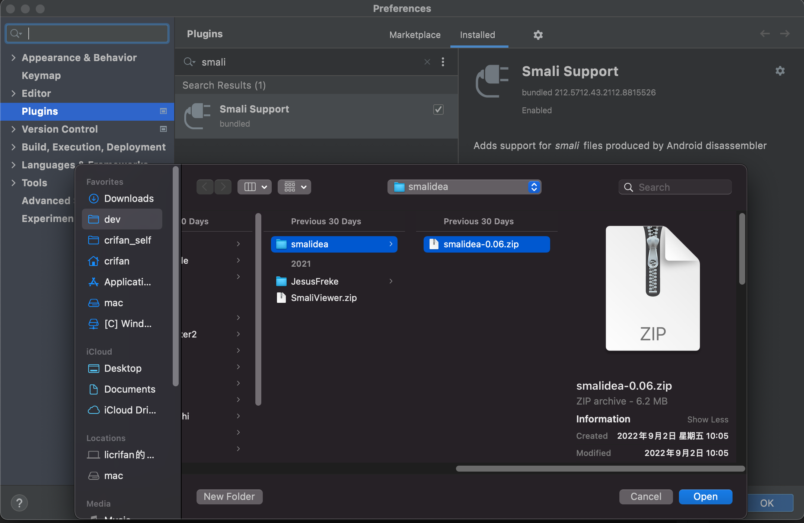
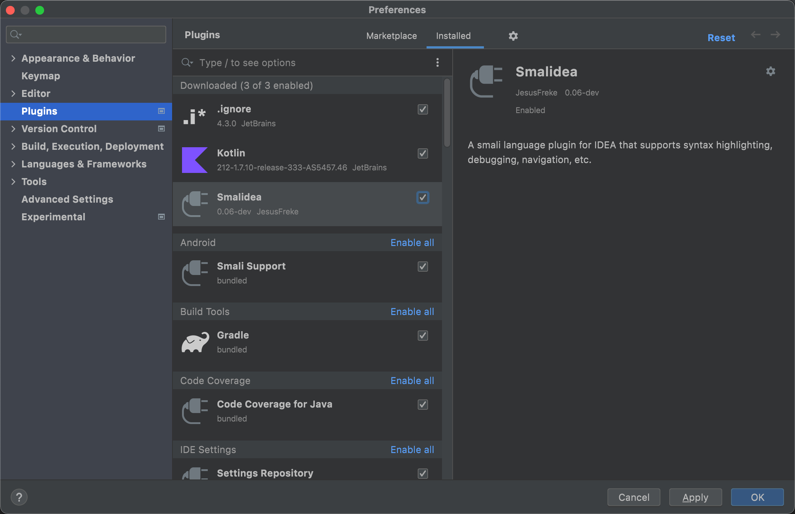

# 调试工具选择

* 调试安卓apk 的工具/环境
  * `Android Studio` + `smalidea`插件：调试`smali`
  * `JDB`：调试`Smali`
  * `IDA`：调试`dex`
  * `Qtrace`

此处选择，相对易用的：

* `Android Studio` + `smalidea`插件：调试`smali`

## Android Studio中安装smali插件`smalidea`

* 安装AS插件：`Smalidea`
  * AS中搜索并点击安装`Smalidea`
  * 手动下载zip从再手动安装
    * 从[JesusFreke / smalidea / Downloads — Bitbucket](https://bitbucket.org/JesusFreke/smalidea/downloads/)下载插件压缩包文件
      * https://bitbucket.org/JesusFreke/smalidea/downloads/smalidea-0.06.zip
    * 然后AS中`Install Plugin from Disk`
      * 
      * 

-> 安装后的`Smalidea`插件：

