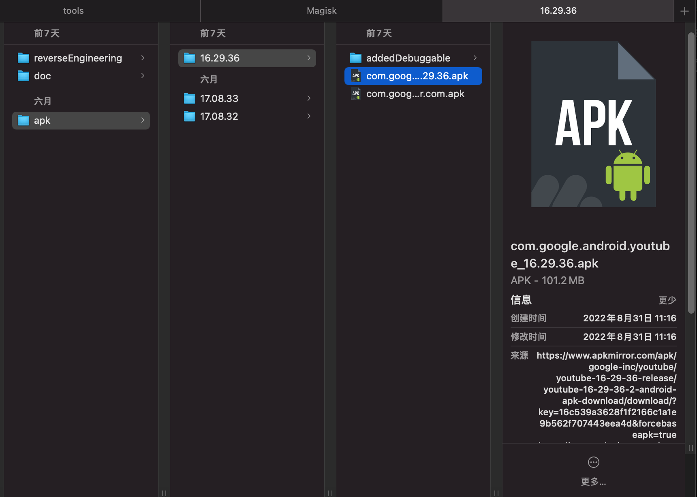
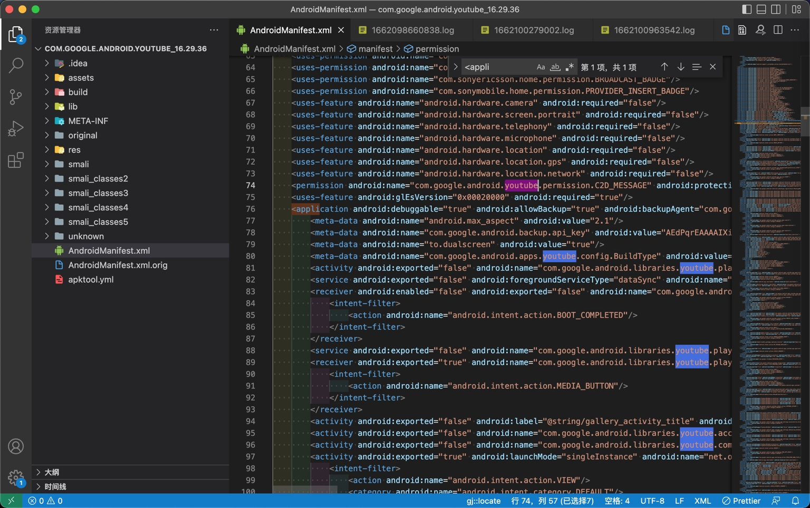

# 反编译出smali

反编译`apk`，得到`smali`源码

常见反编译工具：

* [Apktool](https://ibotpeaches.github.io/Apktool/install/)
  * 直接1步：apk to smali
* [baksmali](https://github.com/JesusFreke/smali)
  * 要2步：先 apk to dex，再 dex to smali

此处用`apktool`去反编译YouTube的apk：



去反编译得到包含`smali`源码的目录：

```bash
apktool d --use-aapt2 ../../apk/16.29.36/com.google.android.youtube_16.29.36.apk
```

如果要指定输出目录，也可以加上`-o`

```bash
apktool d --use-aapt2 ../../apk/16.29.36/com.google.android.youtube_16.29.36.apk -o com.google.android.youtube_16.29.36_aapt2
```

输出的目录的内容：



* 一个或多个`smali`目录
  * 注：每个`smali`目录，对应着`apk`内部的`dex`文件
* `AndroidManifest.xml`
  * 文本模式的，有`apk`核心的配置和参数
