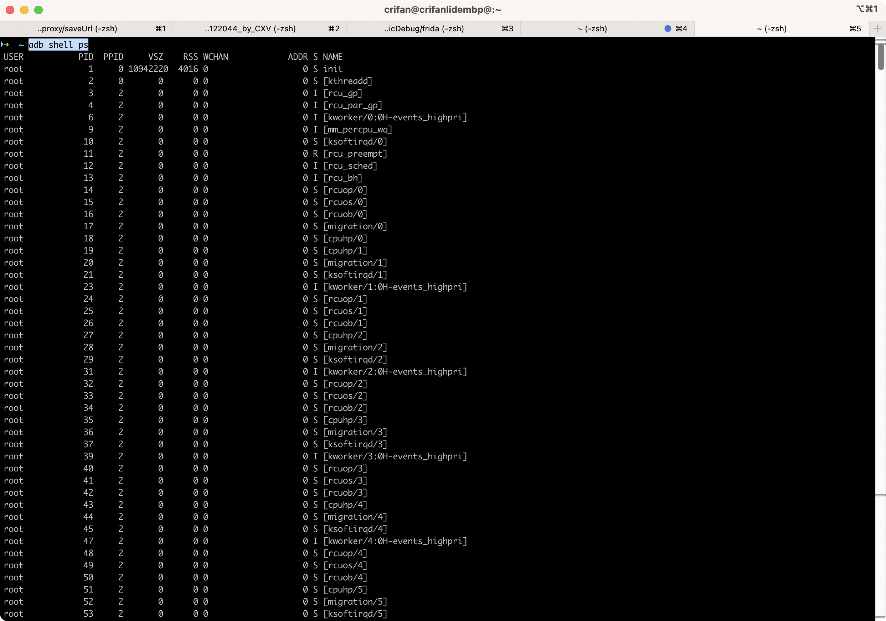
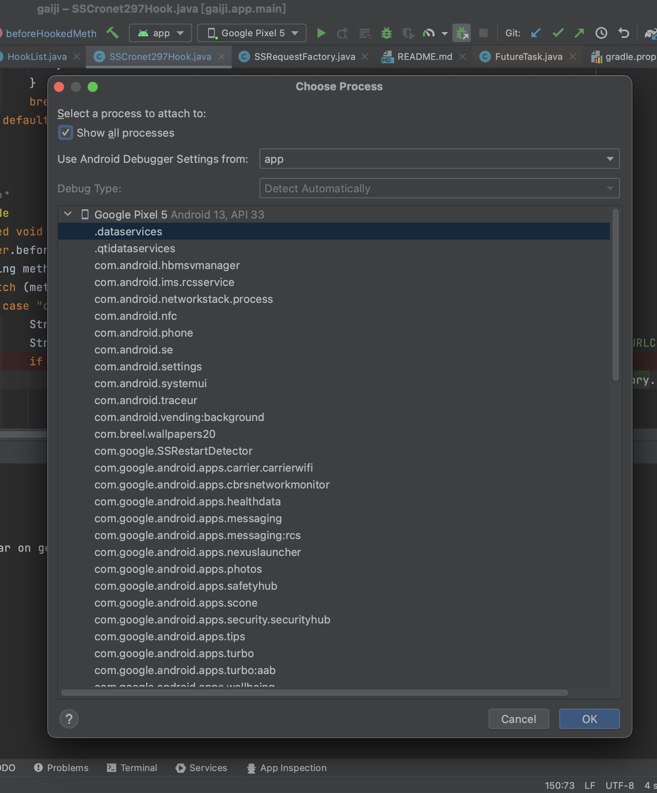
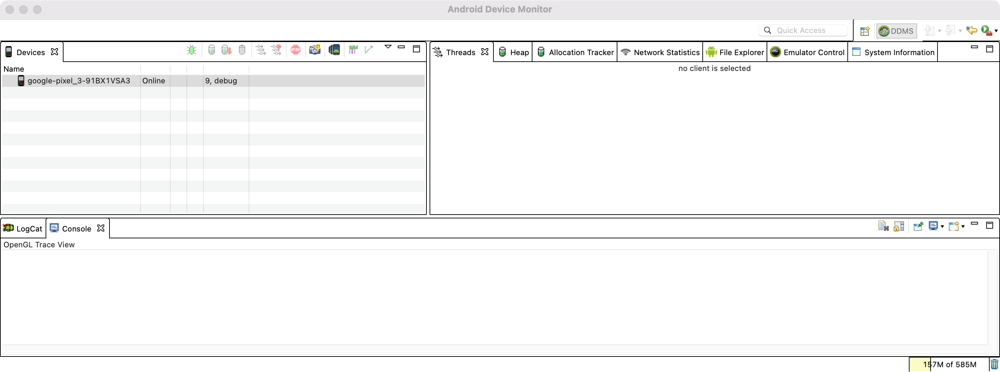
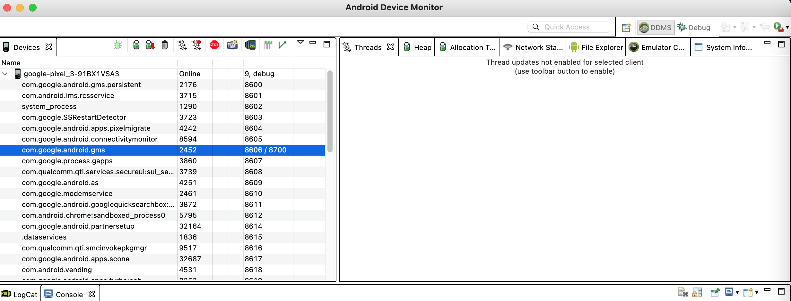

# 可获取全部进程列表

此处要确保：

* 可以查看到全部进程列表
  * adb shell中
    * `adb shell ps`能输出全部进程列表
      * 
  * `Android Studio`中
    * `Attach Debugger to Android Process`的`Choose Process`中，（勾选了`Show all processes`后）
      * 

否则如果不满足上述条件，则后续无法顺利调试。

## 之前遇到的各种情况

此处记录和整理，之前遇到的各种情况：

* adb没有root权限
  * 现象：`adb shell`的子命令，包括`ps`，无法直接运行（要么报错，要么没权限，要么没返回结果）
    * 相应的，`adb shell ps`，也无法列出全部进程的列表
  * 解决办法：
    * 是Magisk的插件`ADB Root`的问题，关闭`ADB Root`，就解决问题了。
* 没有开启app可调试
  * 现象：`adb shell getprop ro.debuggable`输出`0`
  * 解决办法：
    * 参考：[app可调试](../../../debug_smali/steps/detail/app_debuggable.md)，用Magisk的插件`MagiskHide Props Config`，去新增设置`ro.debuggable = 1`
  * 效果：开启了app可调试权限：
    * `adb shell getprop ro.debuggable`输出`1`
* `Android Device Monitor`(注：已废弃`DDMS`)，中看不到进程列表
  * 现象
    * 
  * 原因：adb没有权限
  * 解决办法：
    * 用Magisk给adb授予root权限
  * 效果
    * 
