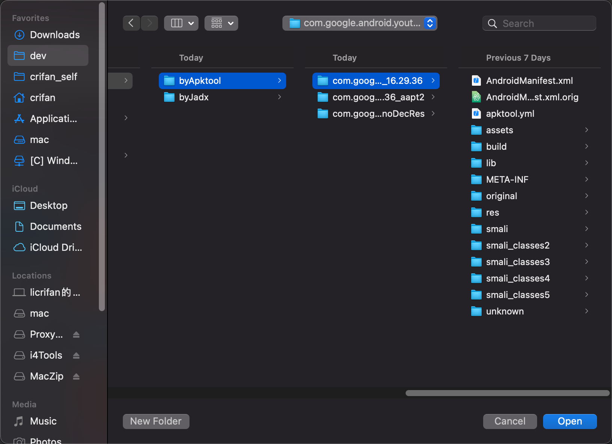
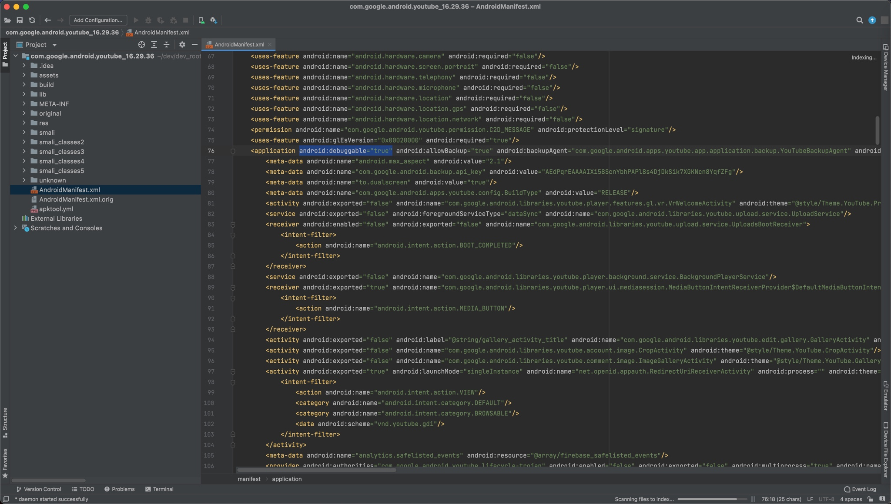
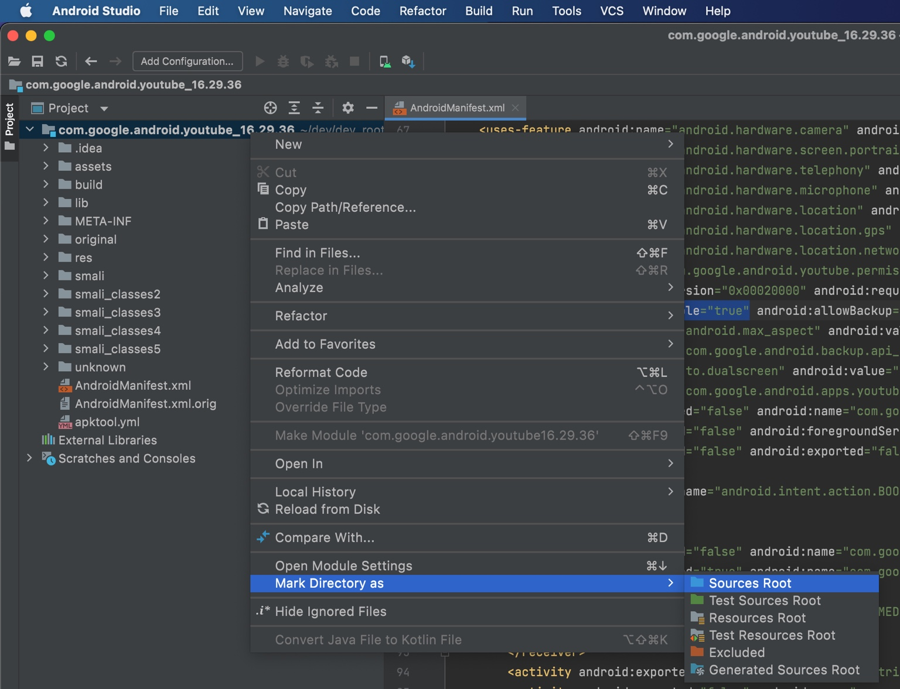

# AS中导入smali代码

导入带`smali`源码的目录到`Android Studio`作为新项目：

导入smali的源码：

新版`Android Studio`的`Welcome to Android Studio`欢迎对话框中，点击：

* `Open`
  * 

去选择对应的，`Apktool`反编译后的输出的目录：

导入后，即可：

然后把根目录设置为**源代码根目录**：

`Mark Directory as Source Root`

注：其实不需要像别人说的：

* 一定要：
  * 只导入smali代码到项目中
  * 只能把smali代码所在目录去mark as source root

而是：

* 只要当前项目中包含了smali代码

即可。

TODO：

* 【已解决】安卓AS调试apk的smali：导入apktool反编译的源码作为项目代码
