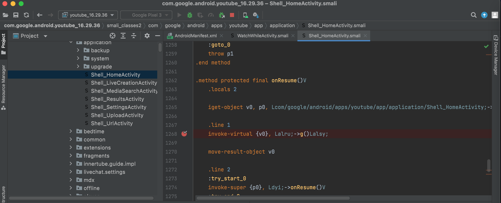
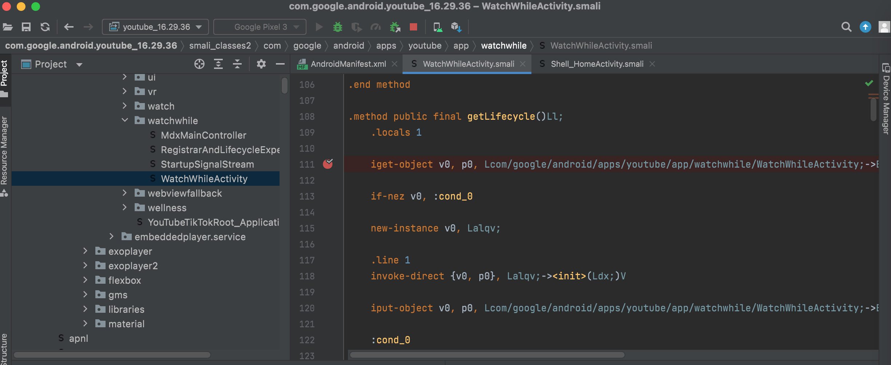

# 给smali加断点

给Smali代码加断点：

* 先(重点)是：找到要加断点的地方
* 再去加断点

## 如何找到要加断点的位置？

要在哪里加断点？

才能实现，app运行时触发到断点而停下来，供自己调试

一般逻辑是：

* 找到最有可能运行到的代码的逻辑对应的地方
  * 入口的`MainActivity`
    * 前面的：如何获取app的`MainActivity`，已经解释过
      * 此处`YouTube`就是：`com.google.android.apps.youtube.app.application.Shell_HomeActivity`
  * 或者是你调试时的看到的**顶层页面**

### 获取顶层页面的activity

```bash
 adb shell dumpsys activity top | grep --color=always ACTIVITY
...
  ACTIVITY com.google.android.youtube/com.google.android.apps.youtube.app.watchwhile.WatchWhileActivity 781cc07 pid=20720
```

-》

* 此处`YouTube`的顶层页面是：
  * `com.google.android.apps.youtube.app.watchwhile.WatchWhileActivity`

然后就可以去，此处`Apktool`反编译后的，`smali`的源码所在位置了：

* `com.google.android.youtube_16.29.36`
  * `smali_classes2/com/google/android/apps/youtube/app/application/Shell_HomeActivity.smali`
  * `smali_classes2/com/google/android/apps/youtube/app/watchwhile/WatchWhileActivity.smali`

找到了smali文件位置

### 给哪些函数打断点？

再说说：具体给哪些函数打断点

-》代码运行才能，才容易触发到断点停下来（我们才好调试）

这部分涉及到安卓的正向开发知识

概述是：

* `onResume`
* `onStart`
* `getLifecycle`
* 等等

如此，去找：

* `com.google.android.youtube_16.29.36`
  * `smali_classes2/com/google/android/apps/youtube/app/application/Shell_HomeActivity.smali`
  * `smali_classes2/com/google/android/apps/youtube/app/watchwhile/WatchWhileActivity.smali`

的

* `onResume`
* `onStart`
* `getLifecycle`

等函数，去打断点：





TODO：

【已解决】Android Studio调试Smali：给YouTube的smali代码加断点
