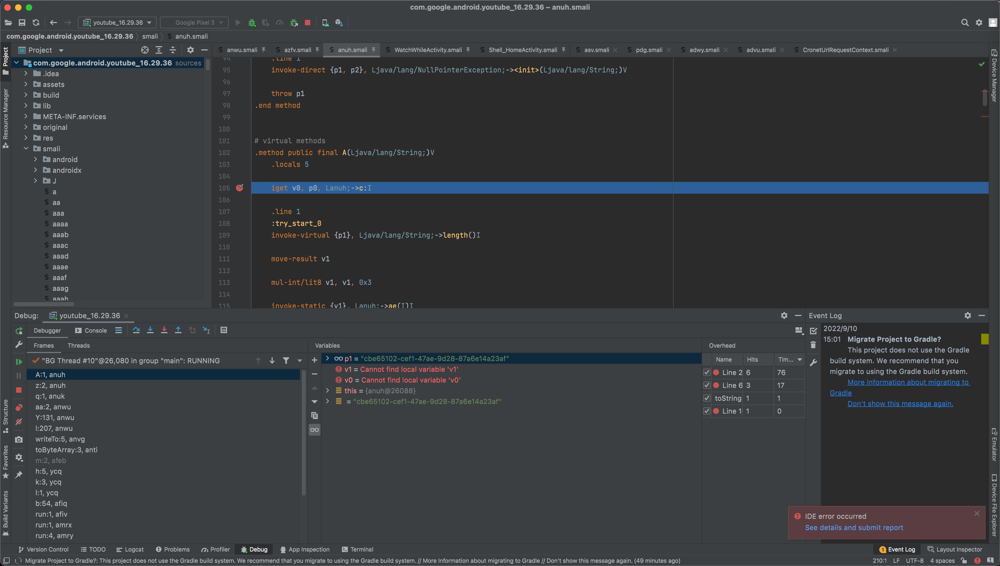
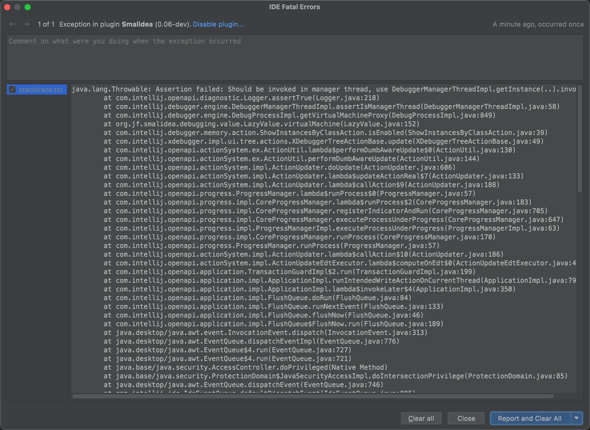

# 调试Smali心得

## AndroidStudio调试Smali代码

TODO：

* smali断点不生效
  * 【未解决】再次出现AS调试Google Pixel3中的YouTube的问题：Smali断点不生效
  * 【记录】Android 11的Google Pixel3中确认adb shell是否工作正常
  * 【未解决】尝试解决Android Studio中smali断点不生效：调试相关设置
  * 【未解决】尝试解决Android Studio中smali断点不生效：smali文件类型File type
  * 【未解决】尝试解决Android Studio中smali断点不生效：卸载重装smalidea插件
  * 【未解决】尝试解决Android Studio中smali断点不生效：故意打开ADM的DDMS有冲突多试试
  * 【未解决】尝试解决Android Studio中smali断点不生效：Android Studio中adb相关设置
  * 【未解决】尝试解决Android Studio中smali断点不生效：用DDMS和monitor配合试试
  * 【未解决】尝试解决Android Studio中smali断点不生效：USB数据线和端口相关
  * 【未解决】Android Studio调试Smali：通过Remote JVM Debug的attach to remote VM的调试按钮去调试
  * 【已解决】Android Device Monitor的DDMS中看不到app包名进程的名称都是问号
  * 【未解决】尝试解决Android Studio中smali断点不生效：JDWP进程相关
  * 【未解决】尝试解决Android Studio中smali断点不生效：Smali插件相关

---

安卓逆向期间，折腾Android Studio去调试smali代码，其实更麻烦的不在于搞懂本身的流程，而在于：

找到一个好用的调试设备：已root好的，可以顺利调试的安卓手机

因为期间遇到Google Pixel 3的adb异常，导致adb shell各种命令无法正常运行，包括adb的ps无法正常获取进程列表

从而导致后续调试时AS中看不到进程，折腾了很长时间，才确认，就是adb方面的问题导致的。

解决了该问题了，AS中能attach到进程，后续就顺利多了。

并且另外Google Pixel 3本身不稳定，导致虽然开始能调试，但是后来出现开发者选项崩溃的问题，无法进入设置了。对于正常安卓逆向开发，也有很大影响。

总之：还是要找个靠谱的root后的安卓手机，才能保证后续安卓逆向的顺利。

## 如何调试Smali代码逻辑

TODO：

* 【记录】用Android Studio调试YouTube的smali代码：smali/anwu.smali
* 【记录】用Android Studio调试YouTube的smali代码：smali_classes2/azfv.smali
* 【记录】用Android Studio调试YouTube的smali代码：smali/anuh.smali
* 【记录】用Android Studio调试YouTube的smali代码：smali_classes2的WatchWhileActivity.smali
* 
* 【记录】用AS调试YouTube的Smali代码：调试相关业务逻辑
* 【未解决】给AS调试YouTube的Smali代码：加url过滤
* 【已解决】Xposed如何hook混淆后的安卓应用中的类名和函数名

---

## 调试Smali常见问题

用AS去调试Smali期间，时不时的遇到一些错误，整理如下：

### IDE error occurred See details and submit report

* 现象：AS中用Smalidea插件调试smali代码期间，突然的出现报错

```bash
IDE error occurred
See details and submit report
```



点击`See details and submit report`，看到详情：



```bash
Exception in plugin Smalidea

java.lang.Throwable: Assertion failed: Should be invoked in manager thread, use DebuggerManagerThreadImpl.getInstance(..).invoke...
    at com.intellij.openapi.diagnostic.Logger.assertTrue(Logger.java:218)
    at com.intellij.debugger.engine.DebuggerManagerThreadImpl.assertIsManagerThread(DebuggerManagerThreadImpl.java:58)
    at com.intellij.debugger.engine.DebugProcessImpl.getVirtualMachineProxy(DebugProcessImpl.java:849)
    at org.jf.smalidea.debugging.value.LazyValue.virtualMachine(LazyValue.java:152)
    at com.intellij.debugger.memory.action.ShowInstancesByClassAction.isEnabled(ShowInstancesByClassAction.java:39)
    at com.intellij.xdebugger.impl.ui.tree.actions.XDebuggerTreeActionBase.update(XDebuggerTreeActionBase.java:49)
    at com.intellij.openapi.actionSystem.ex.ActionUtil.lambda$performDumbAwareUpdate$0(ActionUtil.java:130)
    at com.intellij.openapi.actionSystem.ex.ActionUtil.performDumbAwareUpdate(ActionUtil.java:144)
    at com.intellij.openapi.actionSystem.impl.ActionUpdater.doUpdate(ActionUpdater.java:606)
    at com.intellij.openapi.actionSystem.impl.ActionUpdater.lambda$updateActionReal$7(ActionUpdater.java:133)
    at com.intellij.openapi.actionSystem.impl.ActionUpdater.lambda$callAction$9(ActionUpdater.java:188)
    at com.intellij.openapi.progress.ProgressManager.lambda$runProcess$0(ProgressManager.java:57)
    at com.intellij.openapi.progress.impl.CoreProgressManager.lambda$runProcess$2(CoreProgressManager.java:183)
    at com.intellij.openapi.progress.impl.CoreProgressManager.registerIndicatorAndRun(CoreProgressManager.java:705)
    at com.intellij.openapi.progress.impl.CoreProgressManager.executeProcessUnderProgress(CoreProgressManager.java:647)
    at com.intellij.openapi.progress.impl.ProgressManagerImpl.executeProcessUnderProgress(ProgressManagerImpl.java:63)
    at com.intellij.openapi.progress.impl.CoreProgressManager.runProcess(CoreProgressManager.java:170)
    at com.intellij.openapi.progress.ProgressManager.runProcess(ProgressManager.java:57)
    at com.intellij.openapi.actionSystem.impl.ActionUpdater.lambda$callAction$10(ActionUpdater.java:186)
    at com.intellij.openapi.actionSystem.impl.ActionUpdateEdtExecutor.lambda$computeOnEdt$0(ActionUpdateEdtExecutor.java:45)
    at com.intellij.openapi.application.TransactionGuardImpl$2.run(TransactionGuardImpl.java:199)
    at com.intellij.openapi.application.impl.ApplicationImpl.runIntendedWriteActionOnCurrentThread(ApplicationImpl.java:794)
    at com.intellij.openapi.application.impl.ApplicationImpl.lambda$invokeLater$4(ApplicationImpl.java:350)
    at com.intellij.openapi.application.impl.FlushQueue.doRun(FlushQueue.java:84)
    at com.intellij.openapi.application.impl.FlushQueue.runNextEvent(FlushQueue.java:133)
    at com.intellij.openapi.application.impl.FlushQueue.flushNow(FlushQueue.java:46)
    at com.intellij.openapi.application.impl.FlushQueue$FlushNow.run(FlushQueue.java:189)
    at java.desktop/java.awt.event.InvocationEvent.dispatch(InvocationEvent.java:313)
    at java.desktop/java.awt.EventQueue.dispatchEventImpl(EventQueue.java:776)
    at java.desktop/java.awt.EventQueue$4.run(EventQueue.java:727)
    at java.desktop/java.awt.EventQueue$4.run(EventQueue.java:721)
    at java.base/java.security.AccessController.doPrivileged(Native Method)
    at java.base/java.security.ProtectionDomain$JavaSecurityAccessImpl.doIntersectionPrivilege(ProtectionDomain.java:85)
    at java.desktop/java.awt.EventQueue.dispatchEvent(EventQueue.java:746)
    at com.intellij.ide.IdeEventQueue.defaultDispatchEvent(IdeEventQueue.java:885)
    at com.intellij.ide.IdeEventQueue._dispatchEvent(IdeEventQueue.java:754)
    at com.intellij.ide.IdeEventQueue.lambda$dispatchEvent$6(IdeEventQueue.java:441)
    at com.intellij.openapi.progress.impl.CoreProgressManager.computePrioritized(CoreProgressManager.java:825)
    at com.intellij.ide.IdeEventQueue.lambda$dispatchEvent$7(IdeEventQueue.java:440)
    at com.intellij.openapi.application.impl.ApplicationImpl.runIntendedWriteActionOnCurrentThread(ApplicationImpl.java:794)
    at com.intellij.ide.IdeEventQueue.dispatchEvent(IdeEventQueue.java:486)
    at com.intellij.openapi.actionSystem.impl.Utils.lambda$expandActionGroupImpl$1(Utils.java:166)
    at com.intellij.openapi.actionSystem.impl.Utils.runLoopAndWaitForFuture(Utils.java:530)
    at com.intellij.openapi.actionSystem.impl.Utils.expandActionGroupImpl(Utils.java:159)
    at com.intellij.openapi.actionSystem.impl.Utils.fillMenu(Utils.java:244)
    at com.intellij.openapi.actionSystem.impl.ActionPopupMenuImpl$MyMenu.lambda$updateChildren$1(ActionPopupMenuImpl.java:180)
    at com.intellij.util.TimeoutUtil.run(TimeoutUtil.java:104)
    at com.intellij.openapi.actionSystem.impl.ActionPopupMenuImpl$MyMenu.lambda$updateChildren$3(ActionPopupMenuImpl.java:179)
    at com.intellij.openapi.actionSystem.impl.Utils.performWithRetries(Utils.java:570)
    at com.intellij.openapi.actionSystem.impl.ActionPopupMenuImpl$MyMenu.updateChildren(ActionPopupMenuImpl.java:178)
    at com.intellij.openapi.actionSystem.impl.ActionPopupMenuImpl$MyMenu.show(ActionPopupMenuImpl.java:138)
    at com.intellij.ui.PopupHandler$2.invokePopup(PopupHandler.java:130)
    at com.intellij.ui.PopupHandler.mousePressed(PopupHandler.java:48)
    at java.desktop/java.awt.AWTEventMulticaster.mousePressed(AWTEventMulticaster.java:288)
    at java.desktop/java.awt.AWTEventMulticaster.mousePressed(AWTEventMulticaster.java:287)
    at java.desktop/java.awt.AWTEventMulticaster.mousePressed(AWTEventMulticaster.java:287)
    at java.desktop/java.awt.AWTEventMulticaster.mousePressed(AWTEventMulticaster.java:287)
    at java.desktop/java.awt.AWTEventMulticaster.mousePressed(AWTEventMulticaster.java:287)
    at java.desktop/java.awt.Component.processMouseEvent(Component.java:6649)
    at java.desktop/javax.swing.JComponent.processMouseEvent(JComponent.java:3345)
    at com.intellij.ui.treeStructure.Tree.processMouseEvent(Tree.java:394)
    at com.intellij.ide.dnd.aware.DnDAwareTree.processMouseEvent(DnDAwareTree.java:44)
    at java.desktop/java.awt.Component.processEvent(Component.java:6417)
    at java.desktop/java.awt.Container.processEvent(Container.java:2263)
    at java.desktop/java.awt.Component.dispatchEventImpl(Component.java:5027)
    at java.desktop/java.awt.Container.dispatchEventImpl(Container.java:2321)
    at java.desktop/java.awt.Component.dispatchEvent(Component.java:4859)
    at java.desktop/java.awt.LightweightDispatcher.retargetMouseEvent(Container.java:4918)
    at java.desktop/java.awt.LightweightDispatcher.processMouseEvent(Container.java:4544)
    at java.desktop/java.awt.LightweightDispatcher.dispatchEvent(Container.java:4488)
    at java.desktop/java.awt.Container.dispatchEventImpl(Container.java:2307)
    at java.desktop/java.awt.Window.dispatchEventImpl(Window.java:2784)
    at java.desktop/java.awt.Component.dispatchEvent(Component.java:4859)
    at java.desktop/java.awt.EventQueue.dispatchEventImpl(EventQueue.java:778)
    at java.desktop/java.awt.EventQueue$4.run(EventQueue.java:727)
    at java.desktop/java.awt.EventQueue$4.run(EventQueue.java:721)
    at java.base/java.security.AccessController.doPrivileged(Native Method)
    at java.base/java.security.ProtectionDomain$JavaSecurityAccessImpl.doIntersectionPrivilege(ProtectionDomain.java:85)
    at java.base/java.security.ProtectionDomain$JavaSecurityAccessImpl.doIntersectionPrivilege(ProtectionDomain.java:95)
    at java.desktop/java.awt.EventQueue$5.run(EventQueue.java:751)
    at java.desktop/java.awt.EventQueue$5.run(EventQueue.java:749)
    at java.base/java.security.AccessController.doPrivileged(Native Method)
    at java.base/java.security.ProtectionDomain$JavaSecurityAccessImpl.doIntersectionPrivilege(ProtectionDomain.java:85)
    at java.desktop/java.awt.EventQueue.dispatchEvent(EventQueue.java:748)
    at com.intellij.ide.IdeEventQueue.defaultDispatchEvent(IdeEventQueue.java:885)
    at com.intellij.ide.IdeEventQueue.dispatchMouseEvent(IdeEventQueue.java:814)
    at com.intellij.ide.IdeEventQueue._dispatchEvent(IdeEventQueue.java:751)
    at com.intellij.ide.IdeEventQueue.lambda$dispatchEvent$6(IdeEventQueue.java:441)
    at com.intellij.openapi.progress.impl.CoreProgressManager.computePrioritized(CoreProgressManager.java:825)
    at com.intellij.ide.IdeEventQueue.lambda$dispatchEvent$7(IdeEventQueue.java:440)
    at com.intellij.openapi.application.impl.ApplicationImpl.runIntendedWriteActionOnCurrentThread(ApplicationImpl.java:794)
    at com.intellij.ide.IdeEventQueue.dispatchEvent(IdeEventQueue.java:492)
    at java.desktop/java.awt.EventDispatchThread.pumpOneEventForFilters(EventDispatchThread.java:203)
    at java.desktop/java.awt.EventDispatchThread.pumpEventsForFilter(EventDispatchThread.java:124)
    at java.desktop/java.awt.EventDispatchThread.pumpEventsForHierarchy(EventDispatchThread.java:113)
    at java.desktop/java.awt.EventDispatchThread.pumpEvents(EventDispatchThread.java:109)
    at java.desktop/java.awt.EventDispatchThread.pumpEvents(EventDispatchThread.java:101)
    at java.desktop/java.awt.EventDispatchThread.run(EventDispatchThread.java:90)
```

* 原因：Smalidea插件的bug
* 解决办法：暂无
