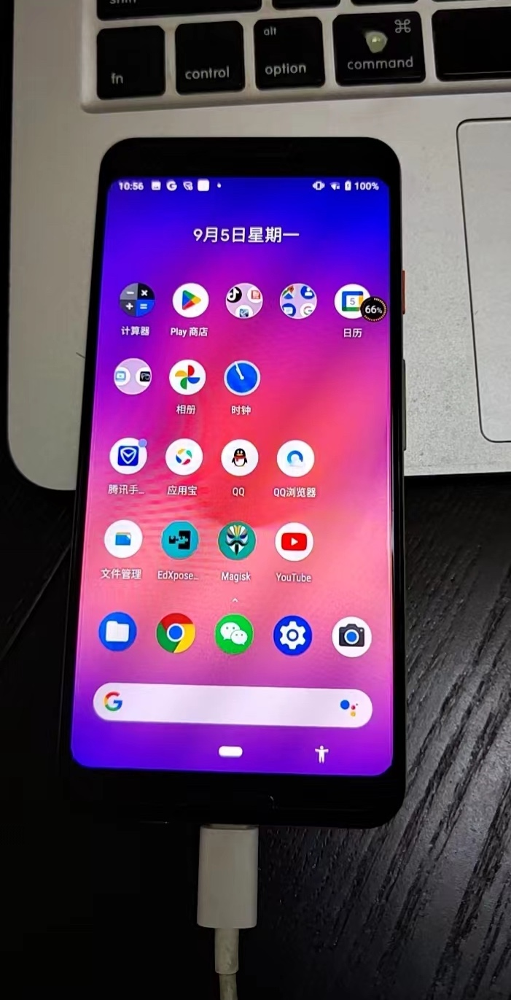
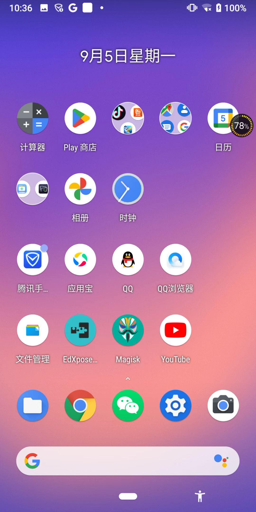
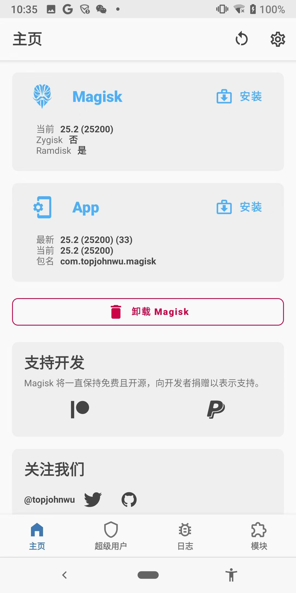
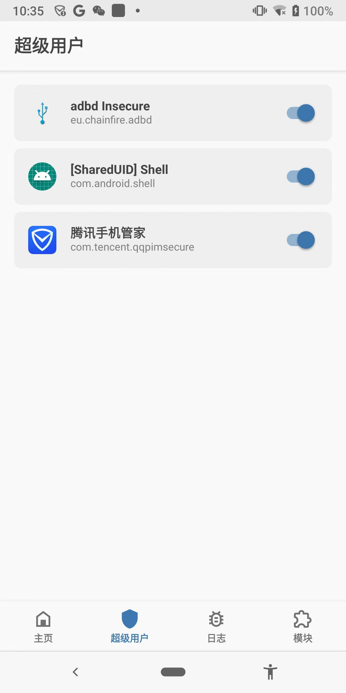

# 确保安卓已root

确保安卓设备已root：

此处之前买的二手的`Google Pixel 3`，已root：

自带安装了：

* `Magisk Manager`
  * 图
    * 
    * 
  * 升级后是：`Magisk`
    * 内部包含：
      * `Magisk`（的框架）
      * `App`=`Manager`：管理配置界面的app

且已给相关app授权了root权限：

* （对应着）`adb shell`中首次`su`后，即可申请`root权限`，允许后，此处就会出现：
  * `Shell` = `com.android.shell`
    * 
