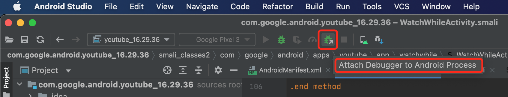
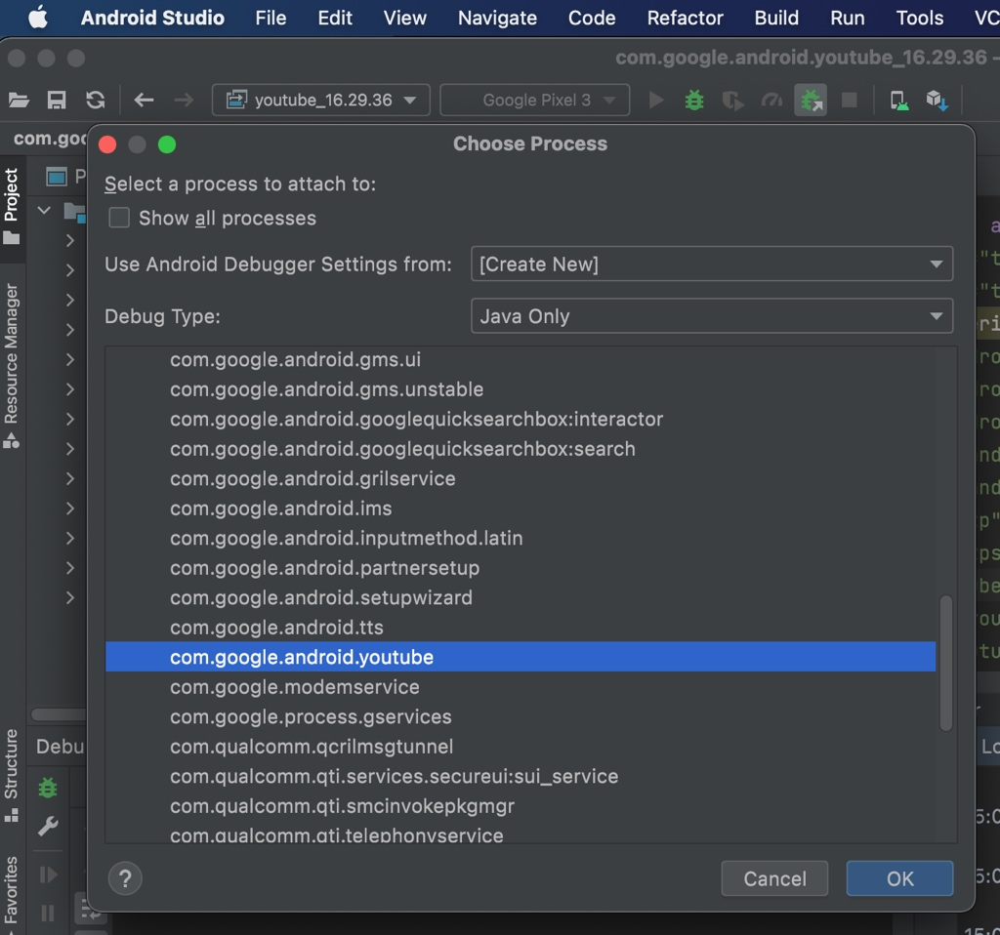
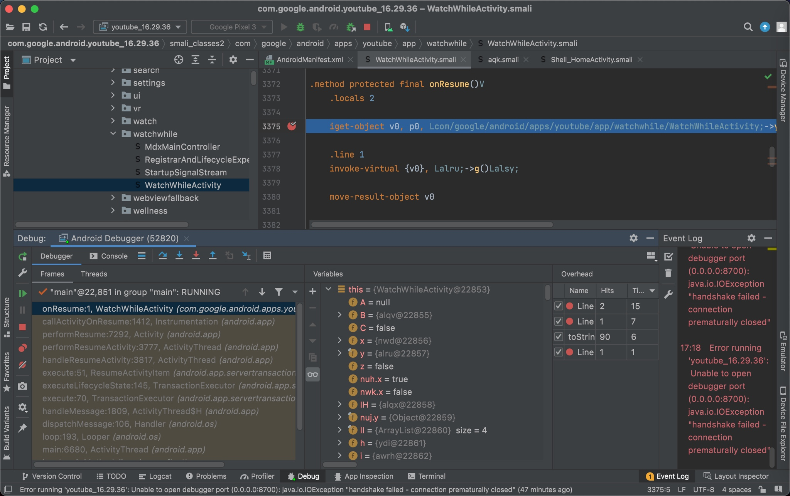
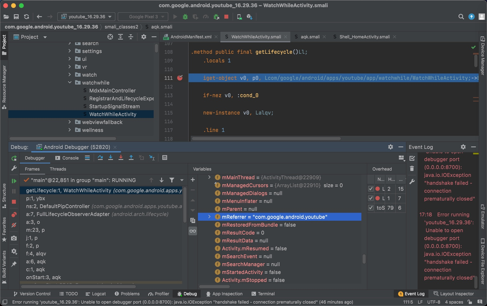

# AS调试app进程

TODO：

* 查看参数变量值
  * 【已解决】Android Studio调试Smali代码：如何查看函数的局部变量临时变量的值
  * 【已解决】Android Studio调试Smali代码：如何查看函数的全部参数的值
  * 【已解决】Android 11的Google Pixel3中AS调试YouTube的Smali代码
  * 【已解决】Android Studio调试smali代码：查看变量值出错internal error

---

Android Studio中调试设备端的app进程

* `Attach Debugger to Android Process`
  * 

进入`Choose Process`弹框页面

正常会显示出安卓设备，且会列出设备中可调试的众多进程

选择对应的要调试（此处是`YouTube`）的进程：

即可顺利启动调试

并触发之前加的断点了：

> #### warning:: 如果没启动或断点没生效，则重新点击调试
> 有时候，至少此处经常发生：点击了一次 `Attach Debugger to Android Process`+`OK`，虽然启动了YouTube，但是无法调试进程
> 
> 所以经常需要再去重新点击一次  `Attach Debugger to Android Process`+`OK`，然后就可以正常调试，触发断点了
> 
> 但是其实感觉是：没有真正挂上安卓手机中YouTube的进程，因为此时YouTube的app端还在正常运行
> 
> 感觉是此处调试环境还是有点问题的，有空再去深究原因。

TODO：

* 【基本解决】安卓AS调试apk的smali：新建和设置远程调试配置
* 【已解决】安卓AS调试apk的smali：初始化配置AS调试环境
* 【未解决】用Android Studio调试YouTube的smali代码：request请求发送相关的位置
* 【未解决】用root的安卓手机OPPO R11s去配合Android Studio调试YouTube的Smali代码
* 【已解决】安卓YouTube逆向：搭建安卓apk动态调试环境
