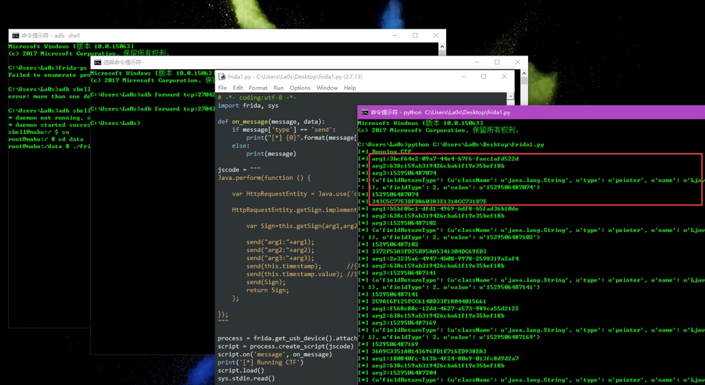
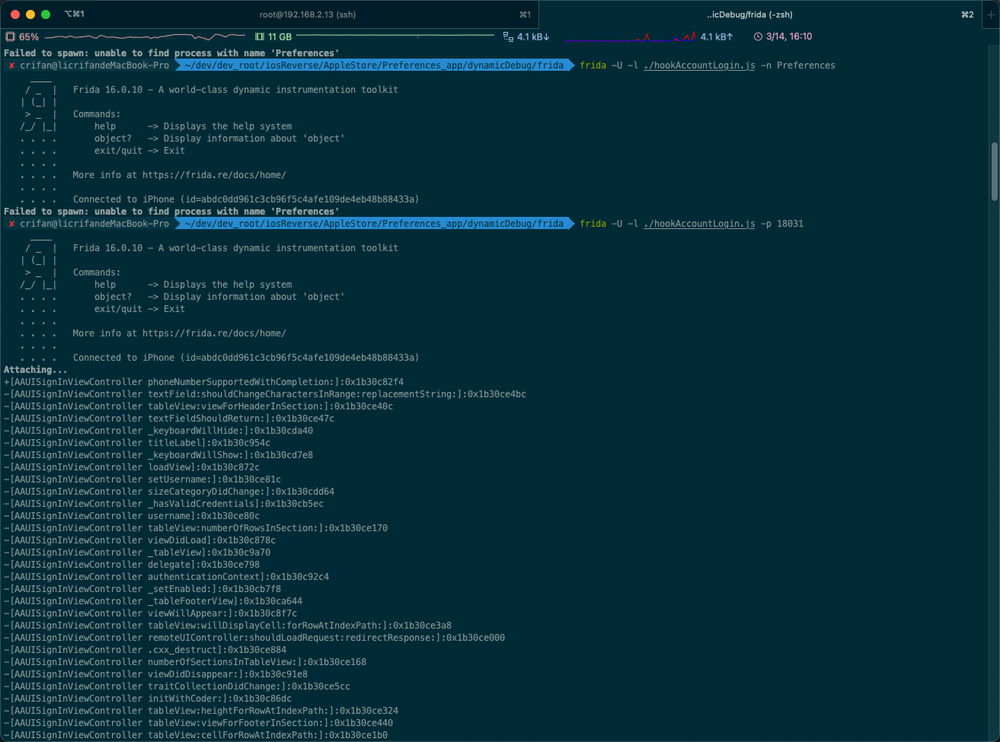

# Frida调试安卓

* `Frida`
  * 概述
    * **iOS逆向**和**Android逆向**中常用的动态调试工具之一
    * 用于动态调试程序逻辑，实现各种调试功能
    * 核心使用逻辑是`frida+js脚本`，或`frida-trace`追踪函数执行过程
      * 以及高级的`Frida`的`Stalker`追踪函数实际运行过程等等
  * 主页
    * 官网
      * https://frida.re/
    * Github
      * https://github.com/frida/frida
* 截图
  * Windows
    * 
  * Mac
    * 
* 详解
  * 独立子教程
    * [逆向调试利器：Frida](https://book.crifan.org/books/reverse_debug_frida/website/)
