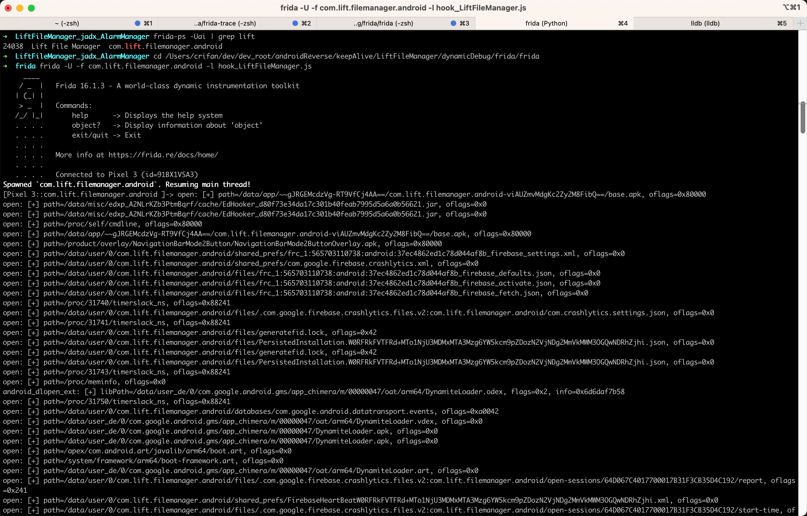
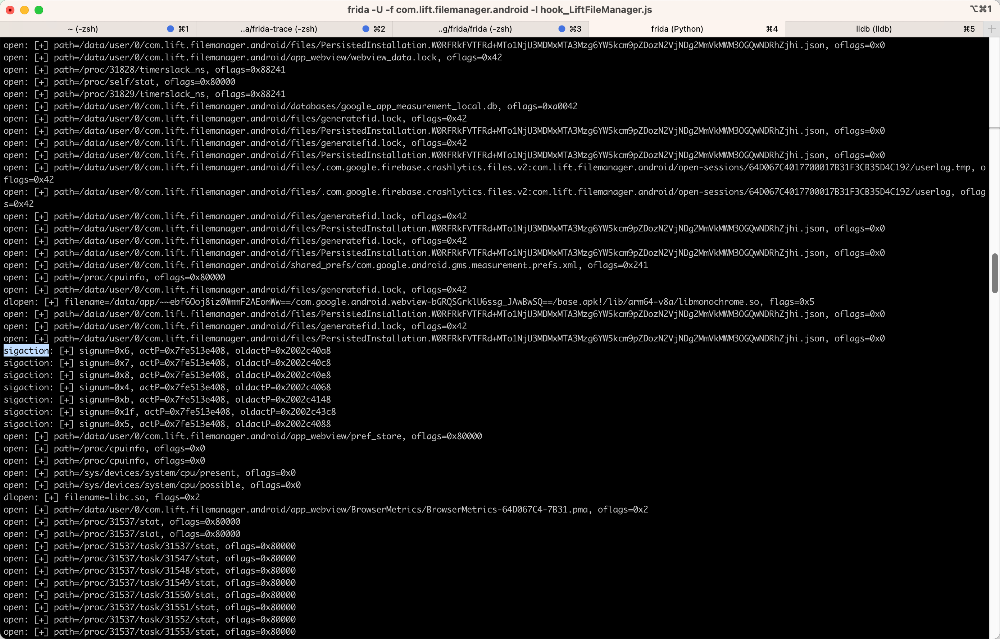
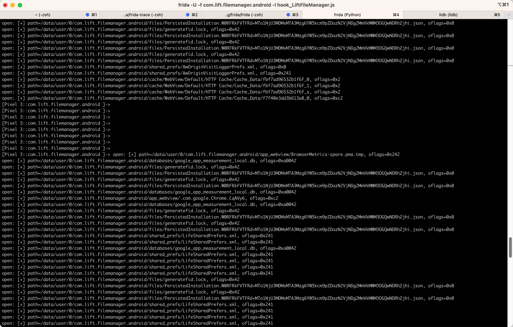

# LiftFileManager

用`frida`加`js`脚本去调试`com.lift.filemanager.android`=`LiftFileManager`：

## 命令
```bash
frida -U -f com.lift.filemanager.android -l hook_LiftFileManager.js
```

## js脚本代码

* `hook_LiftFileManager.js`

```js
/**
 * Update: 20230808
 * Usage:
 *  frida -U -f com.lift.filemanager.android -l hook_LiftFileManager.js
 */

function processJniOnLoad(libraryName) {
  const funcSym = "JNI_OnLoad";
  const funcPtr = Module.findExportByName(libraryName, funcSym);
  console.log("funcSym=" + funcSym + ", funcPtr=" + funcPtr);

  console.log("[+] Hooking " + funcSym + "() @ " + funcPtr + "...");
  // jint JNI_OnLoad(JavaVM *vm, void *reserved);
  var funcHook = Interceptor.attach(funcPtr, {
      onEnter: function (args) {
          const vm = args[0];
          const reserved = args[1];
          console.log("[+] " + funcSym + "(" + vm + ", " + reserved + ") called");
      },
      onLeave: function (retval) {
        console.log("[+]\t= " + retval);
      }
  });
}

function processNativeFunc(libraryName, nativeFuncName) {
  const nativeFuncPtr = Module.findExportByName(libraryName, nativeFuncName);
  console.log("nativeFuncName=" + nativeFuncName + ", nativeFuncPtr=" + nativeFuncPtr);
  var nativeFuncHook = Interceptor.attach(nativeFuncPtr, {
    onEnter: function (args) {
      const args0 = args[0];
      console.log(nativeFuncName + " [+] args0=" + args0);
    },
    onLeave: function (retval) {
      console.log("[+]\t= " + retval);
    }
  });
}

// hook normal C function
function hookCFunc(){

  // int execlp(const char *path, const char *arg0, ..., NULL);
  Interceptor.attach(Module.findExportByName(null, "execlp"), {
    onEnter: function (args) {
      var path = Memory.readCString(args[0]);
      var arg0 = Memory.readCString(args[1]);
      var arg1 = Memory.readCString(args[2]);
      console.log("execlp: path=" + path + ", arg0=" + arg0 + ", arg1=" + arg1);
    },
    onLeave: function (args) {
    }
  });

  // int execv(const char *pathname, char *const argv[]);
  Interceptor.attach(Module.findExportByName(null, "execv"), {
    onEnter: function (args) {
      var pathname = Memory.readCString(args[0]);
      var argv = args[1];
      console.log("execv: pathname=" + pathname + ", argv=" + argv);
    },
    onLeave: function (args) {
    }
  });

  // int pthread_create(pthread_t *thread, const pthread_attr_t *attr, void *(*start_routine)(void*), void *arg);
  Interceptor.attach(Module.findExportByName(null, "pthread_create"), {
    onEnter: function (args) {
      var thread = args[0];
      var attr = args[1];
      var start_routine = args[2];
      var arg = args[3];
      console.log("pthread_create: thread=" + thread + ", attr=" + attr + ", start_routine=" + start_routine + ", arg=" + arg);
    },
    onLeave: function (retNewPid) {
      console.log("\t pthread_create retNewPid= " + retNewPid);
    }
  });

  // int clone(int (*fn)(void *_Nullable), void *stack, int flags, void *_Nullable arg, ...  /* pid_t *_Nullable parent_tid, void *_Nullable tls, pid_t *_Nullable child_tid */ );
  Interceptor.attach(Module.findExportByName(null, "clone"), {
    onEnter: function (args) {
      var fn = args[0];
      var stack = args[1];
      var flags = args[2];
      var arg = args[3];
      console.log("clone: fn=" + fn + ", stack=" + stack + ", flags=" + flags + ", arg=" + arg);
    },
    onLeave: function (retval) {
    }
  });

  // pid_t fork(void);
  Interceptor.attach(Module.findExportByName(null, "fork"), {
    onEnter: function (args) {
      console.log("fork called");
    },
    onLeave: function (retval) {
      console.log("\t fork retval= " + retval);
    }
  });

  // int posix_spawn(pid_t *pid, const char *path, const posix_spawn_file_actions_t *file_actions, const posix_spawnattr_t *attrp, char *const argv[], char *const envp[]);
  Interceptor.attach(Module.findExportByName(null, "posix_spawn"), {
    onEnter: function (args) {
      var pid = args[0];
      var path = Memory.readCString(args[1]);
      var file_actions = args[2];
      var attrp = args[3];
      var argv = args[4];
      var envp = args[5];
      console.log("posix_spawn: pid=" + pid + ", path=" + path + ", file_actions=" + file_actions + ", attrp=" + attrp + ", argv=" + argv + ", envp=" + envp);
    },
    onLeave: function (retval) {
    }
  });

  // int posix_spawnp(pid_t *pid, const char *file, const posix_spawn_file_actions_t *file_actions, const posix_spawnattr_t *attrp, char *const argv[], char *const envp[]);
  Interceptor.attach(Module.findExportByName(null, "posix_spawnp"), {
    onEnter: function (args) {
      var pid = args[0];
      var file = Memory.readCString(args[1]);
      var file_actions = args[2];
      var attrp = args[3];
      var argv = args[4];
      var envp = args[5];
      console.log("posix_spawnp: pid=" + pid + ", file=" + file + ", file_actions=" + file_actions + ", attrp=" + attrp + ", argv=" + argv + ", envp=" + envp);
    },
    onLeave: function (retval) {
    }
  });

  // int sigaction(int signum, const struct sigaction *_Nullable restrict act, struct sigaction *_Nullable restrict oldact);
  Interceptor.attach(Module.findExportByName(null, "sigaction"), {
    onEnter: function (args) {
      var signum = args[0];
      var actP = args[1];
      var oldactP = args[2];
      console.log("sigaction: signum=" + signum + ", actP=" + actP + ", oldactP=" + oldactP);
    },
    onLeave: function (args) {
    }
  });

  // int remove(const char *path);
  Interceptor.attach(Module.findExportByName(null, "remove"), {
    onEnter: function (args) {
      var path = Memory.readCString(args[0]);
      console.log("remove: path=" + path);
    },
    onLeave: function (args) {
    }
  });

  // FILE *fopen(const char *restrict pathname, const char *restrict mode);
  Interceptor.attach(Module.findExportByName(null, "fopen"), {
    onEnter: function (args) {
      var pathname = Memory.readCString(args[0]);
      var mode = Memory.readCString(args[1]);
      console.log("fopen: pathname=" + pathname + ", mode=" + mode);
    },
    onLeave: function (args) {
    }
  });

  // int open(const char *pathname, int flags, mode_t mode);
  Interceptor.attach(Module.findExportByName(null, "open"), {
    onEnter: function (args) {
      var path = Memory.readCString(args[0]);
      var oflags = args[1];
      console.log("open: path=" + path + ", oflags=" + oflags);
    },
    onLeave: function (retFd) {
      console.log("\t open retFd=" + retFd);
    }
  });

  // int flock(int fd, int operation);
  Interceptor.attach(Module.findExportByName(null, "flock"), {
    onEnter: function (args) {
      var fd = args[0];
      var operation = args[1];
      console.log("flock: fd=" + fd + ", operation=" + operation);
    },
    onLeave: function (retval) {
    }
  });

  // int killpg(int pgrp, int sig);
  Interceptor.attach(Module.findExportByName(null, "killpg"), {
    onEnter: function (args) {
      var pgrp = args[0];
      var sig = args[1];
      console.log("killpg: pgrp=" + pgrp + ", sig=" + sig);
    },
    onLeave: function (args) {
    }
  });
  
  // // ssize_t read(int fd, void buf[.count], size_t count);
  // Interceptor.attach(Module.findExportByName(null, "read"), {
  //   onEnter: function (args) {
  //     var fd = args[0];
  //     var buf = args[1];
  //     var count = args[2];
  //     console.log("read: fd=" + fd + ", buf=" + buf + ", count=" + count);
  //   },
  //   onLeave: function (args) {
  //   }
  // });
  
  // ssize_t pread(int fildes, void *buf, size_t nbyte, off_t offset);
  Interceptor.attach(Module.findExportByName(null, "pread"), {
    onEnter: function (args) {
      var fildes = args[0];
      var buf = args[1];
      var nbyte = args[2];
      var offset = args[3];
      console.log("pread: fildes=" + fildes + ", buf=" + buf + ", nbyte=" + nbyte + ", offset=" + offset);
    },
    onLeave: function (args) {
    }
  });

  // // ssize_t write(int fildes, const void *buf, size_t nbyte);
  // Interceptor.attach(Module.findExportByName(null, "write"), {
  //   onEnter: function (args) {
  //     var fildes = args[0];
  //     var buf = args[1];
  //     var nbyte = args[2];
  //     console.log("write: fildes=" + fildes + ", buf=" + buf + ", nbyte=" + nbyte);
  //   },
  //   onLeave: function (args) {
  //   }
  // });
  
  // ssize_t pwrite(int fildes, const void *buf, size_t nbyte, off_t offset);
  Interceptor.attach(Module.findExportByName(null, "pwrite"), {
    onEnter: function (args) {
      var fildes = args[0];
      var buf = args[1];
      var nbyte = args[2];
      var offset = args[3];
      console.log("pwrite: fildes=" + fildes + ", buf=" + buf + ", nbyte=" + nbyte + ", offset=" + offset);
    },
    onLeave: function (args) {
    }
  });

  // int close(int fd);
  Interceptor.attach(Module.findExportByName(null, "close"), {
    onEnter: function (args) {
      var fd = args[0];
      console.log("close: fd=" + fd);
    },
    onLeave: function (retval) {
    }
  });

  // int pipe(int pipefd[2]);
  Interceptor.attach(Module.findExportByName(null, "pipe"), {
    onEnter: function (args) {
      var pipefdArray = args[0];
      console.log("pipe: pipefdArray=" + pipefdArray);
    },
    onLeave: function (retval) {
    }
  });

  const KnownStrLis = [
    "",
    "CurrencyMap/US/0/",
    "CurrencyMap/CN/0/",
    "CurrencyMap/CN/",
    "CurrencyMap/",
    "CurrencyMap",
    "CN",
    "US",
    "/",
    "0",
    "id",
    "zh_CN_#HANS",
    "zh_Hans_CN",
    "zh",
    "Hans",
    "HANS",
  ]

  // char *strcpy(char *restrict dst, const char *restrict src);
  Interceptor.attach(Module.findExportByName(null, "strcpy"), {
    onEnter: function (args) {
      var dst = Memory.readCString(args[0]);
      var src = Memory.readCString(args[1]);
      if (!KnownStrLis.includes(src)) {
        console.log("strcpy: dst=" + dst + ", src=" + src);
      }
    },
    onLeave: function (args) {
    }
  });

  // char *strncpy(char *dest, const char *src, size_t count);
  Interceptor.attach(Module.findExportByName(null, "strncpy"), {
    onEnter: function (args) {
      var dest = Memory.readCString(args[0]);
      var src = Memory.readCString(args[1]);
      var count = args[2];
      console.log("strncpy: dest=" + dest + ", src=" + src + ", count=" + count);
    },
    onLeave: function (args) {
    }
  });

  // char *strcat(char *restrict dst, const char *restrict src);
  Interceptor.attach(Module.findExportByName(null, "strcat"), {
    onEnter: function (args) {
      var dst = Memory.readCString(args[0]);
      var src = Memory.readCString(args[1]);
      console.log("strcat: dst=" + dst + ", src=" + src);
    },
    onLeave: function (args) {
    }
  });

  // // pid_t getpid(void);
  // Interceptor.attach(Module.findExportByName(null, "getpid"), {
  //   onEnter: function (args) {
  //     // console.log("getpid called");
  //   },
  //   onLeave: function (retPid) {
  //     console.log("\t getpid retPid=" + retPid);
  //   }
  // });

  // pid_t getppid(void);
  Interceptor.attach(Module.findExportByName(null, "getppid"), {
    onEnter: function (args) {
      console.log("getppid called");
    },
    onLeave: function (retval) {
      console.log("\t getppid retval=" + retval);
    }
  });

  // pid_t setsid(void);
  Interceptor.attach(Module.findExportByName(null, "setsid"), {
    onEnter: function (args) {
      console.log("setsid called");
    },
    onLeave: function (retval) {
      console.log("\t setsid retval=" + retval);
    }
  });

  // void *dlopen(const char *filename, int flags);
  Interceptor.attach(Module.findExportByName(null, "dlopen"), {
    onEnter: function (args) {
      var filename = Memory.readCString(args[0]);
      var flags = args[1];
      console.log("dlopen: filename=" + filename + ", flags=" + flags);
    },
    onLeave: function (args) {
    }
  });

}

function waitForLibLoading(libraryName) {
  var isLibLoaded = false;

  hookCFunc();

  Interceptor.attach(Module.findExportByName(null, "android_dlopen_ext"), {
      onEnter: function (args) {
          var libPath = Memory.readCString(args[0]);
          var flags = args[1];
          var info = args[2];
          console.log("android_dlopen_ext: libPath=" + libPath + ", flags=" + flags + ", info=" + info);
          if (libPath.includes(libraryName)) {
            console.log("[+] Loading library " + libPath + "...");
            isLibLoaded = true;
          }
      },
      onLeave: function (args) {
          if (isLibLoaded) {
            processJniOnLoad(libraryName);

            // public static native void display(Application application);
            const nativeFuncName = "Java_com_aSIIoEMUzSX_fukjRx_Nzilsxr_DYphTcg"
            processNativeFunc(libraryName, nativeFuncName);

            isLibLoaded = false;
          }
      }
  });
}

Java.perform(function() {
  const libraryName = "libRehADGd.so";
  waitForLibLoading(libraryName);
});
```

## 输出

### 截图

* （之前某次的）截图
  * 
  * 
  * 

### log日志

```bash
➜  frida frida -U -f com.lift.filemanager.android -l hook_LiftFileManager.js
     ____
    / _  |   Frida 16.1.3 - A world-class dynamic instrumentation toolkit
   | (_| |
    > _  |   Commands:
   /_/ |_|       help      -> Displays the help system
   . . . .       object?   -> Display information about 'object'
   . . . .       exit/quit -> Exit
   . . . .
   . . . .   More info at https://frida.re/docs/home/
   . . . .
   . . . .   Connected to Pixel 3 (id=91BX1VSA3)
Spawned `com.lift.filemanager.android`. Resuming main thread!
[Pixel 3::com.lift.filemanager.android ]-> open: path=/data/app/~~gJRGEMcdzVg-RT9VfCj4AA==/com.lift.filemanager.android-viAUZmvMdgKc2Zy2M8FibQ==/base.apk, oflags=0x80000
open: path=/data/misc/edxp_A2NLrKZb3PtmBqrf/cache/EdHooker_d80f73e34da17c301b40feab7995d5a6a0b56621.jar, oflags=0x0
open: path=/data/misc/edxp_A2NLrKZb3PtmBqrf/cache/EdHooker_d80f73e34da17c301b40feab7995d5a6a0b56621.jar, oflags=0x0
open: path=/proc/self/cmdline, oflags=0x80000
open: path=/data/app/~~gJRGEMcdzVg-RT9VfCj4AA==/com.lift.filemanager.android-viAUZmvMdgKc2Zy2M8FibQ==/base.apk, oflags=0x80000
open: path=/product/overlay/NavigationBarMode2Button/NavigationBarMode2ButtonOverlay.apk, oflags=0x80000
pthread_create: thread=0x7fe513f228, attr=0x7fe513f260, start_routine=0x6ddf1e6b3c, arg=0x6f4f35ffc0
clone: fn=0x707076fd0c, stack=0x6d6daf4cc0, flags=0x3d0f00, arg=0x6d6daf4cc0
pthread_create: thread=0x7fe513f258, attr=0x7fe513f290, start_routine=0x6ddf1e6b3c, arg=0x6f4f35ffc0
clone: fn=0x707076fd0c, stack=0x6d6daf4cc0, flags=0x3d0f00, arg=0x6d6daf4cc0
pthread_create: thread=0x7fe513f2a8, attr=0x7fe513f2e0, start_routine=0x6ddf1e6b3c, arg=0x6f4f35c820
clone: fn=0x707076fd0c, stack=0x6d6c9eacc0, flags=0x3d0f00, arg=0x6d6c9eacc0
pthread_create: thread=0x6d6c9ea3c8, attr=0x6d6c9ea400, start_routine=0x6ddf1e6b3c, arg=0x6f4f361b90
clone: fn=0x707076fd0c, stack=0x6d6b8e0cc0, flags=0x3d0f00, arg=0x6d6b8e0cc0
open: path=/data/user/0/com.lift.filemanager.android/shared_prefs/frc_1:565703110738:android:37ec4862ed1c78d044af8b_firebase_settings.xml, oflags=0x0
pthread_create: thread=0x7fe513f1e8, attr=0x7fe513f220, start_routine=0x6ddf1e6b3c, arg=0x6f4f365330
clone: fn=0x707076fd0c, stack=0x6d6a7d6cc0, flags=0x3d0f00, arg=0x6d6a7d6cc0
pthread_create: thread=0x6d6c9ea388, attr=0x6d6c9ea3c0, start_routine=0x6ddf1e6b3c, arg=0x6f4f366f00
clone: fn=0x707076fd0c, stack=0x6d6a8e0cc0, flags=0x3d0f00, arg=0x6d6a8e0cc0
pthread_create: thread=0x6d6c9ea388, attr=0x6d6c9ea3c0, start_routine=0x6ddf1e6b3c, arg=0x6f4f363760
clone: fn=0x707076fd0c, stack=0x6d6a6cccc0, flags=0x3d0f00, arg=0x6d6a6cccc0
pthread_create: thread=0x6d6c9ea388, attr=0x6d6c9ea3c0, start_routine=0x6ddf1e6b3c, arg=0x6f4f36c270
clone: fn=0x707076fd0c, stack=0x6d6a5c2cc0, flags=0x3d0f00, arg=0x6d6a5c2cc0
open: path=/data/user/0/com.lift.filemanager.android/shared_prefs/com.google.firebase.crashlytics.xml, oflags=0x0
open: path=/data/user/0/com.lift.filemanager.android/files/frc_1:565703110738:android:37ec4862ed1c78d044af8b_firebase_defaults.json, oflags=0x0
open: path=/data/user/0/com.lift.filemanager.android/files/frc_1:565703110738:android:37ec4862ed1c78d044af8b_firebase_fetch.json, oflags=0x0
open: path=/data/user/0/com.lift.filemanager.android/files/frc_1:565703110738:android:37ec4862ed1c78d044af8b_firebase_activate.json, oflags=0x0
pthread_create: thread=0x7fe513f258, attr=0x7fe513f290, start_routine=0x6ddf1e6b3c, arg=0x6f4f36de40
pthread_create: thread=0x6d6daf4348, attr=0x6d6daf4380, start_routine=0x6ddf1e6b3c, arg=0x6f4f361b90
clone: fn=0x707076fd0c, stack=0x6d6b6e0cc0, flags=0x3d0f00, arg=0x6d6b6e0cc0
clone: fn=0x707076fd0c, stack=0x6d6b5d6cc0, flags=0x3d0f00, arg=0x6d6b5d6cc0
open: path=/proc/6929/timerslack_ns, oflags=0x88241
android_dlopen_ext: libPath=/data/user_de/0/com.google.android.gms/app_chimera/m/00000047/oat/arm64/DynamiteLoader.odex, flags=0x2, info=0x6d6daf3b58
open: path=/proc/6930/timerslack_ns, oflags=0x88241
open: path=/data/user_de/0/com.google.android.gms/app_chimera/m/00000047/oat/arm64/DynamiteLoader.vdex, oflags=0x0
open: path=/data/user/0/com.lift.filemanager.android/files/.com.google.firebase.crashlytics.files.v2:com.lift.filemanager.android/com.crashlytics.settings.json, oflags=0x0
open: path=/data/user_de/0/com.google.android.gms/app_chimera/m/00000047/DynamiteLoader.apk, oflags=0x0
open: path=/data/user_de/0/com.google.android.gms/app_chimera/m/00000047/DynamiteLoader.apk, oflags=0x0
open: path=/apex/com.android.art/javalib/arm64/boot.art, oflags=0x0
open: path=/system/framework/arm64/boot-framework.art, oflags=0x0
open: path=/data/user_de/0/com.google.android.gms/app_chimera/m/00000047/oat/arm64/DynamiteLoader.art, oflags=0x0
pthread_create: thread=0x7fe513f1e8, attr=0x7fe513f220, start_routine=0x6ddf1e6b3c, arg=0x6f4f36a6a0
clone: fn=0x707076fd0c, stack=0x6d6b3bccc0, flags=0x3d0f00, arg=0x6d6b3bccc0
open: path=/proc/6931/timerslack_ns, oflags=0x88241
pthread_create: thread=0x7fe513f1f8, attr=0x7fe513f230, start_routine=0x6ddf1e6b3c, arg=0x6f4f368ad0
clone: fn=0x707076fd0c, stack=0x6d6b2b2cc0, flags=0x3d0f00, arg=0x6d6b2b2cc0
open: path=/data/user/0/com.lift.filemanager.android/files/generatefid.lock, oflags=0x42
open: path=/data/user/0/com.lift.filemanager.android/files/PersistedInstallation.W0RFRkFVTFRd+MTo1NjU3MDMxMTA3Mzg6YW5kcm9pZDozN2VjNDg2MmVkMWM3OGQwNDRhZjhi.json, oflags=0x0
pthread_create: thread=0x6d6b2b2408, attr=0x6d6b2b2440, start_routine=0x6ddf1e6b3c, arg=0x6f4f3715e0
clone: fn=0x707076fd0c, stack=0x6d6b1a8cc0, flags=0x3d0f00, arg=0x6d6b1a8cc0
pthread_create: thread=0x6d6b2b2598, attr=0x6d6b2b25d0, start_routine=0x6ddf1e6b3c, arg=0x6f4f36fa10
clone: fn=0x707076fd0c, stack=0x6d6b09ecc0, flags=0x3d0f00, arg=0x6d6b09ecc0
open: path=/proc/6933/timerslack_ns, oflags=0x88241
open: path=/data/user/0/com.lift.filemanager.android/files/generatefid.lock, oflags=0x42
open: path=/data/user/0/com.lift.filemanager.android/files/PersistedInstallation.W0RFRkFVTFRd+MTo1NjU3MDMxMTA3Mzg6YW5kcm9pZDozN2VjNDg2MmVkMWM3OGQwNDRhZjhi.json, oflags=0x0
pthread_create: thread=0x7fe513f0f8, attr=0x7fe513f130, start_routine=0x6ddf1e6b3c, arg=0x6f4f374d80
clone: fn=0x707076fd0c, stack=0x6d6af94cc0, flags=0x3d0f00, arg=0x6d6af94cc0
pthread_create: thread=0x7fe513f508, attr=0x7fe513f540, start_routine=0x6ddf1e6b3c, arg=0x6f4f3731b0
clone: fn=0x707076fd0c, stack=0x6d6ae8acc0, flags=0x3d0f00, arg=0x6d6ae8acc0
open: path=/proc/meminfo, oflags=0x0
pthread_create: thread=0x6d6ae8a3b8, attr=0x6d6ae8a3f0, start_routine=0x6ddf1e6b3c, arg=0x6f4f376950
clone: fn=0x707076fd0c, stack=0x6d6ad80cc0, flags=0x3d0f00, arg=0x6d6ad80cc0
open: path=/data/app/~~H9XVwTH8sAvVL5p5cBHHzw==/com.google.android.gms-EalbGkD7CDLYvLNBylKTSQ==/base.apk, oflags=0x80000
pthread_create: thread=0x7fe513f808, attr=0x7fe513f840, start_routine=0x6ddf1e6b3c, arg=0x6f4f378520
clone: fn=0x707076fd0c, stack=0x6d6ac76cc0, flags=0x3d0f00, arg=0x6d6ac76cc0
open: path=/data/user/0/com.lift.filemanager.android/databases/com.google.android.datatransport.events, oflags=0xa0042
open: path=/data/app/~~H9XVwTH8sAvVL5p5cBHHzw==/com.google.android.gms-EalbGkD7CDLYvLNBylKTSQ==/split_config.xxhdpi.apk, oflags=0x80000
open: path=/data/app/~~H9XVwTH8sAvVL5p5cBHHzw==/com.google.android.gms-EalbGkD7CDLYvLNBylKTSQ==/split_config.zh.apk, oflags=0x80000
open: path=/data/user/0/com.lift.filemanager.android/shared_prefs/FirebaseHeartBeatW0RFRkFVTFRd+MTo1NjU3MDMxMTA3Mzg6YW5kcm9pZDozN2VjNDg2MmVkMWM3OGQwNDRhZjhi.xml, oflags=0x0
pthread_create: thread=0x7fe513f3a8, attr=0x7fe513f3e0, start_routine=0x6ddf1e6b3c, arg=0x6f4f37a0f0
clone: fn=0x707076fd0c, stack=0x6d6ad80cc0, flags=0x3d0f00, arg=0x6d6ad80cc0
open: path=/data/user/0/com.lift.filemanager.android/files/.com.google.firebase.crashlytics.files.v2:com.lift.filemanager.android/open-sessions/64D0B857022700011AB6F3CB35D4C192/report, oflags=0x241
open: path=/data/user/0/com.lift.filemanager.android/files/.com.google.firebase.crashlytics.files.v2:com.lift.filemanager.android/open-sessions/64D0B857022700011AB6F3CB35D4C192/start-time, oflags=0x241
open: path=/data/user/0/com.lift.filemanager.android/files/.com.google.firebase.crashlytics.files.v2:com.lift.filemanager.android/initialization_marker, oflags=0xc2
android_dlopen_ext: libPath=/system/framework/oat/arm64/org.apache.http.legacy.odex, flags=0x2, info=0x6d6ac749a8
open: path=/data/user/0/com.lift.filemanager.android/no_backup/androidx.work.workdb, oflags=0xa0042
pthread_create: thread=0x7fe513f558, attr=0x7fe513f590, start_routine=0x6ddf1e6b3c, arg=0x6f4f376950
clone: fn=0x707076fd0c, stack=0x6d6a7d6cc0, flags=0x3d0f00, arg=0x6d6a7d6cc0
open: path=/data/user/0/com.lift.filemanager.android/shared_prefs/com.facebook.sdk.appEventPreferences.xml, oflags=0x0
android_dlopen_ext: libPath=/data/user_de/0/com.google.android.gms/app_chimera/m/0000004c/oat/arm64/MeasurementDynamite.odex, flags=0x2, info=0x6d6daf3838
open: path=/system/framework/oat/arm64/org.apache.http.legacy.vdex, oflags=0x0
open: path=/system/framework/org.apache.http.legacy.jar, oflags=0x0
open: path=/data/user/0/com.lift.filemanager.android/no_backup/androidx.work.workdb-wal, oflags=0xa0042
open: path=/data/user/0/com.lift.filemanager.android/no_backup/androidx.work.workdb-shm, oflags=0x80042
open: path=/data/user_de/0/com.google.android.gms/app_chimera/m/0000004c/oat/arm64/MeasurementDynamite.vdex, oflags=0x0
open: path=/data/user_de/0/com.google.android.gms/app_chimera/m/0000004c/MeasurementDynamite.apk, oflags=0x0
open: path=/system/framework/org.apache.http.legacy.jar, oflags=0x0
open: path=/data/user_de/0/com.google.android.gms/app_chimera/m/0000004c/MeasurementDynamite.apk, oflags=0x0
open: path=/apex/com.android.art/javalib/arm64/boot.art, oflags=0x0
open: path=/data/user_de/0/com.google.android.gms/app_chimera/m/0000004c/MeasurementDynamite.apk, oflags=0x80000
open: path=/system/framework/arm64/boot-framework.art, oflags=0x0
open: path=/system/framework/oat/arm64/org.apache.http.legacy.art, oflags=0x0
pthread_create: thread=0x7fe513f558, attr=0x7fe513f590, start_routine=0x6ddf1e6b3c, arg=0x6f4f376950
clone: fn=0x707076fd0c, stack=0x6d6a7d6cc0, flags=0x3d0f00, arg=0x6d6a7d6cc0
open: path=/data/user/0/com.lift.filemanager.android/shared_prefs/com.facebook.sdk.USER_SETTINGS.xml, oflags=0x0
android_dlopen_ext: libPath=/system/framework/oat/arm64/com.android.media.remotedisplay.odex, flags=0x2, info=0x6d6ac749a8
open: path=/data/user/0/com.lift.filemanager.android/no_backup/androidx.work.workdb, oflags=0xa0042
pthread_create: thread=0x7fe513f5f8, attr=0x7fe513f630, start_routine=0x6ddf1e6b3c, arg=0x6f4f376950
clone: fn=0x707076fd0c, stack=0x6d6b8e0cc0, flags=0x3d0f00, arg=0x6d6b8e0cc0
open: path=/data/user/0/com.lift.filemanager.android/no_backup/androidx.work.workdb-wal, oflags=0xa0042
open: path=/system/framework/oat/arm64/com.android.media.remotedisplay.vdex, oflags=0x0
open: path=/system/framework/com.android.media.remotedisplay.jar, oflags=0x0
open: path=/system/framework/com.android.media.remotedisplay.jar, oflags=0x0
open: path=/apex/com.android.art/javalib/arm64/boot.art, oflags=0x0
open: path=/system/framework/arm64/boot-framework.art, oflags=0x0
open: path=/system/framework/oat/arm64/com.android.media.remotedisplay.art, oflags=0x0
pthread_create: thread=0x6d6b8e01c8, attr=0x6d6b8e0200, start_routine=0x6ddf1e6b3c, arg=0x6f4f37bcc0
clone: fn=0x707076fd0c, stack=0x6d6a7d6cc0, flags=0x3d0f00, arg=0x6d6a7d6cc0
pthread_create: thread=0x7fe513f508, attr=0x7fe513f540, start_routine=0x6ddf1e6b3c, arg=0x6f4f381030
clone: fn=0x707076fd0c, stack=0x6d5ccb2cc0, flags=0x3d0f00, arg=0x6d5ccb2cc0
open: path=/dev/urandom, oflags=0x80000
open: path=/data/user/0/com.lift.filemanager.android/shared_prefs/com.facebook.internal.preferences.APP_GATEKEEPERS.xml, oflags=0x0
open: path=/data/user/0/com.lift.filemanager.android/no_backup/androidx.work.workdb-wal, oflags=0xa0042
android_dlopen_ext: libPath=/system/framework/oat/arm64/com.android.location.provider.odex, flags=0x2, info=0x6d6ac749a8
pthread_create: thread=0x7fe513f5f8, attr=0x7fe513f630, start_routine=0x6ddf1e6b3c, arg=0x6f4f381030
clone: fn=0x707076fd0c, stack=0x6d6a7d6cc0, flags=0x3d0f00, arg=0x6d6a7d6cc0
pthread_create: thread=0x7fe513f658, attr=0x7fe513f690, start_routine=0x6ddf1e6b3c, arg=0x6f4f37bcc0
clone: fn=0x707076fd0c, stack=0x6d5ccb2cc0, flags=0x3d0f00, arg=0x6d5ccb2cc0
pthread_create: thread=0x7fe513f678, attr=0x7fe513f6b0, start_routine=0x6ddf1e6b3c, arg=0x6f4f37d890
clone: fn=0x707076fd0c, stack=0x6d5aac4cc0, flags=0x3d0f00, arg=0x6d5aac4cc0
pthread_create: thread=0x6d5ccb24d8, attr=0x6d5ccb2510, start_routine=0x6ddf1e6b3c, arg=0x6f4f382c00
pthread_create: thread=0x7fe513f678, attr=0x7fe513f6b0, start_routine=0x6ddf1e6b3c, arg=0x6f4f387f70
clone: fn=0x707076fd0c, stack=0x6d597bacc0, flags=0x3d0f00, arg=0x6d597bacc0
clone: fn=0x707076fd0c, stack=0x6d598c4cc0, flags=0x3d0f00, arg=0x6d598c4cc0
pthread_create: thread=0x7fe513f6b8, attr=0x7fe513f6f0, start_routine=0x6ddf1e6b3c, arg=0x6f4f3863a0
clone: fn=0x707076fd0c, stack=0x6d566b0cc0, flags=0x3d0f00, arg=0x6d566b0cc0
open: path=/system/framework/oat/arm64/com.android.location.provider.vdex, oflags=0x0
open: path=/data/user/0/com.lift.filemanager.android/shared_prefs/com.facebook.internal.preferences.APP_SETTINGS.xml, oflags=0x0
open: path=/system/framework/com.android.location.provider.jar, oflags=0x0
pthread_create: thread=0x6d566b03b8, attr=0x6d566b03f0, start_routine=0x6ddf1e6b3c, arg=0x6f4f3847d0
open: path=/system/framework/com.android.location.provider.jar, oflags=0x0
clone: fn=0x707076fd0c, stack=0x6d555a6cc0, flags=0x3d0f00, arg=0x6d555a6cc0
pthread_create: thread=0x6d6ad805b8, attr=0x6d6ad805f0, start_routine=0x6ddf1e6b3c, arg=0x6f4f38d2e0
pthread_create: thread=0x7fe513f758, attr=0x7fe513f790, start_routine=0x6ddf1e6b3c, arg=0x6f4f38eeb0
open: path=/apex/com.android.art/javalib/arm64/boot.art, oflags=0x0
open: path=/system/framework/arm64/boot-framework.art, oflags=0x0
open: path=/system/framework/oat/arm64/com.android.location.provider.art, oflags=0x0
clone: fn=0x707076fd0c, stack=0x6d54392cc0, flags=0x3d0f00, arg=0x6d54392cc0
clone: fn=0x707076fd0c, stack=0x6d5449ccc0, flags=0x3d0f00, arg=0x6d5449ccc0
pthread_create: thread=0x6d566b0418, attr=0x6d566b0450, start_routine=0x6ddf1e6b3c, arg=0x6f4f390a80
clone: fn=0x707076fd0c, stack=0x6d598c4cc0, flags=0x3d0f00, arg=0x6d598c4cc0
open: path=/data/user/0/com.lift.filemanager.android/files/AppEventsLogger.persistedevents, oflags=0x0
open: path=/data/user/0/com.lift.filemanager.android/shared_prefs/LifeSharedPrefers.xml, oflags=0x0
android_dlopen_ext: libPath=/data/app/~~H9XVwTH8sAvVL5p5cBHHzw==/com.google.android.gms-EalbGkD7CDLYvLNBylKTSQ==/oat/arm64/base.odex, flags=0x2, info=0x6d6ac74b18
open: path=/data/app/~~H9XVwTH8sAvVL5p5cBHHzw==/com.google.android.gms-EalbGkD7CDLYvLNBylKTSQ==/oat/arm64/base.vdex, oflags=0x0
open: path=/data/app/~~H9XVwTH8sAvVL5p5cBHHzw==/com.google.android.gms-EalbGkD7CDLYvLNBylKTSQ==/base.apk, oflags=0x0
open: path=/data/app/~~H9XVwTH8sAvVL5p5cBHHzw==/com.google.android.gms-EalbGkD7CDLYvLNBylKTSQ==/base.apk, oflags=0x0
open: path=/apex/com.android.art/javalib/arm64/boot.art, oflags=0x0
open: path=/system/framework/arm64/boot-framework.art, oflags=0x0
open: path=/data/app/~~H9XVwTH8sAvVL5p5cBHHzw==/com.google.android.gms-EalbGkD7CDLYvLNBylKTSQ==/oat/arm64/base.art, oflags=0x0
pthread_create: thread=0x6d6ac764c8, attr=0x6d6ac76500, start_routine=0x6ddf1e6b3c, arg=0x6f4f38eeb0
clone: fn=0x707076fd0c, stack=0x6d533d0cc0, flags=0x3d0f00, arg=0x6d533d0cc0
open: path=/data/user/0/com.google.android.gms/shared_prefs/google_ads_flags.xml, oflags=0x0
open: path=/data/app/~~RbAu5LfZALdcOdiK1xs1uA==/com.google.android.trichromelibrary_579016631-9HB7aC3CI8mFFZlcY5ZSvA==/base.apk, oflags=0x0
pthread_create: thread=0x6d6daf3148, attr=0x6d6daf3180, start_routine=0x6ddf1e6b3c, arg=0x6f4f389b40
android_dlopen_ext: libPath=/data/app/~~ebf6Ooj8iz0WmmF2AEomWw==/com.google.android.webview-bGRQSGrklU6ssg_JAwBwSQ==/oat/arm64/base.odex, flags=0x2, info=0x7fe513d088
clone: fn=0x707076fd0c, stack=0x6d457b6cc0, flags=0x3d0f00, arg=0x6d457b6cc0
open: path=/proc/6959/timerslack_ns, oflags=0x88241
open: path=/data/app/~~ebf6Ooj8iz0WmmF2AEomWw==/com.google.android.webview-bGRQSGrklU6ssg_JAwBwSQ==/oat/arm64/base.vdex, oflags=0x0
pthread_create: thread=0x6d6b8e0048, attr=0x6d6b8e0080, start_routine=0x6ddf1e6b3c, arg=0x6f4f38b710
clone: fn=0x707076fd0c, stack=0x6d533d0cc0, flags=0x3d0f00, arg=0x6d533d0cc0
open: path=/data/app/~~ebf6Ooj8iz0WmmF2AEomWw==/com.google.android.webview-bGRQSGrklU6ssg_JAwBwSQ==/base.apk, oflags=0x0
open: path=/data/app/~~ebf6Ooj8iz0WmmF2AEomWw==/com.google.android.webview-bGRQSGrklU6ssg_JAwBwSQ==/base.apk, oflags=0x0
open: path=/apex/com.android.art/javalib/arm64/boot.art, oflags=0x0
open: path=/system/framework/arm64/boot-framework.art, oflags=0x0
open: path=/data/app/~~ebf6Ooj8iz0WmmF2AEomWw==/com.google.android.webview-bGRQSGrklU6ssg_JAwBwSQ==/oat/arm64/base.art, oflags=0x0
android_dlopen_ext: libPath=/data/user_de/0/com.google.android.gms/app_chimera/m/00000032/oat/arm64/dl-AdsFdrDynamite.integ_232400000100000.odex, flags=0x2, info=0x6d6ac75908
pthread_create: thread=0x6d457b5398, attr=0x6d457b53d0, start_routine=0x6ddf1e6b3c, arg=0x6f4f38eeb0
open: path=/data/user_de/0/com.google.android.gms/app_chimera/m/00000032/oat/arm64/dl-AdsFdrDynamite.integ_232400000100000.vdex, oflags=0x0
clone: fn=0x707076fd0c, stack=0x6d435c7cc0, flags=0x3d0f00, arg=0x6d435c7cc0
open: path=/proc/6961/timerslack_ns, oflags=0x88241
open: path=/data/user/0/com.lift.filemanager.android/shared_prefs/com.google.android.gms.measurement.prefs.xml, oflags=0x0
open: path=/data/app/~~ebf6Ooj8iz0WmmF2AEomWw==/com.google.android.webview-bGRQSGrklU6ssg_JAwBwSQ==/base.apk, oflags=0x80000
open: path=/data/user_de/0/com.google.android.gms/app_chimera/m/00000032/dl-AdsFdrDynamite.integ_232400000100000.apk, oflags=0x0
open: path=/data/app/~~ebf6Ooj8iz0WmmF2AEomWw==/com.google.android.webview-bGRQSGrklU6ssg_JAwBwSQ==/split_config.zh.apk, oflags=0x80000
open: path=/data/app/~~RbAu5LfZALdcOdiK1xs1uA==/com.google.android.trichromelibrary_579016631-9HB7aC3CI8mFFZlcY5ZSvA==/base.apk, oflags=0x80000
open: path=/data/user_de/0/com.google.android.gms/app_chimera/m/00000032/dl-AdsFdrDynamite.integ_232400000100000.apk, oflags=0x0
open: path=/apex/com.android.art/javalib/arm64/boot.art, oflags=0x0
open: path=/data/app/~~ebf6Ooj8iz0WmmF2AEomWw==/com.google.android.webview-bGRQSGrklU6ssg_JAwBwSQ==/base.apk, oflags=0x80000
open: path=/system/framework/arm64/boot-framework.art, oflags=0x0
open: path=/data/user_de/0/com.google.android.gms/app_chimera/m/00000032/oat/arm64/dl-AdsFdrDynamite.integ_232400000100000.art, oflags=0x0
open: path=/data/app/~~ebf6Ooj8iz0WmmF2AEomWw==/com.google.android.webview-bGRQSGrklU6ssg_JAwBwSQ==/split_config.zh.apk, oflags=0x80000
open: path=/data/app/~~ebf6Ooj8iz0WmmF2AEomWw==/com.google.android.webview-bGRQSGrklU6ssg_JAwBwSQ==/split_weblayer.apk, oflags=0x80000
open: path=/data/app/~~RbAu5LfZALdcOdiK1xs1uA==/com.google.android.trichromelibrary_579016631-9HB7aC3CI8mFFZlcY5ZSvA==/base.apk, oflags=0x80000
android_dlopen_ext: libPath=libmonochrome.so, flags=0x2, info=0x7fe513ec70
open: path=/data/user_de/0/com.google.android.gms/app_chimera/m/00000032/dl-AdsFdrDynamite.integ_232400000100000.apk, oflags=0x80000
pthread_create: thread=0x6d457b5718, attr=0x6d457b5750, start_routine=0x6ddf1e6b3c, arg=0x6f4f392650
clone: fn=0x707076fd0c, stack=0x6d4308fcc0, flags=0x3d0f00, arg=0x6d4308fcc0
open: path=/proc/6962/timerslack_ns, oflags=0x88241
open: path=/data/user/0/com.lift.filemanager.android/files/generatefid.lock, oflags=0x42
open: path=/data/user/0/com.lift.filemanager.android/files/PersistedInstallation.W0RFRkFVTFRd+MTo1NjU3MDMxMTA3Mzg6YW5kcm9pZDozN2VjNDg2MmVkMWM3OGQwNDRhZjhi.json, oflags=0x0
open: path=/data/user/0/com.lift.filemanager.android/files/generatefid.lock, oflags=0x42
open: path=/data/user/0/com.lift.filemanager.android/files/PersistedInstallation.W0RFRkFVTFRd+MTo1NjU3MDMxMTA3Mzg6YW5kcm9pZDozN2VjNDg2MmVkMWM3OGQwNDRhZjhi.json, oflags=0x0
open: path=/data/user/0/com.lift.filemanager.android/databases/google_app_measurement_local.db, oflags=0xa0042
open: path=/data/user/0/com.lift.filemanager.android/files/generatefid.lock, oflags=0x42
open: path=/data/user/0/com.lift.filemanager.android/files/PersistedInstallation.W0RFRkFVTFRd+MTo1NjU3MDMxMTA3Mzg6YW5kcm9pZDozN2VjNDg2MmVkMWM3OGQwNDRhZjhi.json, oflags=0x0
open: path=/data/user/0/com.lift.filemanager.android/files/generatefid.lock, oflags=0x42
open: path=/data/user/0/com.lift.filemanager.android/files/PersistedInstallation.W0RFRkFVTFRd+MTo1NjU3MDMxMTA3Mzg6YW5kcm9pZDozN2VjNDg2MmVkMWM3OGQwNDRhZjhi.json, oflags=0x0
open: path=/data/user/0/com.lift.filemanager.android/files/generatefid.lock, oflags=0x42
open: path=/data/user/0/com.lift.filemanager.android/files/PersistedInstallation.W0RFRkFVTFRd+MTo1NjU3MDMxMTA3Mzg6YW5kcm9pZDozN2VjNDg2MmVkMWM3OGQwNDRhZjhi.json, oflags=0x0
open: path=/data/user/0/com.lift.filemanager.android/files/generatefid.lock, oflags=0x42
open: path=/data/user/0/com.lift.filemanager.android/files/PersistedInstallation.W0RFRkFVTFRd+MTo1NjU3MDMxMTA3Mzg6YW5kcm9pZDozN2VjNDg2MmVkMWM3OGQwNDRhZjhi.json, oflags=0x0
pthread_create: thread=0x7fe513ddb8, attr=0x7fe513ddf0, start_routine=0x6ddf1e6b3c, arg=0x6f4f382c00
clone: fn=0x707076fd0c, stack=0x6d6ac76cc0, flags=0x3d0f00, arg=0x6d6ac76cc0
pthread_create: thread=0x7fe513dac8, attr=0x7fe513db00, start_routine=0x6ddf1e6b3c, arg=0x6f4f38eeb0
clone: fn=0x707076fd0c, stack=0x6d6ac76cc0, flags=0x3d0f00, arg=0x6d6ac76cc0
open: path=/data/app/~~ebf6Ooj8iz0WmmF2AEomWw==/com.google.android.webview-bGRQSGrklU6ssg_JAwBwSQ==/lib/arm64/libmonochrome.so, oflags=0x0
open: path=/proc/6964/timerslack_ns, oflags=0x88241
open: path=/data/app/~~ebf6Ooj8iz0WmmF2AEomWw==/com.google.android.webview-bGRQSGrklU6ssg_JAwBwSQ==/base.apk, oflags=0x80000
android_dlopen_ext: libPath=/data/app/~~ebf6Ooj8iz0WmmF2AEomWw==/com.google.android.webview-bGRQSGrklU6ssg_JAwBwSQ==/base.apk!/lib/arm64-v8a/libmonochrome.so, flags=0x2, info=0x7fe513d860
open: path=/data/app/~~ebf6Ooj8iz0WmmF2AEomWw==/com.google.android.webview-bGRQSGrklU6ssg_JAwBwSQ==/lib/arm64/libwebviewchromium_plat_support.so, oflags=0x0
open: path=/data/app/~~RbAu5LfZALdcOdiK1xs1uA==/com.google.android.trichromelibrary_579016631-9HB7aC3CI8mFFZlcY5ZSvA==/base.apk, oflags=0x80000
open: path=/system/lib64/libwebviewchromium_plat_support.so, oflags=0x0
android_dlopen_ext: libPath=/system/lib64/libwebviewchromium_plat_support.so, flags=0x2, info=0x7fe513d9b0
pthread_create: thread=0x7fe513dbd8, attr=0x7fe513dc10, start_routine=0x6ddf1e6b3c, arg=0x6f4f382c00
clone: fn=0x707076fd0c, stack=0x6d43e7ecc0, flags=0x3d0f00, arg=0x6d43e7ecc0
open: path=/data/user/0/com.lift.filemanager.android/shared_prefs/WebViewChromiumPrefs.xml, oflags=0x0
pthread_create: thread=0x7fe513ddf8, attr=0x7fe513de30, start_routine=0x6ddf1e6b3c, arg=0x6f4f382c00
clone: fn=0x707076fd0c, stack=0x6d43e7ecc0, flags=0x3d0f00, arg=0x6d43e7ecc0
open: path=/data/app/~~ebf6Ooj8iz0WmmF2AEomWw==/com.google.android.webview-bGRQSGrklU6ssg_JAwBwSQ==/base.apk, oflags=0x80000
open: path=/data/app/~~ebf6Ooj8iz0WmmF2AEomWw==/com.google.android.webview-bGRQSGrklU6ssg_JAwBwSQ==/split_config.zh.apk, oflags=0x80000
open: path=/data/app/~~ebf6Ooj8iz0WmmF2AEomWw==/com.google.android.webview-bGRQSGrklU6ssg_JAwBwSQ==/split_weblayer.apk, oflags=0x80000
open: path=/product/overlay/NavigationBarMode2Button/NavigationBarMode2ButtonOverlay.apk, oflags=0x80000
open: path=/proc/meminfo, oflags=0x0
open: path=/data/user/0/com.lift.filemanager.android/app_webview/webview_data.lock, oflags=0x42
pthread_create: thread=0x7fe513e008, attr=0x7fe513e040, start_routine=0x6ddf1e6b3c, arg=0x6f4f378520
clone: fn=0x707076fd0c, stack=0x6d43e7ecc0, flags=0x3d0f00, arg=0x6d43e7ecc0
pthread_create: thread=0x7fe513e988, attr=0x7fe513e9c0, start_routine=0x6ddf1e6b3c, arg=0x6f4f394220
clone: fn=0x707076fd0c, stack=0x6d43d74cc0, flags=0x3d0f00, arg=0x6d43d74cc0
open: path=/proc/6968/timerslack_ns, oflags=0x88241
pthread_create: thread=0x6d43d744f8, attr=0x6d43d74530, start_routine=0x6ddf1e6b3c, arg=0x6f4f382c00
clone: fn=0x707076fd0c, stack=0x6d416fbcc0, flags=0x3d0f00, arg=0x6d416fbcc0
open: path=/proc/self/stat, oflags=0x80000
open: path=/proc/6969/timerslack_ns, oflags=0x88241
open: path=/proc/cpuinfo, oflags=0x80000
dlopen: filename=/data/app/~~ebf6Ooj8iz0WmmF2AEomWw==/com.google.android.webview-bGRQSGrklU6ssg_JAwBwSQ==/base.apk!/lib/arm64-v8a/libmonochrome.so, flags=0x5
sigaction: signum=0x6, actP=0x7fe513e408, oldactP=0x2002c40a8
sigaction: signum=0x7, actP=0x7fe513e408, oldactP=0x2002c40c8
sigaction: signum=0x8, actP=0x7fe513e408, oldactP=0x2002c40e8
sigaction: signum=0x4, actP=0x7fe513e408, oldactP=0x2002c4068
sigaction: signum=0xb, actP=0x7fe513e408, oldactP=0x2002c4148
sigaction: signum=0x1f, actP=0x7fe513e408, oldactP=0x2002c43c8
sigaction: signum=0x5, actP=0x7fe513e408, oldactP=0x2002c4088
open: path=/data/user/0/com.lift.filemanager.android/app_webview/pref_store, oflags=0x80000
open: path=/proc/cpuinfo, oflags=0x0
open: path=/proc/cpuinfo, oflags=0x0
open: path=/sys/devices/system/cpu/present, oflags=0x0
open: path=/sys/devices/system/cpu/possible, oflags=0x0
dlopen: filename=libc.so, flags=0x2
open: path=/data/user/0/com.lift.filemanager.android/app_webview/BrowserMetrics/BrowserMetrics-64D0B857-1AB6.pma, oflags=0x2
pthread_create: thread=0x7fe513e598, attr=0x7fe513e6e0, start_routine=0x6d83f30904, arg=0x2003b7ea0
clone: fn=0x707076fd0c, stack=0x6d41187cc0, flags=0x3d0f00, arg=0x6d41187cc0
pthread_create: thread=0x7fe513e408, attr=0x7fe513e550, start_routine=0x6d83f30904, arg=0x2003b7da0
clone: fn=0x707076fd0c, stack=0x6d41089cc0, flags=0x3d0f00, arg=0x6d41089cc0
pthread_create: thread=0x6d41089758, attr=0x6d410898a0, start_routine=0x6d83f30904, arg=0x2003b7a60
clone: fn=0x707076fd0c, stack=0x6d3be70cc0, flags=0x3d0f00, arg=0x6d3be70cc0
open: path=/proc/6838/stat, oflags=0x80000
pthread_create: thread=0x6d3be70758, attr=0x6d3be708a0, start_routine=0x6d83f30904, arg=0x2003b77a0
clone: fn=0x707076fd0c, stack=0x6d3ad42cc0, flags=0x3d0f00, arg=0x6d3ad42cc0
open: path=/proc/6838/stat, oflags=0x80000
open: path=/proc/6838/task/6838/stat, oflags=0x80000
open: path=/proc/6838/task/6848/stat, oflags=0x80000
open: path=/proc/6838/task/6849/stat, oflags=0x80000
open: path=/proc/6838/task/6851/stat, oflags=0x80000
open: path=/proc/6838/task/6852/stat, oflags=0x80000
open: path=/proc/6838/task/6853/stat, oflags=0x80000
open: path=/proc/6838/task/6854/stat, oflags=0x80000
pthread_create: thread=0x6d3ad42758, attr=0x6d3ad428a0, start_routine=0x6d83f30904, arg=0x2003b7620
open: path=/proc/6838/task/6855/stat, oflags=0x80000
clone: fn=0x707076fd0c, stack=0x6d39c14cc0, flags=0x3d0f00, arg=0x6d39c14cc0
open: path=/proc/6838/task/6892/stat, oflags=0x80000
open: path=/proc/6838/task/6893/stat, oflags=0x80000
open: path=/proc/6838/task/6894/stat, oflags=0x80000
open: path=/proc/6838/task/6895/stat, oflags=0x80000
open: path=/proc/6838/task/6896/stat, oflags=0x80000
open: path=/proc/6838/task/6897/stat, oflags=0x80000
open: path=/proc/6838/task/6898/stat, oflags=0x80000
open: path=/proc/6838/task/6899/stat, oflags=0x80000
open: path=/proc/6838/task/6900/stat, oflags=0x80000
open: path=/proc/6838/task/6901/stat, oflags=0x80000
open: path=/proc/6838/task/6917/stat, oflags=0x80000
open: path=/proc/6838/task/6918/stat, oflags=0x80000
open: path=/proc/6838/task/6919/stat, oflags=0x80000
open: path=/proc/6838/task/6920/stat, oflags=0x80000
open: path=/proc/6838/task/6922/stat, oflags=0x80000
open: path=/proc/6838/task/6923/stat, oflags=0x80000
open: path=/proc/6838/task/6926/stat, oflags=0x80000
open: path=/proc/6838/task/6927/stat, oflags=0x80000
open: path=/proc/6838/task/6928/stat, oflags=0x80000
open: path=/proc/6838/task/6929/stat, oflags=0x80000
open: path=/proc/6838/task/6930/stat, oflags=0x80000
open: path=/proc/6838/task/6931/stat, oflags=0x80000
open: path=/proc/6838/task/6932/stat, oflags=0x80000
open: path=/proc/6838/task/6933/stat, oflags=0x80000
pthread_create: thread=0x7fe513e558, attr=0x7fe513e6a0, start_routine=0x6d83f30904, arg=0x2003b7600
clone: fn=0x707076fd0c, stack=0x6d38b0dcc0, flags=0x3d0f00, arg=0x6d38b0dcc0
open: path=/proc/6838/task/6934/stat, oflags=0x80000
open: path=/proc/6838/task/6935/stat, oflags=0x80000
open: path=/proc/6838/task/6936/stat, oflags=0x80000
open: path=/proc/6838/task/6939/stat, oflags=0x80000
open: path=/proc/6838/task/6942/stat, oflags=0x80000
open: path=/proc/6838/task/6945/stat, oflags=0x80000
open: path=/proc/6838/task/6946/stat, oflags=0x80000
open: path=/proc/6838/task/6947/stat, oflags=0x80000
open: path=/proc/6838/task/6948/stat, oflags=0x80000
pthread_create: thread=0x7fe513e578, attr=0x7fe513e6c0, start_routine=0x6d83f30904, arg=0x2003b72e0
open: path=/proc/6838/task/6950/stat, oflags=0x80000
clone: fn=0x707076fd0c, stack=0x6d37a06cc0, flags=0x3d0f00, arg=0x6d37a06cc0
open: path=/proc/6838/task/6951/stat, oflags=0x80000
open: path=/proc/6838/task/6953/stat, oflags=0x80000
open: path=/proc/6838/task/6954/stat, oflags=0x80000
open: path=/proc/6838/task/6959/stat, oflags=0x80000
open: path=/proc/6838/task/6960/stat, oflags=0x80000
open: path=/proc/6838/task/6962/stat, oflags=0x80000
open: path=/proc/6838/task/6964/stat, oflags=0x80000
open: path=/proc/6838/task/6967/stat, oflags=0x80000
open: path=/proc/6838/task/6968/stat, oflags=0x80000
open: path=/proc/6838/task/6969/stat, oflags=0x80000
open: path=/proc/6838/task/6990/stat, oflags=0x80000
open: path=/proc/6838/task/6991/stat, oflags=0x80000
open: path=/proc/6838/task/6992/stat, oflags=0x80000
open: path=/sys/devices/system/cpu/cpu0/regs/identification/midr_el1, oflags=0x0
open: path=/proc/6838/task/6993/stat, oflags=0x80000
open: path=/proc/6838/task/6994/stat, oflags=0x80000
open: path=/proc/6838/task/6995/stat, oflags=0x80000
open: path=/proc/6838/task/6996/stat, oflags=0x80000
open: path=/sys/devices/system/cpu/cpu1/regs/identification/midr_el1, oflags=0x0
open: path=/sys/devices/system/cpu/cpu2/regs/identification/midr_el1, oflags=0x0
open: path=/sys/devices/system/cpu/cpu3/regs/identification/midr_el1, oflags=0x0
open: path=/sys/devices/system/cpu/cpu4/regs/identification/midr_el1, oflags=0x0
open: path=/sys/devices/system/cpu/cpu5/regs/identification/midr_el1, oflags=0x0
open: path=/sys/devices/system/cpu/cpu6/regs/identification/midr_el1, oflags=0x0
open: path=/sys/devices/system/cpu/cpu7/regs/identification/midr_el1, oflags=0x0
open: path=/sys/devices/system/cpu/cpu8/regs/identification/midr_el1, oflags=0x0
dlopen: filename=libandroid.so, flags=0x2
dlopen: filename=libmediandk.so, flags=0x2
dlopen: filename=libandroid.so, flags=0x2
pthread_create: thread=0x7fe513e988, attr=0x7fe513ead0, start_routine=0x6d83f30904, arg=0x6a0001ce40
clone: fn=0x707076fd0c, stack=0x6d368ffcc0, flags=0x3d0f00, arg=0x6d368ffcc0
open: path=/system/etc/hosts, oflags=0x80000
pthread_create: thread=0x7fe513e958, attr=0x7fe513eaa0, start_routine=0x6d83f30904, arg=0x6a0001cdc0
clone: fn=0x707076fd0c, stack=0x6d357f8cc0, flags=0x3d0f00, arg=0x6d357f8cc0
open: path=/data/user/0/com.lift.filemanager.android/cache/WebView/font_unique_name_table.pb, oflags=0x0
dlopen: filename=libandroid.so, flags=0x2
open: path=/data/user/0/com.lift.filemanager.android/app_webview/Default/Preferences, oflags=0x80000
pthread_create: thread=0x7fe513e748, attr=0x7fe513e890, start_routine=0x6d83f30904, arg=0x6a0001d8a0
clone: fn=0x707076fd0c, stack=0x6d34698cc0, flags=0x3d0f00, arg=0x6d34698cc0
open: path=/data/data/com.lift.filemanager.android/app_webview/Default/Web Data, oflags=0xa8042
pthread_create: thread=0x7fe513dc68, attr=0x7fe513ddb0, start_routine=0x6d83f30904, arg=0x6a0001f680
clone: fn=0x707076fd0c, stack=0x6d33561cc0, flags=0x3d0f00, arg=0x6d33561cc0
open: path=/data/user/0/com.lift.filemanager.android/app_webview/Default/Local Storage/leveldb/LOG, oflags=0x241
open: path=/data/user/0/com.lift.filemanager.android/app_webview/Default/Local Storage/leveldb/LOCK, oflags=0x2
open: path=/data/user/0/com.lift.filemanager.android/app_webview/Default/Local Storage/leveldb/CURRENT, oflags=0x0
open: path=/data/user/0/com.lift.filemanager.android/app_webview/Default/Local Storage/leveldb/MANIFEST-000001, oflags=0x0
pthread_create: thread=0x7fe513e0b8, attr=0x7fe513e200, start_routine=0x6d83f30904, arg=0x6a0013fae0
clone: fn=0x707076fd0c, stack=0x6d32442cc0, flags=0x3d0f00, arg=0x6d32442cc0
pthread_create: thread=0x7fe513e0b8, attr=0x7fe513e200, start_routine=0x6d83f30904, arg=0x6a0013fb60
clone: fn=0x707076fd0c, stack=0x6d3133bcc0, flags=0x3d0f00, arg=0x6d3133bcc0
open: path=/data/user/0/com.lift.filemanager.android/app_webview/Default/Local Storage/leveldb/MANIFEST-000001, oflags=0x401
open: path=/data/user/0/com.lift.filemanager.android/app_webview/Default/Local Storage/leveldb/000003.log, oflags=0x0
open: path=/data/user/0/com.lift.filemanager.android/app_webview/Default/Local Storage/leveldb/000003.log, oflags=0x401
pthread_create: thread=0x7fe513e478, attr=0x7fe513e5c0, start_routine=0x6d83f30904, arg=0x6a0013eb40
clone: fn=0x707076fd0c, stack=0x6d30234cc0, flags=0x3d0f00, arg=0x6d30234cc0
open: path=/data/user/0/com.lift.filemanager.android/cache/WebView/Default/HTTP Cache/Code Cache/wasm/index, oflags=0x0
open: path=/data/user/0/com.lift.filemanager.android/cache/WebView/Default/HTTP Cache/Code Cache/js/index, oflags=0x0
open: path=/data/user/0/com.lift.filemanager.android/cache/WebView/Default/HTTP Cache/Code Cache/wasm/index, oflags=0xc1
open: path=/data/user/0/com.lift.filemanager.android/cache/WebView/Default/HTTP Cache/Code Cache/js/index, oflags=0xc1
open: path=/data/user/0/com.lift.filemanager.android/cache/WebView/Default/HTTP Cache/Code Cache/wasm/index-dir/the-real-index, oflags=0x0
open: path=/data/user/0/com.lift.filemanager.android/cache/WebView/Default/HTTP Cache/Code Cache/js/index-dir/the-real-index, oflags=0x0
open: path=/data/user/0/com.lift.filemanager.android/cache/WebView/Default/HTTP Cache/Code Cache/wasm/index-dir/temp-index, oflags=0x241
open: path=/data/user/0/com.lift.filemanager.android/cache/WebView/Default/HTTP Cache/Code Cache/js/index-dir/temp-index, oflags=0x241
pthread_create: thread=0x7fe513ed08, attr=0x7fe513ed40, start_routine=0x6ddf1e6b3c, arg=0x6f4f39e900
clone: fn=0x707076fd0c, stack=0x6d2f12dcc0, flags=0x3d0f00, arg=0x6d2f12dcc0
pthread_create: thread=0x7fe513e618, attr=0x7fe513e650, start_routine=0x6ddf1e6b3c, arg=0x6f4f399590
clone: fn=0x707076fd0c, stack=0x6d2dfeacc0, flags=0x3d0f00, arg=0x6d2dfeacc0
pthread_create: thread=0x7fe513e848, attr=0x7fe513e990, start_routine=0x6d83f30904, arg=0x6a0013d820
clone: fn=0x707076fd0c, stack=0x6d2dfcacc0, flags=0x3d0f00, arg=0x6d2dfcacc0
pthread_create: thread=0x7fe513e048, attr=0x7fe513e080, start_routine=0x6ddf1e6b3c, arg=0x6f4f39cd30
clone: fn=0x707076fd0c, stack=0x6d2dec3cc0, flags=0x3d0f00, arg=0x6d2dec3cc0
open: path=/data/user/0/com.lift.filemanager.android/files/frc_1:565703110738:android:37ec4862ed1c78d044af8b_firebase_defaults.json, oflags=0x241
pthread_create: thread=0x6d6a6cc4c8, attr=0x6d6a6cc500, start_routine=0x6ddf1e6b3c, arg=0x6f4f3a04d0
clone: fn=0x707076fd0c, stack=0x6d2dd80cc0, flags=0x3d0f00, arg=0x6d2dd80cc0
open: path=/data/user/0/com.lift.filemanager.android/files/generatefid.lock, oflags=0x42
open: path=/data/user/0/com.lift.filemanager.android/files/PersistedInstallation.W0RFRkFVTFRd+MTo1NjU3MDMxMTA3Mzg6YW5kcm9pZDozN2VjNDg2MmVkMWM3OGQwNDRhZjhi.json, oflags=0x0
open: path=/data/user/0/com.lift.filemanager.android/files/generatefid.lock, oflags=0x42
open: path=/data/user/0/com.lift.filemanager.android/files/PersistedInstallation.W0RFRkFVTFRd+MTo1NjU3MDMxMTA3Mzg6YW5kcm9pZDozN2VjNDg2MmVkMWM3OGQwNDRhZjhi.json, oflags=0x0
open: path=/data/user/0/com.lift.filemanager.android/files/generatefid.lock, oflags=0x42
open: path=/data/user/0/com.lift.filemanager.android/files/PersistedInstallation.W0RFRkFVTFRd+MTo1NjU3MDMxMTA3Mzg6YW5kcm9pZDozN2VjNDg2MmVkMWM3OGQwNDRhZjhi.json, oflags=0x0
open: path=/data/user/0/com.lift.filemanager.android/files/generatefid.lock, oflags=0x42
open: path=/data/user/0/com.lift.filemanager.android/files/PersistedInstallation.W0RFRkFVTFRd+MTo1NjU3MDMxMTA3Mzg6YW5kcm9pZDozN2VjNDg2MmVkMWM3OGQwNDRhZjhi.json, oflags=0x0
pthread_create: thread=0x7fe513f678, attr=0x7fe513f6b0, start_routine=0x6ddf1e6b3c, arg=0x6f4f3a20a0
clone: fn=0x707076fd0c, stack=0x6d2dc6dcc0, flags=0x3d0f00, arg=0x6d2dc6dcc0
pthread_create: thread=0x7fe513f678, attr=0x7fe513f6b0, start_routine=0x6ddf1e6b3c, arg=0x6f4f3a3c70
clone: fn=0x707076fd0c, stack=0x6d2db63cc0, flags=0x3d0f00, arg=0x6d2db63cc0
pthread_create: thread=0x7fe513f678, attr=0x7fe513f6b0, start_routine=0x6ddf1e6b3c, arg=0x6f4f3a7410
clone: fn=0x707076fd0c, stack=0x6d2da59cc0, flags=0x3d0f00, arg=0x6d2da59cc0
pthread_create: thread=0x7fe513f678, attr=0x7fe513f6b0, start_routine=0x6ddf1e6b3c, arg=0x6f4f3a8fe0
clone: fn=0x707076fd0c, stack=0x6d2d94fcc0, flags=0x3d0f00, arg=0x6d2d94fcc0
pthread_create: thread=0x7fe513f678, attr=0x7fe513f6b0, start_routine=0x6ddf1e6b3c, arg=0x6f4f3aabb0
clone: fn=0x707076fd0c, stack=0x6d2d833cc0, flags=0x3d0f00, arg=0x6d2d833cc0
pthread_create: thread=0x7fe513f678, attr=0x7fe513f6b0, start_routine=0x6ddf1e6b3c, arg=0x6f4f3ac780
clone: fn=0x707076fd0c, stack=0x6d2d729cc0, flags=0x3d0f00, arg=0x6d2d729cc0
pthread_create: thread=0x6d2db63448, attr=0x6d2db63480, start_routine=0x6ddf1e6b3c, arg=0x6f4f399590
open: path=/data/app/~~gJRGEMcdzVg-RT9VfCj4AA==/com.lift.filemanager.android-viAUZmvMdgKc2Zy2M8FibQ==/lib/arm64/libobjectbox-jni.so, oflags=0x0
android_dlopen_ext: libPath=/data/app/~~gJRGEMcdzVg-RT9VfCj4AA==/com.lift.filemanager.android-viAUZmvMdgKc2Zy2M8FibQ==/lib/arm64/libobjectbox-jni.so, flags=0x2, info=0x7fe513e700
clone: fn=0x707076fd0c, stack=0x6d2d5cbcc0, flags=0x3d0f00, arg=0x6d2d5cbcc0
open: path=/data/data/com.lift.filemanager.android/files/objectbox/objectbox/lock.mdb, oflags=0x80042
open: path=/data/data/com.lift.filemanager.android/files/objectbox/objectbox/data.mdb, oflags=0x42
open: path=/data/data/com.lift.filemanager.android/files/objectbox/objectbox/data.mdb, oflags=0x81001
open: path=/data/data/com.lift.filemanager.android/files/objectbox/objectbox/lock.mdb, oflags=0x80042
open: path=/data/data/com.lift.filemanager.android/files/objectbox/objectbox/data.mdb, oflags=0x42
open: path=/data/data/com.lift.filemanager.android/files/objectbox/objectbox/data.mdb, oflags=0x81001
pthread_create: thread=0x6d39c14758, attr=0x6d39c148a0, start_routine=0x6d83f30904, arg=0x6a0013d0a0
pthread_create: thread=0x7fe5143d18, attr=0x7fe5143e60, start_routine=0x6d83f30904, arg=0x6a0013eb20
clone: fn=0x707076fd0c, stack=0x6ce2ca4cc0, flags=0x3d0f00, arg=0x6ce2ca4cc0
clone: fn=0x707076fd0c, stack=0x6d2d045cc0, flags=0x3d0f00, arg=0x6d2d045cc0
pthread_create: thread=0x7fe5144dd8, attr=0x7fe5144de0, start_routine=0x707355dbf8, arg=0x6dff42da20
clone: fn=0x707076fd0c, stack=0x6ce0ba6cc0, flags=0x3d0f00, arg=0x6ce0ba6cc0
pthread_create: thread=0x7fe5144f40, attr=0x0, start_routine=0x706f43972c, arg=0x6def34cd10
clone: fn=0x707076fd0c, stack=0x6ce0aa8cc0, flags=0x3d0f00, arg=0x6ce0aa8cc0
pthread_create: thread=0x6ce0ba6ab8, attr=0x0, start_routine=0x7071af09a0, arg=0x6def347190
clone: fn=0x707076fd0c, stack=0x6ce0aa8cc0, flags=0x3d0f00, arg=0x6ce0aa8cc0
open: path=/data/vendor/gpu/esx_config_com.lift.filemanager.android.txt, oflags=0x0
open: path=/data/vendor/gpu/esx_config.txt, oflags=0x0
open: path=/data/misc/gpu/esx_config_com.lift.filemanager.android.txt, oflags=0x0
open: path=/data/misc/gpu/esx_config.txt, oflags=0x0
pthread_create: thread=0x7fe51448a8, attr=0x7fe51448e0, start_routine=0x6ddf1e6b3c, arg=0x6f4f3aff20
clone: fn=0x707076fd0c, stack=0x6ce0aa8cc0, flags=0x3d0f00, arg=0x6ce0aa8cc0
pthread_create: thread=0x6ce0aa83a8, attr=0x6ce0aa83e0, start_routine=0x6ddf1e6b3c, arg=0x6f4f3ae350
clone: fn=0x707076fd0c, stack=0x6ce099ecc0, flags=0x3d0f00, arg=0x6ce099ecc0
open: path=/data/user/0/com.lift.filemanager.android/shared_prefs/com.lift.filemanager.android_preferences.xml, oflags=0x0
pthread_create: thread=0x7fe51443c8, attr=0x7fe5144400, start_routine=0x6ddf1e6b3c, arg=0x6f4f3ae350
clone: fn=0x707076fd0c, stack=0x6cdffcdcc0, flags=0x3d0f00, arg=0x6cdffcdcc0
pthread_create: thread=0x6cdffcd3f8, attr=0x6cdffcd430, start_routine=0x6ddf1e6b3c, arg=0x6f4f3b1af0
clone: fn=0x707076fd0c, stack=0x6cdfec3cc0, flags=0x3d0f00, arg=0x6cdfec3cc0
open: path=/data/user/0/com.lift.filemanager.android/shared_prefs/admob.xml, oflags=0x0
pthread_create: thread=0x7fe5143858, attr=0x7fe5143890, start_routine=0x6ddf1e6b3c, arg=0x6f4f3b1af0
clone: fn=0x707076fd0c, stack=0x6cdfec3cc0, flags=0x3d0f00, arg=0x6cdfec3cc0
pthread_create: thread=0x6cdffcd488, attr=0x6cdffcd4c0, start_routine=0x6ddf1e6b3c, arg=0x6f4f3b5290
clone: fn=0x707076fd0c, stack=0x6cdfdb9cc0, flags=0x3d0f00, arg=0x6cdfdb9cc0
pthread_create: thread=0x7fe51442e8, attr=0x7fe5144320, start_routine=0x6ddf1e6b3c, arg=0x6f4f3b8a30
clone: fn=0x707076fd0c, stack=0x6cdfcafcc0, flags=0x3d0f00, arg=0x6cdfcafcc0
open: path=/data/user/0/com.google.android.gms/shared_prefs/admob_user_agent.xml, oflags=0x0
pthread_create: thread=0x7fe5144368, attr=0x7fe51443a0, start_routine=0x6ddf1e6b3c, arg=0x6f4f3b8a30
clone: fn=0x707076fd0c, stack=0x6cdfcafcc0, flags=0x3d0f00, arg=0x6cdfcafcc0
pthread_create: thread=0x7fe5144768, attr=0x7fe51447a0, start_routine=0x6ddf1e6b3c, arg=0x6f4f3ba600
clone: fn=0x707076fd0c, stack=0x6cdfcafcc0, flags=0x3d0f00, arg=0x6cdfcafcc0
pthread_create: thread=0x7fe5144898, attr=0x7fe51448d0, start_routine=0x6ddf1e6b3c, arg=0x6f4f3b6e60
clone: fn=0x707076fd0c, stack=0x6cdfba5cc0, flags=0x3d0f00, arg=0x6cdfba5cc0
pthread_create: thread=0x6cdffcd578, attr=0x6cdffcd5b0, start_routine=0x6ddf1e6b3c, arg=0x6f4f3bc1d0
clone: fn=0x707076fd0c, stack=0x6cd99aacc0, flags=0x3d0f00, arg=0x6cd99aacc0
pthread_create: thread=0x7fe5144898, attr=0x7fe51448d0, start_routine=0x6ddf1e6b3c, arg=0x6f4f3bf970
clone: fn=0x707076fd0c, stack=0x6cd98a0cc0, flags=0x3d0f00, arg=0x6cd98a0cc0
pthread_create: thread=0x6cdffcd4f8, attr=0x6cdffcd530, start_routine=0x6ddf1e6b3c, arg=0x6f4f3bdda0
clone: fn=0x707076fd0c, stack=0x6cd6796cc0, flags=0x3d0f00, arg=0x6cd6796cc0
pthread_create: thread=0x6cdffcd3b8, attr=0x6cdffcd3f0, start_routine=0x6ddf1e6b3c, arg=0x6f4f3c3110
clone: fn=0x707076fd0c, stack=0x6cd568ccc0, flags=0x3d0f00, arg=0x6cd568ccc0
pthread_create: thread=0x6cd568c3b8, attr=0x6cd568c3f0, start_routine=0x6ddf1e6b3c, arg=0x6f4f3c1540
clone: fn=0x707076fd0c, stack=0x6cd4582cc0, flags=0x3d0f00, arg=0x6cd4582cc0
pthread_create: thread=0x7fe5142008, attr=0x7fe5142150, start_routine=0x6d83f30904, arg=0x6a0012bca0
clone: fn=0x707076fd0c, stack=0x6cd4542cc0, flags=0x3d0f00, arg=0x6cd4542cc0
pthread_create: thread=0x6cd45428b8, attr=0x6cd4542a00, start_routine=0x6d83f30904, arg=0x6a0012afe0
clone: fn=0x707076fd0c, stack=0x6cd4444cc0, flags=0x3d0f00, arg=0x6cd4444cc0
dlopen: filename=libGLESv2.so, flags=0x1
dlopen: filename=libEGL.so, flags=0x1
dlopen: filename=libEGL_adreno.so, flags=0x2
pthread_create: thread=0x7fe51449b8, attr=0x7fe51449f0, start_routine=0x6ddf1e6b3c, arg=0x6f4f3c8480
clone: fn=0x707076fd0c, stack=0x6cd42bdcc0, flags=0x3d0f00, arg=0x6cd42bdcc0
open: path=/data/user/0/com.lift.filemanager.android/files/frc_1:565703110738:android:37ec4862ed1c78d044af8b_firebase_defaults.json, oflags=0x241
android_dlopen_ext: libPath=/vendor/lib64/hw/gralloc.sdm845.so, flags=0x2, info=0x6cd453e048
open: path=/data/user/0/com.lift.filemanager.android/files/generatefid.lock, oflags=0x42
open: path=/data/user/0/com.lift.filemanager.android/files/PersistedInstallation.W0RFRkFVTFRd+MTo1NjU3MDMxMTA3Mzg6YW5kcm9pZDozN2VjNDg2MmVkMWM3OGQwNDRhZjhi.json, oflags=0x0
open: path=/data/user/0/com.lift.filemanager.android/files/generatefid.lock, oflags=0x42
open: path=/data/user/0/com.lift.filemanager.android/files/PersistedInstallation.W0RFRkFVTFRd+MTo1NjU3MDMxMTA3Mzg6YW5kcm9pZDozN2VjNDg2MmVkMWM3OGQwNDRhZjhi.json, oflags=0x0
open: path=/data/user/0/com.lift.filemanager.android/files/generatefid.lock, oflags=0x42
open: path=/data/user/0/com.lift.filemanager.android/files/PersistedInstallation.W0RFRkFVTFRd+MTo1NjU3MDMxMTA3Mzg6YW5kcm9pZDozN2VjNDg2MmVkMWM3OGQwNDRhZjhi.json, oflags=0x0
open: path=/data/user/0/com.lift.filemanager.android/files/generatefid.lock, oflags=0x42
open: path=/data/user/0/com.lift.filemanager.android/files/PersistedInstallation.W0RFRkFVTFRd+MTo1NjU3MDMxMTA3Mzg6YW5kcm9pZDozN2VjNDg2MmVkMWM3OGQwNDRhZjhi.json, oflags=0x0
open: path=/data/vendor/gpu/esx_config_com.lift.filemanager.android.txt, oflags=0x0
open: path=/data/vendor/gpu/esx_config.txt, oflags=0x0
open: path=/data/misc/gpu/esx_config_com.lift.filemanager.android.txt, oflags=0x0
open: path=/data/misc/gpu/esx_config.txt, oflags=0x0
pthread_create: thread=0x7fe5144c58, attr=0x7fe5144c90, start_routine=0x6ddf1e6b3c, arg=0x6f4f3ca050
clone: fn=0x707076fd0c, stack=0x6cd40fccc0, flags=0x3d0f00, arg=0x6cd40fccc0
open: path=./adreno_config.txt, oflags=0x0
open: path=/data/vendor/gpu//adreno_config.txt, oflags=0x0
open: path=/data/misc/gpu//adreno_config.txt, oflags=0x0
pthread_create: thread=0x6ce0aa7b08, attr=0x6ce0aa7b40, start_routine=0x6ddf1e6b3c, arg=0x6f4f3cd7f0
clone: fn=0x707076fd0c, stack=0x6cd3ff2cc0, flags=0x3d0f00, arg=0x6cd3ff2cc0
open: path=./yamato_panel.txt, oflags=0x0
open: path=/data/vendor/gpu//yamato_panel.txt, oflags=0x0
open: path=/data/misc/gpu//yamato_panel.txt, oflags=0x0
open: path=/data/vendor/gpu/esx_config_com.lift.filemanager.android.txt, oflags=0x0
open: path=/data/vendor/gpu/esx_config.txt, oflags=0x0
open: path=/data/misc/gpu/esx_config_com.lift.filemanager.android.txt, oflags=0x0
open: path=/data/misc/gpu/esx_config.txt, oflags=0x0
open: path=/data/vendor/gpu/esx_config_com.lift.filemanager.android.txt, oflags=0x0
open: path=/data/vendor/gpu/esx_config.txt, oflags=0x0
open: path=/data/misc/gpu/esx_config_com.lift.filemanager.android.txt, oflags=0x0
open: path=/data/misc/gpu/esx_config.txt, oflags=0x0
open: path=/sys/devices/system/cpu/present, oflags=0x0
open: path=/sys/devices/system/cpu/cpu0/cpu_capacity, oflags=0x0
open: path=/sys/devices/system/cpu/cpu0/cpufreq/cpuinfo_max_freq, oflags=0x0
open: path=/sys/devices/system/cpu/cpu1/cpufreq/cpuinfo_max_freq, oflags=0x0
open: path=/sys/devices/system/cpu/cpu2/cpufreq/cpuinfo_max_freq, oflags=0x0
open: path=/sys/devices/system/cpu/cpu3/cpufreq/cpuinfo_max_freq, oflags=0x0
open: path=/sys/devices/system/cpu/cpu4/cpufreq/cpuinfo_max_freq, oflags=0x0
open: path=/sys/devices/system/cpu/cpu5/cpufreq/cpuinfo_max_freq, oflags=0x0
open: path=/sys/devices/system/cpu/cpu6/cpufreq/cpuinfo_max_freq, oflags=0x0
open: path=/sys/devices/system/cpu/cpu7/cpufreq/cpuinfo_max_freq, oflags=0x0
open: path=/sys/class/kgsl/kgsl-3d0/gpu_model, oflags=0x0
dlopen: filename=libGLESv2_adreno.so, flags=0x2
dlopen: filename=libGLESv1_CM_adreno.so, flags=0x2
open: path=/data/data/com.lift.filemanager.android/app_webview/Default/Cookies, oflags=0xa8042
open: path=/data/data/com.lift.filemanager.android/app_webview/Default/Cookies, oflags=0x0
open: path=/data/user/0/com.lift.filemanager.android/cache/WebView/Default/HTTP Cache/Cache_Data/index, oflags=0x0
open: path=/data/user/0/com.lift.filemanager.android/cache/WebView/Default/HTTP Cache/Cache_Data/index-dir/the-real-index, oflags=0x0
open: path=/data/user/0/com.lift.filemanager.android/cache/WebView/Default/HTTP Cache/Cache_Data/3804ac0efe04121c_0, oflags=0x2
open: path=/data/user/0/com.lift.filemanager.android/cache/WebView/Default/HTTP Cache/Cache_Data/3804ac0efe04121c_1, oflags=0x2
open: path=/data/user/0/com.lift.filemanager.android/cache/WebView/Default/HTTP Cache/Cache_Data/3804ac0efe04121c_s, oflags=0x2
open: path=/data/user/0/com.lift.filemanager.android/app_webview/Default/Session Storage/LOCK, oflags=0x2
open: path=/data/user/0/com.lift.filemanager.android/app_webview/Default/Session Storage/LOG, oflags=0x241
open: path=/data/user/0/com.lift.filemanager.android/app_webview/Default/Session Storage/LOCK, oflags=0x2
open: path=/data/user/0/com.lift.filemanager.android/app_webview/Default/Session Storage/LOCK, oflags=0x42
open: path=/data/user/0/com.lift.filemanager.android/app_webview/Default/Session Storage/MANIFEST-000001, oflags=0x241
open: path=/data/user/0/com.lift.filemanager.android/app_webview/Default/Session Storage, oflags=0x0
open: path=/data/user_de/0/com.lift.filemanager.android/code_cache/com.android.skia.shaders_cache, oflags=0x0
open: path=/data/user/0/com.lift.filemanager.android/databases/google_app_measurement_local.db, oflags=0xa0042
open: path=/data/user/0/com.lift.filemanager.android/app_webview/Default/Session Storage/000001.dbtmp, oflags=0x241
open: path=/data/user/0/com.lift.filemanager.android/app_webview/Default/Session Storage/CURRENT, oflags=0x0
open: path=/data/user/0/com.lift.filemanager.android/app_webview/Default/Session Storage/MANIFEST-000001, oflags=0x0
open: path=/data/user/0/com.lift.filemanager.android/app_webview/Default/Session Storage/MANIFEST-000001, oflags=0x401
open: path=/data/user/0/com.lift.filemanager.android/app_webview/Default/Session Storage/000003.log, oflags=0x241
android_dlopen_ext: libPath=/vendor/lib64/hw/android.hardware.graphics.mapper@2.0-impl-qti-display.so, flags=0x1, info=0x6ce0ba5fc8
dlopen: filename=libadreno_utils.so, flags=0x2
open: path=/data/user/0/com.lift.filemanager.android/cache/WebView/.com.google.Chrome.syx3nP, oflags=0xc2
open: path=/data/user/0/com.lift.filemanager.android/cache/WebView/.com.google.Chrome.syx3nP, oflags=0x242
open: path=/data/user/0/com.lift.filemanager.android/files/generatefid.lock, oflags=0x42
open: path=/data/user/0/com.lift.filemanager.android/files/PersistedInstallation.W0RFRkFVTFRd+MTo1NjU3MDMxMTA3Mzg6YW5kcm9pZDozN2VjNDg2MmVkMWM3OGQwNDRhZjhi.json, oflags=0x0
open: path=/data/user/0/com.lift.filemanager.android/files/generatefid.lock, oflags=0x42
open: path=/data/user/0/com.lift.filemanager.android/files/PersistedInstallation.W0RFRkFVTFRd+MTo1NjU3MDMxMTA3Mzg6YW5kcm9pZDozN2VjNDg2MmVkMWM3OGQwNDRhZjhi.json, oflags=0x0
open: path=/data/user/0/com.lift.filemanager.android/shared_prefs/com.lift.filemanager.android_preferences.xml, oflags=0x241
open: path=/data/user/0/com.lift.filemanager.android/shared_prefs/com.google.android.gms.measurement.prefs.xml, oflags=0x241
open: path=/data/user/0/com.lift.filemanager.android/app_webview/.com.google.Chrome.glOOwN, oflags=0xc2
open: path=/data/user/0/com.lift.filemanager.android/files/AppEventsLogger.persistedevents, oflags=0x0
open: path=/data/user/0/com.lift.filemanager.android/files/.com.google.firebase.crashlytics.files.v2:com.lift.filemanager.android/open-sessions/64D0B857022700011AB6F3CB35D4C192/userlog.tmp, oflags=0x42
pthread_create: thread=0x6d3be6fbe8, attr=0x6d3be6fc20, start_routine=0x6ddf1e6b3c, arg=0x6f4f3cbc20
clone: fn=0x707076fd0c, stack=0x6cd3ae1cc0, flags=0x3d0f00, arg=0x6cd3ae1cc0
open: path=/data/user/0/com.lift.filemanager.android/shared_prefs/AwOriginVisitLoggerPrefs.xml, oflags=0x0
open: path=/data/user/0/com.lift.filemanager.android/files/.com.google.firebase.crashlytics.files.v2:com.lift.filemanager.android/open-sessions/64D0B857022700011AB6F3CB35D4C192/userlog, oflags=0x42
open: path=/data/user/0/com.lift.filemanager.android/files/generatefid.lock, oflags=0x42
open: path=/data/user/0/com.lift.filemanager.android/files/PersistedInstallation.W0RFRkFVTFRd+MTo1NjU3MDMxMTA3Mzg6YW5kcm9pZDozN2VjNDg2MmVkMWM3OGQwNDRhZjhi.json, oflags=0x0
open: path=/data/user/0/com.lift.filemanager.android/files/generatefid.lock, oflags=0x42
open: path=/data/user/0/com.lift.filemanager.android/files/PersistedInstallation.W0RFRkFVTFRd+MTo1NjU3MDMxMTA3Mzg6YW5kcm9pZDozN2VjNDg2MmVkMWM3OGQwNDRhZjhi.json, oflags=0x0
pthread_create: thread=0x6d598c3368, attr=0x6d598c33a0, start_routine=0x6ddf1e6b3c, arg=0x6f4f3cbc20
clone: fn=0x707076fd0c, stack=0x6cd3997cc0, flags=0x3d0f00, arg=0x6cd3997cc0
open: path=/data/user/0/com.lift.filemanager.android/files/generatefid.lock, oflags=0x42
open: path=/data/user/0/com.lift.filemanager.android/files/PersistedInstallation.W0RFRkFVTFRd+MTo1NjU3MDMxMTA3Mzg6YW5kcm9pZDozN2VjNDg2MmVkMWM3OGQwNDRhZjhi.json, oflags=0x0
open: path=/data/user/0/com.lift.filemanager.android/files/generatefid.lock, oflags=0x42
open: path=/data/user/0/com.lift.filemanager.android/files/PersistedInstallation.W0RFRkFVTFRd+MTo1NjU3MDMxMTA3Mzg6YW5kcm9pZDozN2VjNDg2MmVkMWM3OGQwNDRhZjhi.json, oflags=0x0
open: path=/data/user/0/com.lift.filemanager.android/databases/google_app_measurement_local.db, oflags=0xa0042
open: path=/data/user/0/com.lift.filemanager.android/databases/google_app_measurement_local.db, oflags=0xa0042
pthread_create: thread=0x6d38b0c3b8, attr=0x6d38b0c3f0, start_routine=0x6ddf1e6b3c, arg=0x6f4f3cbc20
clone: fn=0x707076fd0c, stack=0x6cd3957cc0, flags=0x3d0f00, arg=0x6cd3957cc0
open: path=/data/user/0/com.lift.filemanager.android/cache/WebView/Default/HTTP Cache/Cache_Data/fbf7ad96532b1f6f_0, oflags=0x2
open: path=/data/user/0/com.lift.filemanager.android/cache/WebView/Default/HTTP Cache/Cache_Data/fbf7ad96532b1f6f_1, oflags=0x2
open: path=/data/user/0/com.lift.filemanager.android/cache/WebView/Default/HTTP Cache/Cache_Data/fbf7ad96532b1f6f_s, oflags=0x2
open: path=/data/user/0/com.lift.filemanager.android/databases/google_app_measurement_local.db, oflags=0xa0042
pthread_create: thread=0x7fe5144238, attr=0x7fe5144270, start_routine=0x6ddf1e6b3c, arg=0x6f4f3d6300
clone: fn=0x707076fd0c, stack=0x6cd37edcc0, flags=0x3d0f00, arg=0x6cd37edcc0
pthread_create: thread=0x6d2f12d308, attr=0x6d2f12d340, start_routine=0x6ddf1e6b3c, arg=0x6f4f3d7ed0
clone: fn=0x707076fd0c, stack=0x6cd36e3cc0, flags=0x3d0f00, arg=0x6cd36e3cc0
open: path=/data/user/0/com.lift.filemanager.android/cache/WebView/Default/HTTP Cache/Cache_Data/47dd006ca3dbb334_0, oflags=0xc2
open: path=/data/user/0/com.lift.filemanager.android/files/generatefid.lock, oflags=0x42
open: path=/data/user/0/com.lift.filemanager.android/files/PersistedInstallation.W0RFRkFVTFRd+MTo1NjU3MDMxMTA3Mzg6YW5kcm9pZDozN2VjNDg2MmVkMWM3OGQwNDRhZjhi.json, oflags=0x0
open: path=/data/user/0/com.lift.filemanager.android/files/generatefid.lock, oflags=0x42
open: path=/data/user/0/com.lift.filemanager.android/files/PersistedInstallation.W0RFRkFVTFRd+MTo1NjU3MDMxMTA3Mzg6YW5kcm9pZDozN2VjNDg2MmVkMWM3OGQwNDRhZjhi.json, oflags=0x0
open: path=/data/user/0/com.lift.filemanager.android/files/generatefid.lock, oflags=0x42
open: path=/data/user/0/com.lift.filemanager.android/files/PersistedInstallation.W0RFRkFVTFRd+MTo1NjU3MDMxMTA3Mzg6YW5kcm9pZDozN2VjNDg2MmVkMWM3OGQwNDRhZjhi.json, oflags=0x0
open: path=/data/user/0/com.lift.filemanager.android/files/generatefid.lock, oflags=0x42
open: path=/data/user/0/com.lift.filemanager.android/files/PersistedInstallation.W0RFRkFVTFRd+MTo1NjU3MDMxMTA3Mzg6YW5kcm9pZDozN2VjNDg2MmVkMWM3OGQwNDRhZjhi.json, oflags=0x0
open: path=/data/misc/keychain/pubkey_blacklist.txt, oflags=0x0
open: path=/data/misc/keychain/serial_blacklist.txt, oflags=0x0
open: path=/system/etc/security/cacerts/f013ecaf.0, oflags=0x0
open: path=/system/etc/security/cacerts/f013ecaf.0, oflags=0x0
pthread_create: thread=0x7fe5144f08, attr=0x7fe5144f40, start_routine=0x6ddf1e6b3c, arg=0x6f4f3d2b60
clone: fn=0x707076fd0c, stack=0x6cd35a0cc0, flags=0x3d0f00, arg=0x6cd35a0cc0
pthread_create: thread=0x6dcb829768, attr=0x6dcb829770, start_routine=0x707355dbf8, arg=0x6dff40a9b0
clone: fn=0x707076fd0c, stack=0x6d435c7cc0, flags=0x3d0f00, arg=0x6d435c7cc0
open: path=/data/user/0/com.lift.filemanager.android/app_webview/BrowserMetrics-spare.pma.tmp, oflags=0x242
open: path=/data/user/0/com.lift.filemanager.android/databases/google_app_measurement_local.db, oflags=0xa0042
open: path=/data/user/0/com.lift.filemanager.android/files/generatefid.lock, oflags=0x42
open: path=/data/user/0/com.lift.filemanager.android/files/PersistedInstallation.W0RFRkFVTFRd+MTo1NjU3MDMxMTA3Mzg6YW5kcm9pZDozN2VjNDg2MmVkMWM3OGQwNDRhZjhi.json, oflags=0x0
open: path=/data/user/0/com.lift.filemanager.android/files/generatefid.lock, oflags=0x42
open: path=/data/user/0/com.lift.filemanager.android/files/PersistedInstallation.W0RFRkFVTFRd+MTo1NjU3MDMxMTA3Mzg6YW5kcm9pZDozN2VjNDg2MmVkMWM3OGQwNDRhZjhi.json, oflags=0x0
open: path=/data/user/0/com.lift.filemanager.android/databases/google_app_measurement_local.db, oflags=0xa0042
open: path=/data/user/0/com.lift.filemanager.android/app_webview/.com.google.Chrome.XGSwvA, oflags=0xc2
open: path=/data/user/0/com.lift.filemanager.android/databases/google_app_measurement_local.db, oflags=0xa0042
pthread_create: thread=0x6ce0ba6ab8, attr=0x0, start_routine=0x7071af09a0, arg=0x6def33c0b0
clone: fn=0x707076fd0c, stack=0x6dcf04bcc0, flags=0x3d0f00, arg=0x6dcf04bcc0
open: path=/data/user/0/com.lift.filemanager.android/files/generatefid.lock, oflags=0x42
open: path=/data/user/0/com.lift.filemanager.android/files/PersistedInstallation.W0RFRkFVTFRd+MTo1NjU3MDMxMTA3Mzg6YW5kcm9pZDozN2VjNDg2MmVkMWM3OGQwNDRhZjhi.json, oflags=0x0
open: path=/data/user/0/com.lift.filemanager.android/files/generatefid.lock, oflags=0x42
open: path=/data/user/0/com.lift.filemanager.android/files/PersistedInstallation.W0RFRkFVTFRd+MTo1NjU3MDMxMTA3Mzg6YW5kcm9pZDozN2VjNDg2MmVkMWM3OGQwNDRhZjhi.json, oflags=0x0
open: path=/data/user/0/com.lift.filemanager.android/databases/google_app_measurement_local.db, oflags=0xa0042
open: path=/data/user/0/com.lift.filemanager.android/files/generatefid.lock, oflags=0x42
open: path=/data/user/0/com.lift.filemanager.android/files/PersistedInstallation.W0RFRkFVTFRd+MTo1NjU3MDMxMTA3Mzg6YW5kcm9pZDozN2VjNDg2MmVkMWM3OGQwNDRhZjhi.json, oflags=0x0
open: path=/data/user/0/com.lift.filemanager.android/files/generatefid.lock, oflags=0x42
open: path=/data/user/0/com.lift.filemanager.android/files/PersistedInstallation.W0RFRkFVTFRd+MTo1NjU3MDMxMTA3Mzg6YW5kcm9pZDozN2VjNDg2MmVkMWM3OGQwNDRhZjhi.json, oflags=0x0
pthread_create: thread=0x7fe5143638, attr=0x7fe5143670, start_routine=0x6ddf1e6b3c, arg=0x6f4f3b6e60
clone: fn=0x707076fd0c, stack=0x6dcee9fcc0, flags=0x3d0f00, arg=0x6dcee9fcc0
pthread_create: thread=0x6cdfdb9428, attr=0x6cdfdb9460, start_routine=0x6ddf1e6b3c, arg=0x6f4f33ef50
clone: fn=0x707076fd0c, stack=0x6dcdd95cc0, flags=0x3d0f00, arg=0x6dcdd95cc0
open: path=/data/user/0/com.lift.filemanager.android/shared_prefs/pcvmspf.xml, oflags=0x0
open: path=/data/user/0/com.lift.filemanager.android/shared_prefs/com.lift.filemanager.android_preferences.xml, oflags=0x241
open: path=/data/user/0/com.lift.filemanager.android/shared_prefs/com.google.android.gms.measurement.prefs.xml, oflags=0x241
pthread_create: thread=0x6cdfdb9438, attr=0x6cdfdb9470, start_routine=0x6ddf1e6b3c, arg=0x6f4f3ca050
clone: fn=0x707076fd0c, stack=0x6dcdd95cc0, flags=0x3d0f00, arg=0x6dcdd95cc0
pthread_create: thread=0x6dcdd955c8, attr=0x6dcdd95600, start_routine=0x6ddf1e6b3c, arg=0x6f4f3bf970
clone: fn=0x707076fd0c, stack=0x6dccc8bcc0, flags=0x3d0f00, arg=0x6dccc8bcc0
pthread_create: thread=0x6cdfdb9278, attr=0x6cdfdb92b0, start_routine=0x6ddf1e6b3c, arg=0x6f4f3bc1d0
clone: fn=0x707076fd0c, stack=0x6dccb81cc0, flags=0x3d0f00, arg=0x6dccb81cc0
pthread_create: thread=0x7fe5143418, attr=0x7fe5143450, start_routine=0x6ddf1e6b3c, arg=0x6f4f33ef50
clone: fn=0x707076fd0c, stack=0x6dcca77cc0, flags=0x3d0f00, arg=0x6dcca77cc0
pthread_create: thread=0x6cdfdb9278, attr=0x6cdfdb92b0, start_routine=0x6ddf1e6b3c, arg=0x6f4f33b7b0
clone: fn=0x707076fd0c, stack=0x6dcc96dcc0, flags=0x3d0f00, arg=0x6dcc96dcc0
open: path=/data/user/0/com.lift.filemanager.android/app_pccache/5/AC7BC3562A445BE6E17CD85D775DF427D4C01AD8/pcam.jar, oflags=0x0
pthread_create: thread=0x7fe5143318, attr=0x7fe5143350, start_routine=0x6ddf1e6b3c, arg=0x6f4f3b8a30
clone: fn=0x707076fd0c, stack=0x6dcc7cccc0, flags=0x3d0f00, arg=0x6dcc7cccc0
pthread_create: thread=0x7fe5143318, attr=0x7fe5143350, start_routine=0x6ddf1e6b3c, arg=0x6f4f340b20
open: path=/proc/7411/timerslack_ns, oflags=0x88241
open: path=/data/user/0/com.lift.filemanager.android/app_pccache/5/AC7BC3562A445BE6E17CD85D775DF427D4C01AD8/pcam.jar, oflags=0x0
clone: fn=0x707076fd0c, stack=0x6dcc6c2cc0, flags=0x3d0f00, arg=0x6dcc6c2cc0
pthread_create: thread=0x7fe5143318, attr=0x7fe5143350, start_routine=0x6ddf1e6b3c, arg=0x6f4f338010
clone: fn=0x707076fd0c, stack=0x6dcc5afcc0, flags=0x3d0f00, arg=0x6dcc5afcc0
open: path=/proc/7412/timerslack_ns, oflags=0x88241
pthread_create: thread=0x7fe5143318, attr=0x7fe5143350, start_routine=0x6ddf1e6b3c, arg=0x6f4f3863a0
open: path=/data/user/0/com.lift.filemanager.android/app_pccache/5/AC7BC3562A445BE6E17CD85D775DF427D4C01AD8/pcam.jar, oflags=0x0
open: path=/proc/7413/timerslack_ns, oflags=0x88241
clone: fn=0x707076fd0c, stack=0x6dcc46ccc0, flags=0x3d0f00, arg=0x6dcc46ccc0
pthread_create: thread=0x7fe5143318, attr=0x7fe5143350, start_routine=0x6ddf1e6b3c, arg=0x6f4f37d890
open: path=/data/user/0/com.lift.filemanager.android/cache/volley/-1207530946-547165462, oflags=0x0
clone: fn=0x707076fd0c, stack=0x6d5aac4cc0, flags=0x3d0f00, arg=0x6d5aac4cc0
open: path=/proc/7415/timerslack_ns, oflags=0x88241
open: path=/proc/7414/timerslack_ns, oflags=0x88241
pthread_create: thread=0x7fe5143728, attr=0x7fe5143760, start_routine=0x6ddf1e6b3c, arg=0x6f4f3dd240
open: path=/data/user/0/com.lift.filemanager.android/cache/volley/715414548-394311354, oflags=0x0
clone: fn=0x707076fd0c, stack=0x6d587bacc0, flags=0x3d0f00, arg=0x6d587bacc0
open: path=/data/user/0/com.lift.filemanager.android/app_pccache/5/AC7BC3562A445BE6E17CD85D775DF427D4C01AD8/oat/pcam.jar.cur.prof, oflags=0xc2
open: path=/data/user/0/com.lift.filemanager.android/cache/volley/-1727183717-967741021, oflags=0x0
open: path=/data/user/0/com.lift.filemanager.android/app_pccache/5/AC7BC3562A445BE6E17CD85D775DF427D4C01AD8/pcbc, oflags=0x0
pthread_create: thread=0x7fe5143668, attr=0x7fe51436a0, start_routine=0x6ddf1e6b3c, arg=0x6f4f387f70
clone: fn=0x707076fd0c, stack=0x6d556b0cc0, flags=0x3d0f00, arg=0x6d556b0cc0
pthread_create: thread=0x7fe5143668, attr=0x7fe51436a0, start_routine=0x6ddf1e6b3c, arg=0x6f4f3d2b60
clone: fn=0x707076fd0c, stack=0x6d431a4cc0, flags=0x3d0f00, arg=0x6d431a4cc0
pthread_create: thread=0x7fe5143608, attr=0x7fe5143640, start_routine=0x6ddf1e6b3c, arg=0x6f4f3dee10
clone: fn=0x707076fd0c, stack=0x6cd99aacc0, flags=0x3d0f00, arg=0x6cd99aacc0
open: path=/data/app/~~gJRGEMcdzVg-RT9VfCj4AA==/com.lift.filemanager.android-viAUZmvMdgKc2Zy2M8FibQ==/base.apk, oflags=0x80000
pthread_create: thread=0x7fe5143668, attr=0x7fe51436a0, start_routine=0x6ddf1e6b3c, arg=0x6f4f3db670
clone: fn=0x707076fd0c, stack=0x6cd98a0cc0, flags=0x3d0f00, arg=0x6cd98a0cc0
open: path=/data/user/0/com.lift.filemanager.android/app_pccache/5/AC7BC3562A445BE6E17CD85D775DF427D4C01AD8/pcam.jar, oflags=0x80000
pthread_create: thread=0x7fe51436a8, attr=0x7fe51436e0, start_routine=0x6ddf1e6b3c, arg=0x6f4f3e25b0
clone: fn=0x707076fd0c, stack=0x6cd40fccc0, flags=0x3d0f00, arg=0x6cd40fccc0
pthread_create: thread=0x6cd98a02b8, attr=0x6cd98a02f0, start_routine=0x6ddf1e6b3c, arg=0x6f4f3e5d50
clone: fn=0x707076fd0c, stack=0x6cc4000cc0, flags=0x3d0f00, arg=0x6cc4000cc0
pthread_create: thread=0x6cd40fc348, attr=0x6cd40fc380, start_routine=0x6ddf1e6b3c, arg=0x6f4f3e09e0
clone: fn=0x707076fd0c, stack=0x6cc2ef6cc0, flags=0x3d0f00, arg=0x6cc2ef6cc0
pthread_create: thread=0x7fe5143668, attr=0x7fe51436a0, start_routine=0x6ddf1e6b3c, arg=0x6f4f3e4180
clone: fn=0x707076fd0c, stack=0x6cc1deccc0, flags=0x3d0f00, arg=0x6cc1deccc0
open: path=/data/user/0/com.lift.filemanager.android/shared_prefs/paid_storage_sp.xml, oflags=0x0
pthread_create: thread=0x7fe51435d8, attr=0x7fe5143610, start_routine=0x6ddf1e6b3c, arg=0x6f4f3eb0c0
clone: fn=0x707076fd0c, stack=0x6cc0ce2cc0, flags=0x3d0f00, arg=0x6cc0ce2cc0
android_dlopen_ext: libPath=/data/user/0/com.lift.filemanager.android/app_pccache/5/AC7BC3562A445BE6E17CD85D775DF427D4C01AD8/pcam.jar!/libd36668F50D9B1.so, flags=0x2, info=0x6cdfdb8030
pthread_create: thread=0x7fe5143738, attr=0x7fe5143770, start_routine=0x6ddf1e6b3c, arg=0x6f4f3e7920
clone: fn=0x707076fd0c, stack=0x6cc0bd8cc0, flags=0x3d0f00, arg=0x6cc0bd8cc0
pthread_create: thread=0x6cc0ce2418, attr=0x6cc0ce2450, start_routine=0x6ddf1e6b3c, arg=0x6f4f3ecc90
clone: fn=0x707076fd0c, stack=0x6cbfacecc0, flags=0x3d0f00, arg=0x6cbfacecc0
open: path=/data/user/0/com.lift.filemanager.android/cache/WebView/Default/HTTP Cache/Cache_Data/fb0a44f3e240ce58_0, oflags=0x2
open: path=/data/user/0/com.lift.filemanager.android/cache/WebView/Default/HTTP Cache/Cache_Data/fb0a44f3e240ce58_1, oflags=0x2
open: path=/data/user/0/com.lift.filemanager.android/databases/google_app_measurement_local.db, oflags=0xa0042
open: path=/data/user/0/com.lift.filemanager.android/cache/WebView/Default/HTTP Cache/Cache_Data/fb0a44f3e240ce58_s, oflags=0x2
open: path=/data/user/0/com.lift.filemanager.android/databases/google_app_measurement_local.db, oflags=0xa0042
open: path=/data/user/0/com.lift.filemanager.android/shared_prefs/admob.xml, oflags=0x241
open: path=/data/user/0/com.lift.filemanager.android/cache/WebView/Default/HTTP Cache/Cache_Data/fbf7ad96532b1f6f_0, oflags=0x2
open: path=/data/user/0/com.lift.filemanager.android/cache/WebView/Default/HTTP Cache/Cache_Data/fbf7ad96532b1f6f_1, oflags=0x2
open: path=/data/user/0/com.lift.filemanager.android/cache/WebView/Default/HTTP Cache/Cache_Data/fbf7ad96532b1f6f_s, oflags=0x2
open: path=/proc/self/cmdline, oflags=0x80000
open: path=/proc/self/cmdline, oflags=0x80000
open: path=/proc/self/cmdline, oflags=0x80000
pthread_create: thread=0x6cc0ce1ec8, attr=0x6cc0ce1f00, start_routine=0x6ddf1e6b3c, arg=0x6f4f3ee860
clone: fn=0x707076fd0c, stack=0x6d81d3dcc0, flags=0x3d0f00, arg=0x6d81d3dcc0
pthread_create: thread=0x6cc1dec478, attr=0x6cc1dec4b0, start_routine=0x6ddf1e6b3c, arg=0x6f4f3f2000
clone: fn=0x707076fd0c, stack=0x6d81c33cc0, flags=0x3d0f00, arg=0x6d81c33cc0
open: path=/data/user/0/com.lift.filemanager.android/databases/google_app_measurement_local.db, oflags=0xa0042
open: path=/data/user/0/com.lift.filemanager.android/files/generatefid.lock, oflags=0x42
open: path=/data/user/0/com.lift.filemanager.android/files/PersistedInstallation.W0RFRkFVTFRd+MTo1NjU3MDMxMTA3Mzg6YW5kcm9pZDozN2VjNDg2MmVkMWM3OGQwNDRhZjhi.json, oflags=0x0
open: path=/data/user/0/com.lift.filemanager.android/files/generatefid.lock, oflags=0x42
open: path=/data/user/0/com.lift.filemanager.android/files/PersistedInstallation.W0RFRkFVTFRd+MTo1NjU3MDMxMTA3Mzg6YW5kcm9pZDozN2VjNDg2MmVkMWM3OGQwNDRhZjhi.json, oflags=0x0
open: path=/data/user/0/com.lift.filemanager.android/databases/google_app_measurement_local.db, oflags=0xa0042
pthread_create: thread=0x7fe5143408, attr=0x7fe5143440, start_routine=0x6ddf1e6b3c, arg=0x6f4f3f3bd0
clone: fn=0x707076fd0c, stack=0x6d81929cc0, flags=0x3d0f00, arg=0x6d81929cc0
pthread_create: thread=0x6d556b0348, attr=0x6d556b0380, start_routine=0x6ddf1e6b3c, arg=0x6f4f3f0430
pthread_create: thread=0x7fe5143328, attr=0x7fe5143360, start_routine=0x6ddf1e6b3c, arg=0x6f4f3f57a0
clone: fn=0x707076fd0c, stack=0x6d8181fcc0, flags=0x3d0f00, arg=0x6d8181fcc0
clone: fn=0x707076fd0c, stack=0x6d81715cc0, flags=0x3d0f00, arg=0x6d81715cc0
pthread_create: thread=0x7fe51432c8, attr=0x7fe5143300, start_routine=0x6ddf1e6b3c, arg=0x6f4f3f7370
clone: fn=0x707076fd0c, stack=0x6d81b29cc0, flags=0x3d0f00, arg=0x6d81b29cc0
pthread_create: thread=0x6cd99aa418, attr=0x6cd99aa450, start_routine=0x6ddf1e6b3c, arg=0x6f4f3fc6e0
clone: fn=0x707076fd0c, stack=0x6d8160bcc0, flags=0x3d0f00, arg=0x6d8160bcc0
open: path=/data/user/0/com.lift.filemanager.android/databases/google_app_measurement_local.db, oflags=0xa0042
open: path=/data/user/0/com.lift.filemanager.android/files/generatefid.lock, oflags=0x42
open: path=/data/user/0/com.lift.filemanager.android/files/PersistedInstallation.W0RFRkFVTFRd+MTo1NjU3MDMxMTA3Mzg6YW5kcm9pZDozN2VjNDg2MmVkMWM3OGQwNDRhZjhi.json, oflags=0x0
open: path=/data/user/0/com.lift.filemanager.android/files/generatefid.lock, oflags=0x42
open: path=/data/user/0/com.lift.filemanager.android/files/PersistedInstallation.W0RFRkFVTFRd+MTo1NjU3MDMxMTA3Mzg6YW5kcm9pZDozN2VjNDg2MmVkMWM3OGQwNDRhZjhi.json, oflags=0x0
open: path=/data/user/0/com.lift.filemanager.android/databases/google_app_measurement_local.db, oflags=0xa0042
pthread_create: thread=0x6d8181f418, attr=0x6d8181f450, start_routine=0x6ddf1e6b3c, arg=0x6f4f3f8f40
clone: fn=0x707076fd0c, stack=0x6d81501cc0, flags=0x3d0f00, arg=0x6d81501cc0
open: path=/data/user/0/com.lift.filemanager.android/databases/google_app_measurement_local.db, oflags=0xa0042
open: path=/data/user/0/com.lift.filemanager.android/files/generatefid.lock, oflags=0x42
open: path=/data/user/0/com.lift.filemanager.android/files/PersistedInstallation.W0RFRkFVTFRd+MTo1NjU3MDMxMTA3Mzg6YW5kcm9pZDozN2VjNDg2MmVkMWM3OGQwNDRhZjhi.json, oflags=0x0
open: path=/data/user/0/com.lift.filemanager.android/files/generatefid.lock, oflags=0x42
open: path=/data/user/0/com.lift.filemanager.android/files/PersistedInstallation.W0RFRkFVTFRd+MTo1NjU3MDMxMTA3Mzg6YW5kcm9pZDozN2VjNDg2MmVkMWM3OGQwNDRhZjhi.json, oflags=0x0
open: path=/data/user/0/com.lift.filemanager.android/databases/google_app_measurement_local.db, oflags=0xa0042
pthread_create: thread=0x6cd99aa418, attr=0x6cd99aa450, start_routine=0x6ddf1e6b3c, arg=0x6f4f403620
clone: fn=0x707076fd0c, stack=0x6d813f7cc0, flags=0x3d0f00, arg=0x6d813f7cc0
open: path=/data/user/0/com.lift.filemanager.android/databases/google_app_measurement_local.db, oflags=0xa0042
pthread_create: thread=0x6cdffcd418, attr=0x6cdffcd450, start_routine=0x6ddf1e6b3c, arg=0x6f4f3fe2b0
clone: fn=0x707076fd0c, stack=0x6d810edcc0, flags=0x3d0f00, arg=0x6d810edcc0
open: path=/data/user/0/com.lift.filemanager.android/files/generatefid.lock, oflags=0x42
open: path=/data/user/0/com.lift.filemanager.android/files/PersistedInstallation.W0RFRkFVTFRd+MTo1NjU3MDMxMTA3Mzg6YW5kcm9pZDozN2VjNDg2MmVkMWM3OGQwNDRhZjhi.json, oflags=0x0
open: path=/data/user/0/com.lift.filemanager.android/files/generatefid.lock, oflags=0x42
open: path=/data/user/0/com.lift.filemanager.android/files/PersistedInstallation.W0RFRkFVTFRd+MTo1NjU3MDMxMTA3Mzg6YW5kcm9pZDozN2VjNDg2MmVkMWM3OGQwNDRhZjhi.json, oflags=0x0
open: path=/data/user/0/com.lift.filemanager.android/databases/google_app_measurement_local.db, oflags=0xa0042
open: path=/data/user/0/com.lift.filemanager.android/databases/google_app_measurement_local.db, oflags=0xa0042
open: path=/data/user/0/com.lift.filemanager.android/files/generatefid.lock, oflags=0x42
open: path=/data/user/0/com.lift.filemanager.android/files/PersistedInstallation.W0RFRkFVTFRd+MTo1NjU3MDMxMTA3Mzg6YW5kcm9pZDozN2VjNDg2MmVkMWM3OGQwNDRhZjhi.json, oflags=0x0
open: path=/data/user/0/com.lift.filemanager.android/files/generatefid.lock, oflags=0x42
open: path=/data/user/0/com.lift.filemanager.android/files/PersistedInstallation.W0RFRkFVTFRd+MTo1NjU3MDMxMTA3Mzg6YW5kcm9pZDozN2VjNDg2MmVkMWM3OGQwNDRhZjhi.json, oflags=0x0
open: path=/data/user/0/com.lift.filemanager.android/databases/google_app_measurement_local.db, oflags=0xa0042
open: path=/data/user/0/com.lift.filemanager.android/databases/google_app_measurement_local.db, oflags=0xa0042
open: path=/data/user/0/com.lift.filemanager.android/files/generatefid.lock, oflags=0x42
open: path=/data/user/0/com.lift.filemanager.android/files/PersistedInstallation.W0RFRkFVTFRd+MTo1NjU3MDMxMTA3Mzg6YW5kcm9pZDozN2VjNDg2MmVkMWM3OGQwNDRhZjhi.json, oflags=0x0
open: path=/data/user/0/com.lift.filemanager.android/files/generatefid.lock, oflags=0x42
open: path=/data/user/0/com.lift.filemanager.android/files/PersistedInstallation.W0RFRkFVTFRd+MTo1NjU3MDMxMTA3Mzg6YW5kcm9pZDozN2VjNDg2MmVkMWM3OGQwNDRhZjhi.json, oflags=0x0
open: path=/data/user/0/com.lift.filemanager.android/databases/google_app_measurement_local.db, oflags=0xa0042
pthread_create: thread=0x6d435c7768, attr=0x6d435c7770, start_routine=0x707355dbf8, arg=0x6dff43b5e0
clone: fn=0x707076fd0c, stack=0x6d812edcc0, flags=0x3d0f00, arg=0x6d812edcc0
open: path=/data/user/0/com.lift.filemanager.android/databases/google_app_measurement_local.db, oflags=0xa0042
open: path=/data/user/0/com.lift.filemanager.android/files/generatefid.lock, oflags=0x42
open: path=/data/user/0/com.lift.filemanager.android/files/PersistedInstallation.W0RFRkFVTFRd+MTo1NjU3MDMxMTA3Mzg6YW5kcm9pZDozN2VjNDg2MmVkMWM3OGQwNDRhZjhi.json, oflags=0x0
open: path=/data/user/0/com.lift.filemanager.android/files/generatefid.lock, oflags=0x42
open: path=/data/user/0/com.lift.filemanager.android/files/PersistedInstallation.W0RFRkFVTFRd+MTo1NjU3MDMxMTA3Mzg6YW5kcm9pZDozN2VjNDg2MmVkMWM3OGQwNDRhZjhi.json, oflags=0x0
open: path=/data/user/0/com.lift.filemanager.android/databases/google_app_measurement_local.db, oflags=0xa0042
open: path=/data/user/0/com.lift.filemanager.android/databases/google_app_measurement_local.db, oflags=0xa0042
open: path=/data/user/0/com.lift.filemanager.android/files/generatefid.lock, oflags=0x42
open: path=/data/user/0/com.lift.filemanager.android/files/PersistedInstallation.W0RFRkFVTFRd+MTo1NjU3MDMxMTA3Mzg6YW5kcm9pZDozN2VjNDg2MmVkMWM3OGQwNDRhZjhi.json, oflags=0x0
open: path=/data/user/0/com.lift.filemanager.android/files/generatefid.lock, oflags=0x42
open: path=/data/user/0/com.lift.filemanager.android/files/PersistedInstallation.W0RFRkFVTFRd+MTo1NjU3MDMxMTA3Mzg6YW5kcm9pZDozN2VjNDg2MmVkMWM3OGQwNDRhZjhi.json, oflags=0x0
open: path=/data/user/0/com.lift.filemanager.android/databases/google_app_measurement_local.db, oflags=0xa0042
open: path=/data/user/0/com.lift.filemanager.android/app_webview/.com.google.Chrome.AIYA7r, oflags=0xc2
open: path=/dev/urandom, oflags=0x80000
open: path=/data/user/0/com.lift.filemanager.android/cache/WebView/Default/HTTP Cache/Cache_Data/index-dir/temp-index, oflags=0x241
[Pixel 3::com.lift.filemanager.android ]->
[Pixel 3::com.lift.filemanager.android ]->
[Pixel 3::com.lift.filemanager.android ]->
[Pixel 3::com.lift.filemanager.android ]->
[Pixel 3::com.lift.filemanager.android ]->
[Pixel 3::com.lift.filemanager.android ]->
[Pixel 3::com.lift.filemanager.android ]-> pthread_create: thread=0x6dcb829768, attr=0x6dcb829770, start_routine=0x707355dbf8, arg=0x6dff411640
clone: fn=0x707076fd0c, stack=0x6d81b29cc0, flags=0x3d0f00, arg=0x6d81b29cc0
[Pixel 3::com.lift.filemanager.android ]->
[Pixel 3::com.lift.filemanager.android ]->
[Pixel 3::com.lift.filemanager.android ]->
[Pixel 3::com.lift.filemanager.android ]-> open: path=/data/misc/profiles/cur/0/com.lift.filemanager.android/primary.prof, oflags=0x88002
open: path=/data/user/0/com.lift.filemanager.android/app_pccache/5/AC7BC3562A445BE6E17CD85D775DF427D4C01AD8/oat/pcam.jar.cur.prof, oflags=0x88002
[Pixel 3::com.lift.filemanager.android ]->
[Pixel 3::com.lift.filemanager.android ]-> open: path=/data/user/0/com.lift.filemanager.android/files/AppEventsLogger.persistedevents, oflags=0x0
```
