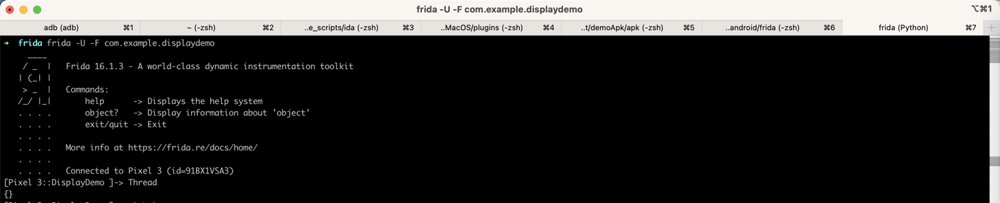
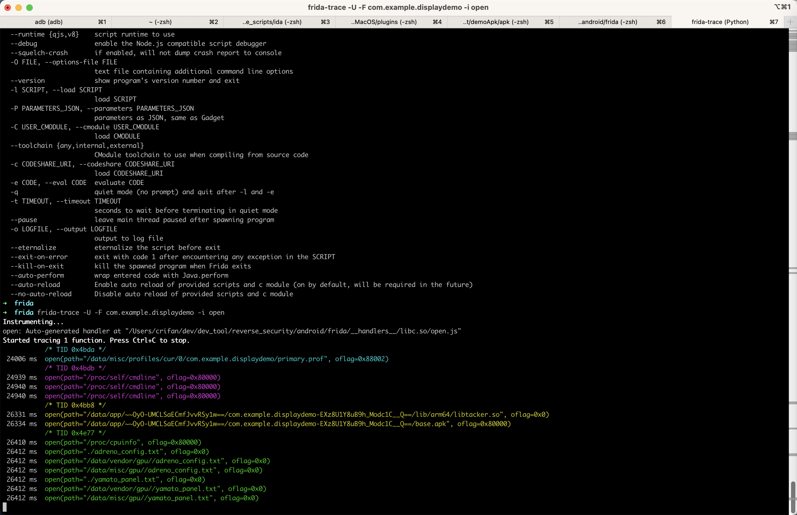
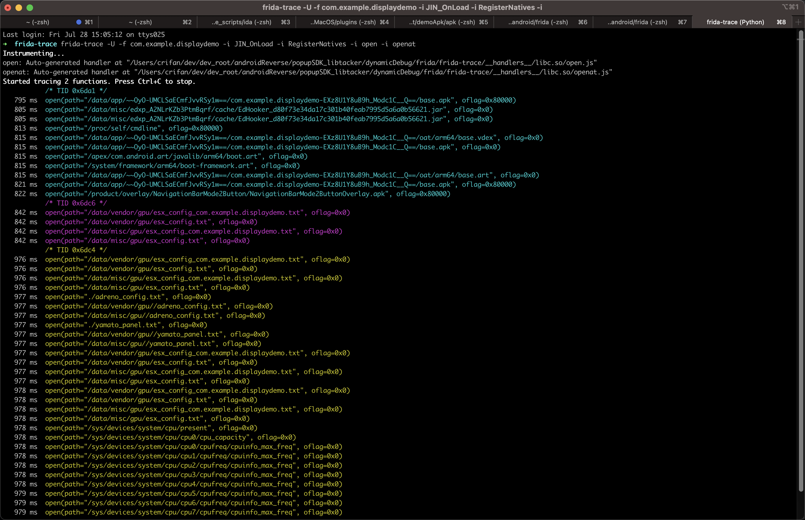

# Frida调试安卓app

用`frida`或`frida-trace`等工具去调试安卓应用：

## 找到安卓应用的包名或PID

```bash
frida-ps -Uai
```

找到此处的要调试的应用：

* 19384   DisplayDemo        com.example.displaydemo
  * =>
    * app名：DisplayDemo
    * 包名：com.example.displaydemo
    * PID：19384

## 用`frida`或`frida-trace`去调试

此处手动点击DisplayDemo这个app，确保在前台运行，然后去hook调试：

* frida
  ```bash
  frida -U -F com.example.displaydemo
  ```
  * 效果
    * 
* frida-trace
  ```bash
  frida-trace -U -F com.example.displaydemo -i open
  frida-trace -U -f com.example.displaydemo -i JIN_OnLoad -i RegisterNatives -i open -i openat
  ```
  * 效果
    * 
    * 
