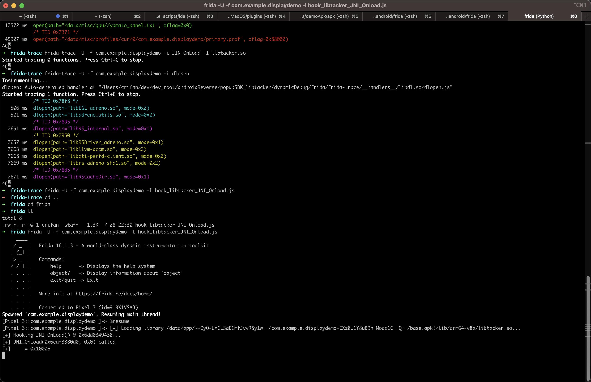
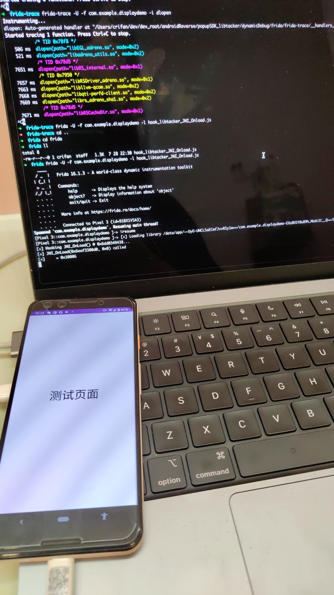

# 心得

## Frida的js脚本中过滤字符串参数

* 背景

想要在`Interceptor.attach`的`onEnter`中，实现参入参数的过滤=判断，去实现，当满足某些条件，才打印（或不打印）某些日志之类的需求

* 核心逻辑：用`someJsStrList.includes(inputParaStr)`去判断即可

* 示例代码

```js
  const KnownStrList = [
    "CurrencyMap/US/0/",
    "CurrencyMap/CN/0/",
    "CurrencyMap/CN/",
    "CurrencyMap/",
    "CurrencyMap",
    "CN",
    "US",
    "/",
    "0",
    "id",
    "zh_CN_#HANS",
    "zh_Hans_CN",
    "zh",
    "Hans",
    "HANS",
  ]

  // char *strcpy(char *restrict dst, const char *restrict src);
  Interceptor.attach(Module.findExportByName(null, "strcpy"), {
    onEnter: function (args) {
      var dst = Memory.readCString(args[0]);
      var src = Memory.readCString(args[1]);
      if (!KnownStrList.includes(src)) {
        console.log("strcpy: dst=" + dst + ", src=" + src);
      }
    },
    onLeave: function (args) {
    }
  });
```

## Frida去hook安卓JNI函数JIN_OnLoad却hook不到无输出

* 现象

此处，要调试的安卓app：

* DisplayDemo
  * 内部的so库：`libtacker.so`
    * 加载方式：`System.loadLibrary("tacker");`

-》可能是此处特殊的加载方式，导致了：

frida-trace无法去hook到，libtacker.so的加载，也就无法找到其内部的函数JNI_OnLoad了

所以frida-trace无法hook此处的JNI_OnLoad，无输出。

* 解决办法

手动写frida的js脚本，去

```js
  const funcSym = "JNI_OnLoad";
  const funcPtr = Module.findExportByName(libraryName, "libtacker.so");
...
```

* 完整代码：
  * `hook_libtacker_JNI_Onload.js`

```js
/**
 * frida -U -f com.example.displaydemo -l hook_libtacker_JNI_Onload.js
 */

function processJniOnLoad(libraryName) {
  const funcSym = "JNI_OnLoad";
  const funcPtr = Module.findExportByName(libraryName, funcSym);

  console.log("[+] Hooking " + funcSym + "() @ " + funcPtr + "...");
  // jint JNI_OnLoad(JavaVM *vm, void *reserved);
  var funcHook = Interceptor.attach(funcPtr, {
      onEnter: function (args) {
          const vm = args[0];
          const reserved = args[1];
          console.log("[+] " + funcSym + "(" + vm + ", " + reserved + ") called");
      },
      onLeave: function (retval) {
          console.log("[+]\t= " + retval);
      }
  });
}

function waitForLibLoading(libraryName) {
  var isLibLoaded = false;

  Interceptor.attach(Module.findExportByName(null, "android_dlopen_ext"), {
      onEnter: function (args) {
          var libraryPath = Memory.readCString(args[0]);
          if (libraryPath.includes(libraryName)) {
              console.log("[+] Loading library " + libraryPath + "...");
              isLibLoaded = true;
          }
      },
      onLeave: function (args) {
          if (isLibLoaded) {
              processJniOnLoad(libraryName);
              isLibLoaded = false;
          }
      }
  });
}

Java.perform(function() {
  const libraryName = "libtacker.so";
  waitForLibLoading(libraryName);
});
```

（此处点击Jump跳转页面后）即可hook到JNI_OnLoad函数的执行：

=> 输出：

* 截图
  * 
  * 
* log日志
```bash
➜  frida frida -U -f com.example.displaydemo -l hook_libtacker_JNI_Onload.js
     ____
    / _  |   Frida 16.1.3 - A world-class dynamic instrumentation toolkit
   | (_| |
    > _  |   Commands:
   /_/ |_|       help      -> Displays the help system
   . . . .       object?   -> Display information about 'object'
   . . . .       exit/quit -> Exit
   . . . .
   . . . .   More info at https://frida.re/docs/home/
   . . . .
   . . . .   Connected to Pixel 3 (id=91BX1VSA3)
Spawned `com.example.displaydemo`. Resuming main thread!
[Pixel 3::com.example.displaydemo ]-> %resume
[Pixel 3::com.example.displaydemo ]-> [+] Loading library /data/app/~~OyO-UMCLSaECmfJvvRSy1w==/com.example.displaydemo-EXz8U1Y8uB9h_Modc1C__Q==/base.apk!/lib/arm64-v8a/libtacker.so...
[+] Hooking JNI_OnLoad() @ 0x6dd0349438...
[+] JNI_OnLoad(0x6eaf3380d0, 0x0) called
[+]    = 0x10006
```
