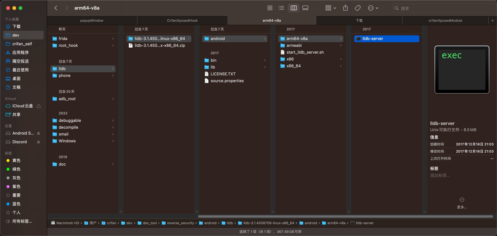

# Mac中：下载安卓版lldb-server

从网上下载lldb-server到Mac

[Android SDK Offline: Android NDK LLDB Direct Download](https://androidsdkoffline.blogspot.com/p/android-ndk-lldb-direct-download.html)

->

https://dl.google.com/android/repository/lldb-3.1.4508709-darwin-x86_64.zip

下载得到`lldb-3.1.4508709-darwin-x86_64.zip`，解压后得到：

`lldb-3.1.4508709-linux-x86_64/android/arm64-v8a/lldb-server`



确认文件类型是ARM64的：

```bash
➜  arm64-v8a ll
total 16568
-rwxr-xr-x@ 1 crifan  staff   8.1M 12 18  2017 lldb-server

➜  arm64-v8a file lldb-server
lldb-server: ELF 64-bit LSB shared object, ARM aarch64, version 1 (SYSV), dynamically linked, interpreter /system/bin/linker64, BuildID[sha1]=16479c73b494c432c5f171db2bb68f29e033f157, stripped
```
