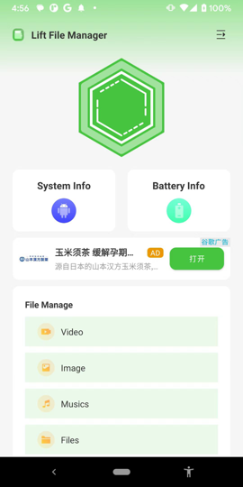
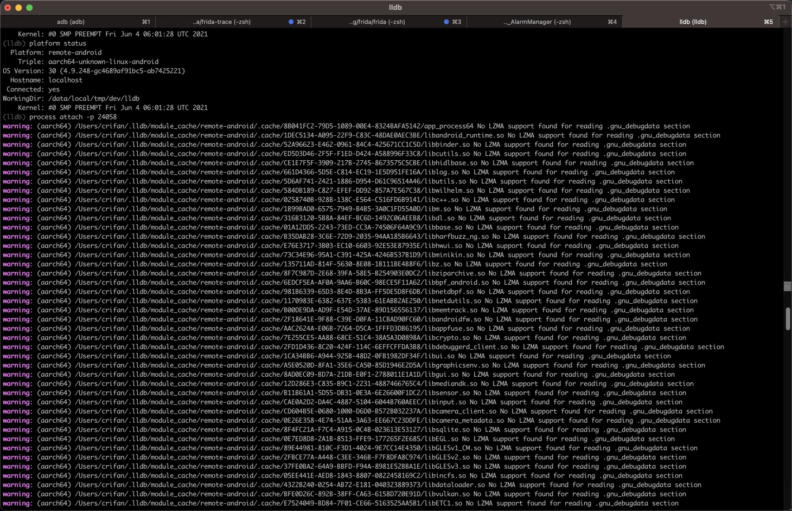
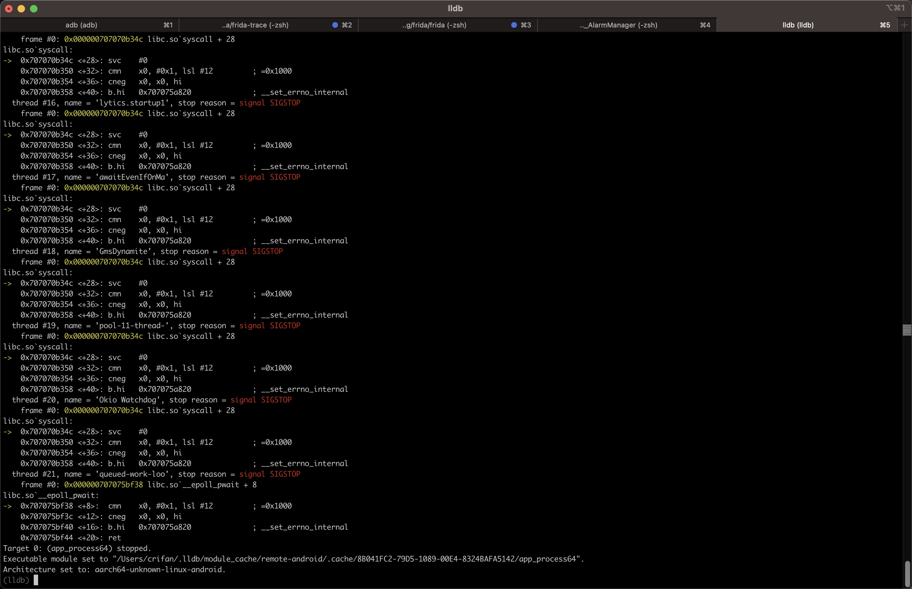
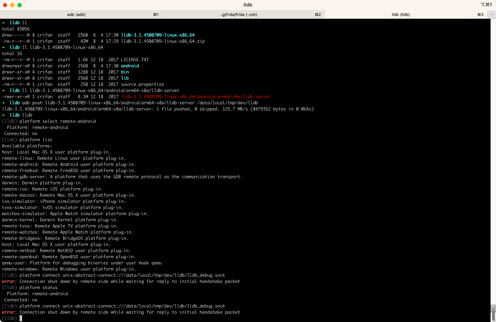
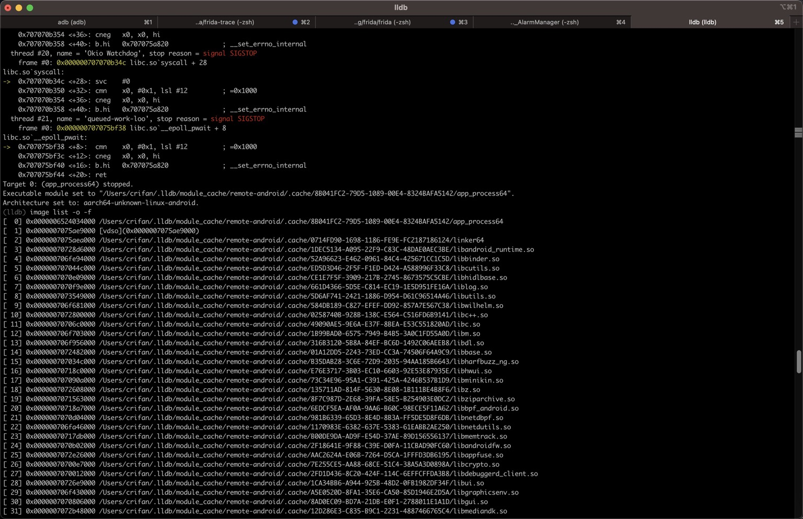
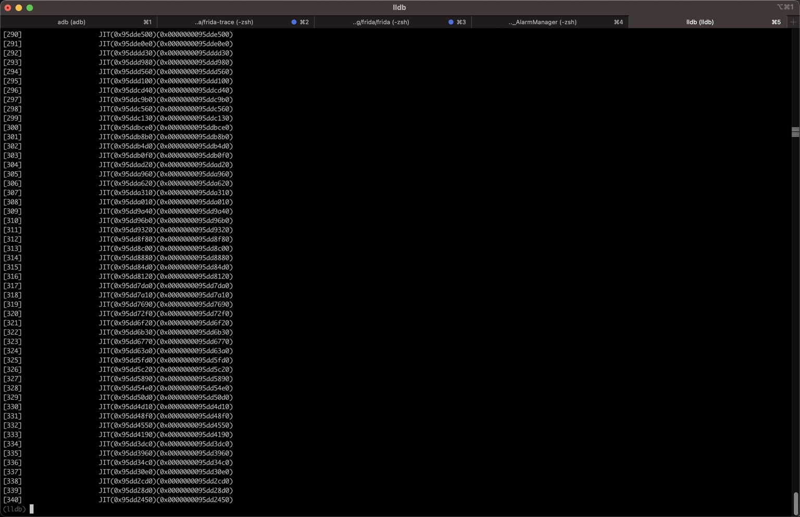

# Mac中：用lldb调试安卓app进程


* 背景
  * 被测安卓的app
    * app名称：`Lift File Manager`
    * 包名：`com.lift.filemanager.android`
    * 主页面
      * 

然后可以用lldb去调试安卓app（进程）了：

```bash
process attach -p 24058
```

* 说明
  * `attach`：当前用挂载模式（而不是spawn模式）
  * `-p 24058`
    * `-p` == `--pid`：进程的PID
    * `24058`：当前安卓app的（主）进程的PID

## 输出举例

* 命令行输出：

```bash
(lldb) process attach -p 24058
warning: (aarch64) /Users/crifan/.lldb/module_cache/remote-android/.cache/8B041FC2-79D5-1089-00E4-8324BAFA5142/app_process64 No LZMA support found for reading .gnu_debugdata section
warning: (aarch64) /Users/crifan/.lldb/module_cache/remote-android/.cache/1DEC5134-A095-22F9-C83C-48DAE0AEC3BE/libandroid_runtime.so No LZMA support found for reading .gnu_debugdata section
warning: (aarch64) /Users/crifan/.lldb/module_cache/remote-android/.cache/52A96623-E462-0961-84C4-425671CC1C5D/libbinder.so No LZMA support found for reading .gnu_debugdata section
warning: (aarch64) /Users/crifan/.lldb/module_cache/remote-android/.cache/ED5D3D46-2F5F-F1ED-D424-A588996F33C8/libcutils.so No LZMA support found for reading .gnu_debugdata section
...
...
...
warning: (aarch64) /Users/crifan/.lldb/module_cache/remote-android/.cache/68482D47-6551-C4A4-AE65-B2B4FC4E6ABA/libGLESv2_adreno.so No LZMA support found for reading .gnu_debugdata section
warning: (aarch64) /Users/crifan/.lldb/module_cache/remote-android/.cache/7A027C1B-6689-FB13-BC4C-DDF60D309D9F/libllvm-glnext.so No LZMA support found for reading .gnu_debugdata section
warning: (aarch64) /Users/crifan/.lldb/module_cache/remote-android/.cache/28A702E7-CF8C-5CCC-2481-D2DD8B341E1B/libcompiler_rt.so No LZMA support found for reading .gnu_debugdata section
warning: (aarch64) /Users/crifan/.lldb/module_cache/remote-android/.cache/11A028BE-C11F-BD95-B235-8593B25A1887/libwebviewchromium_loader.so No LZMA support found for reading .gnu_debugdata section
Process 24058 stopped
* thread #1, name = 'er.android:sist', stop reason = signal SIGSTOP
    frame #0: 0x000000707075bf38 libc.so`__epoll_pwait + 8
libc.so`__epoll_pwait:
->  0x707075bf38 <+8>:  cmn    x0, #0x1, lsl #12         ; =0x1000
    0x707075bf3c <+12>: cneg   x0, x0, hi
    0x707075bf40 <+16>: b.hi   0x707075a820              ; __set_errno_internal
    0x707075bf44 <+20>: ret
  thread #2, name = 'Signal Catcher', stop reason = signal SIGSTOP
    frame #0: 0x000000707075b978 libc.so`__rt_sigtimedwait + 8
libc.so`__rt_sigtimedwait:
->  0x707075b978 <+8>:  cmn    x0, #0x1, lsl #12         ; =0x1000
    0x707075b97c <+12>: cneg   x0, x0, hi
    0x707075b980 <+16>: b.hi   0x707075a820              ; __set_errno_internal
    0x707075b984 <+20>: ret
  thread #3, name = 'perfetto_hprof_', stop reason = signal SIGSTOP
    frame #0: 0x000000707075acf4 libc.so`read + 4
libc.so`read:
->  0x707075acf4 <+4>:  svc    #0
    0x707075acf8 <+8>:  cmn    x0, #0x1, lsl #12         ; =0x1000
    0x707075acfc <+12>: cneg   x0, x0, hi
    0x707075ad00 <+16>: b.hi   0x707075a820              ; __set_errno_internal
...
...
...
  thread #21, name = 'queued-work-loo', stop reason = signal SIGSTOP
    frame #0: 0x000000707075bf38 libc.so`__epoll_pwait + 8
libc.so`__epoll_pwait:
->  0x707075bf38 <+8>:  cmn    x0, #0x1, lsl #12         ; =0x1000
    0x707075bf3c <+12>: cneg   x0, x0, hi
    0x707075bf40 <+16>: b.hi   0x707075a820              ; __set_errno_internal
    0x707075bf44 <+20>: ret
Target 0: (app_process64) stopped.
Executable module set to "/Users/crifan/.lldb/module_cache/remote-android/.cache/8B041FC2-79D5-1089-00E4-8324BAFA5142/app_process64".
Architecture set to: aarch64-unknown-linux-android.
(lldb)
```

* 截图
  * 
  * 

## 常见问题

### error Connection shut down by remote side while waiting for reply to initial handshake packet

* 现象：lldb去连接安卓中lldb-server时报错：
  ```bash
  (lldb) platform connect unix-abstract-connect:///data/local/tmp/dev/lldb/lldb_debug.sock
  error: Connection shut down by remote side while waiting for reply to initial handshake packet
  ```
  * 
* 原因：此处Android 13已开启了SELinux，导致无法连接
* 解决办法：去关于SELinux
  * 有2种方式
    * 永久关闭：需要修改Android源码，重新编译ROM或boot.img
      * 此处暂时没条件，暂时放弃此路
    * 临时关闭：通过参数设置关闭
      * 具体命令
        ```bash
        adb shell setenforce 0
        ```
        * 或：
          * 先`adb shell`进入shell，再`su`切换成root用户，再用`setenforce 0`去关闭`SELinux`
        * （之前和之后都可以）用`getenforce`去确认=查看当前SELinux状态
          * `Enforcing`：SELinux已开启
            ```bash
            1redfin:/data/local/tmp/dev/lldb # getenforce
            Enforcing
            ```
          * `Permissive`：SELinux已关闭
            ```bash
            redfin:/data/local/tmp/dev/lldb # getenforce
            Permissive
            ```

## 心得

### 如何查看安卓app的进程的PID

有多种方式查看到，（当前正在运行的）安卓app的进程的PID：

* Mac中
  ```bash
  frida-ps -Uai
  ```
  * 其中可以看到自己已安装的安卓的app的详情：进程PID、app名称、包名
    * 举例
      ```bash
      ➜  LiftFileManager_jadx_AlarmManager frida-ps -Uai | grep lift
      24058   Lift File Manager  com.lift.filemanager.android
      ```
      * 可以看到要测试的app的：
        * 进程PID：`24058`
        * app名称：`Lift File Manager`
        * 包名：`com.lift.filemanager.android`
* （安卓手机的）adb的shell中
  ```bash
  ps -A | grep yourAndroidAppName
  ```
  * 举例
    ```bash
    redfin:/ # ps -A | grep lift
    u0_a243       24058 1008 33543564 207388 do_epoll_wait      0 S com.lift.filemanager.android
    u0_a243       xxxx  1008 14793148 119908 do_epoll_wait      0 S com.lift.filemanager.android:sist
    u0_a243       xxxx  1008 14754236 139864 do_epoll_wait      0 S com.lift.filemanager.android:dae
    u0_a243       xxxx  1008 14734752 109496 do_epoll_wait      0 S com.lift.filemanager.android:lift
    ```
    * LiftFileManager的主进程PID是：`24058`


### 如何用lldb调试程序

之后就是，如何用lldb调试的具体效果了。

举例：

去看看加载的image：

```bash
(lldb) image list -o -f
(lldb) image list -o -f
[  0] 0x0000006524034000 /Users/crifan/.lldb/module_cache/remote-android/.cache/8B041FC2-79D5-1089-00E4-8324BAFA5142/app_process64
[  1] 0x0000007075ae9000 [vdso](0x0000007075ae9000)
[  2] 0x0000007075aea000 /Users/crifan/.lldb/module_cache/remote-android/.cache/0714FD90-1698-1186-FE9E-FC2187186124/linker64
[  3] 0x00000070728d6000 /Users/crifan/.lldb/module_cache/remote-android/.cache/1DEC5134-A095-22F9-C83C-48DAE0AEC3BE/libandroid_runtime.so
[  4] 0x000000706fe94000 /Users/crifan/.lldb/module_cache/remote-android/.cache/52A96623-E462-0961-84C4-425671CC1C5D/libbinder.so
[  5] 0x000000707044c000 /Users/crifan/.lldb/module_cache/remote-android/.cache/ED5D3D46-2F5F-F1ED-D424-A588996F33C8/libcutils.so
[  6] 0x0000007070e09000 /Users/crifan/.lldb/module_cache/remote-android/.cache/CE1E7F5F-3909-217B-2745-8673575C5CBE/libhidlbase.so
[  7] 0x0000007070f9e000 /Users/crifan/.lldb/module_cache/remote-android/.cache/661D4366-5D5E-C814-EC19-1E5D951FE16A/liblog.so
[  8] 0x0000007073549000 /Users/crifan/.lldb/module_cache/remote-android/.cache/5D6AF741-2421-1886-D954-D61C96514A46/libutils.so
[  9] 0x000000706f681000 /Users/crifan/.lldb/module_cache/remote-android/.cache/584DB189-C827-EFEF-DD92-857A7E567C38/libwilhelm.so
[ 10] 0x0000007072800000 /Users/crifan/.lldb/module_cache/remote-android/.cache/0258740B-928B-138C-E564-C516FD6B9141/libc++.so
[ 11] 0x00000070706c0000 /Users/crifan/.lldb/module_cache/remote-android/.cache/49090AE5-9E6A-E37F-8BEA-E53C551820AD/libc.so
[ 12] 0x000000706f703000 /Users/crifan/.lldb/module_cache/remote-android/.cache/1B99BAD0-6575-7949-B4B5-3A0C1FD55A0D/libm.so
[ 13] 0x000000706f956000 /Users/crifan/.lldb/module_cache/remote-android/.cache/316B3120-5B8A-84EF-BC6D-1492C06AEEB8/libdl.so
[ 14] 0x0000007072482000 /Users/crifan/.lldb/module_cache/remote-android/.cache/01A12DD5-2243-73ED-CC3A-74506F64A9C9/libbase.so
...
[265] 0x0000006dc2241000 /Users/crifan/.lldb/module_cache/remote-android/.cache/7A027C1B-6689-FB13-BC4C-DDF60D309D9F/libllvm-glnext.so
[266] 0x0000006dc1e86000 /Users/crifan/.lldb/module_cache/remote-android/.cache/EF219156-ADF1-D883-C02F-44E4C1FC04B2/libGLESv1_CM_adreno.so
[267] 0x0000006dc1e69000 /Users/crifan/.lldb/module_cache/remote-android/.cache/FFCCE965-AAA2-1D95-77F2-CF1708C764B7/eglSubDriverAndroid.so
[268] 0x0000006dc1d8b000 /Users/crifan/.lldb/module_cache/remote-android/.cache/28A702E7-CF8C-5CCC-2481-D2DD8B341E1B/libcompiler_rt.so
[269] 0x0000006dc1d42000 /Users/crifan/.lldb/module_cache/remote-android/.cache/11A028BE-C11F-BD95-B235-8593B25A1887/libwebviewchromium_loader.so
[270]                    JIT(0x99dda8b0)(0x0000000099dda8b0)
[271]                    JIT(0x99dda350)(0x0000000099dda350)
[272]                    JIT(0x99dda010)(0x0000000099dda010)
...
[338]                    JIT(0x95dd2cd0)(0x0000000095dd2cd0)
[339]                    JIT(0x95dd28d0)(0x0000000095dd28d0)
[340]                    JIT(0x95dd2450)(0x0000000095dd2450)
(lldb)
```

* 截图
  * 
  * 

其他更多关于LLDB的用法，详见独立子教程：

[主流调试器：LLDB](https://book.crifan.org/books/popular_debugger_lldb/website/)
