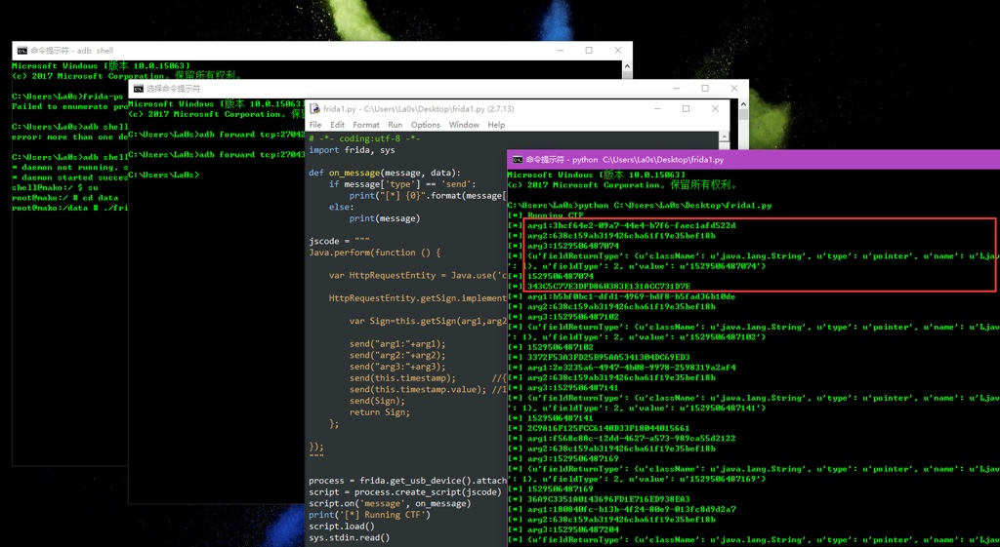

# Frida

* `Frida`
  * 概述
    * iOS逆向和Android逆向中常用的逆向工具之一
    * 用于动态调试程序逻辑，实现各种调试功能
    * 核心使用逻辑是frida加js脚本，或frida-trace追踪函数执行过程
    * 以及高级的frida的Stalker追踪函数实际运行过程等等
  * 主页
    * 官网
      * https://frida.re/
    * Github
      * https://github.com/frida/frida
* 截图
  * Windows
    * 
  * Mac
    * 
* 详解
  * 独立子教程
    * [逆向调试利器：Frida](https://book.crifan.org/books/reverse_debug_frida/website/)
